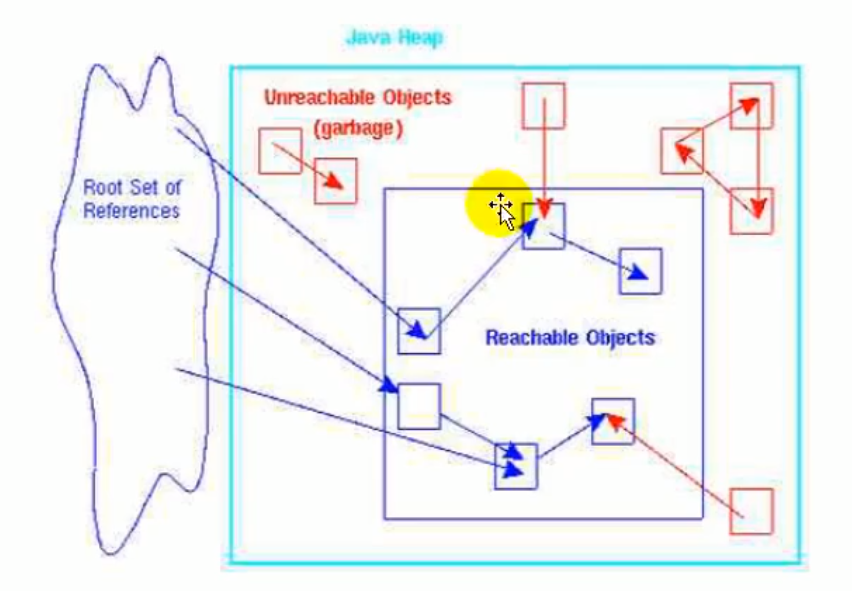
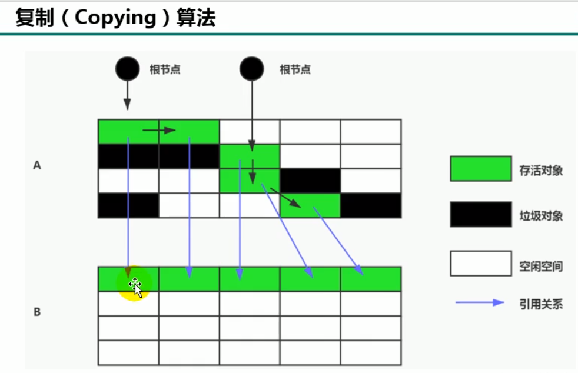
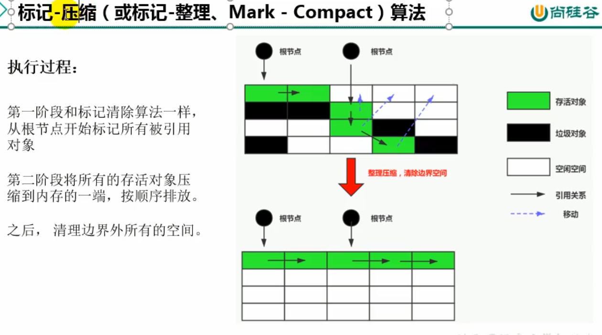
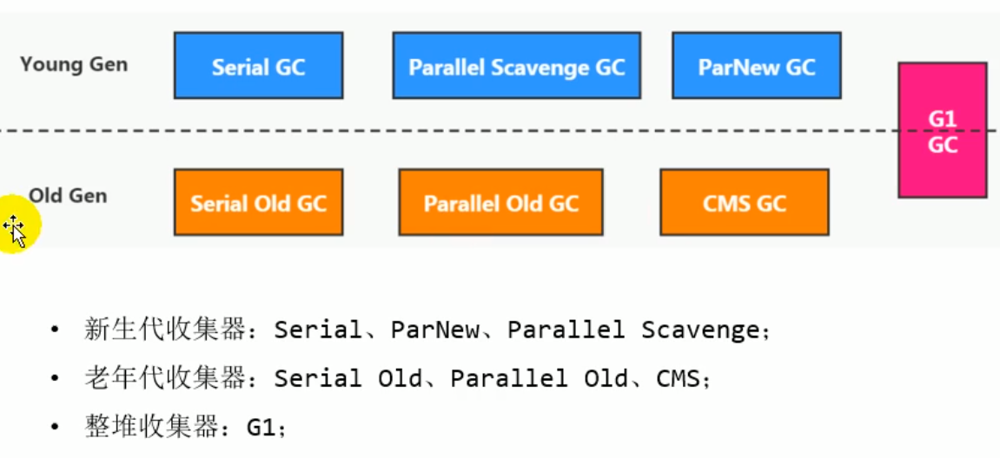
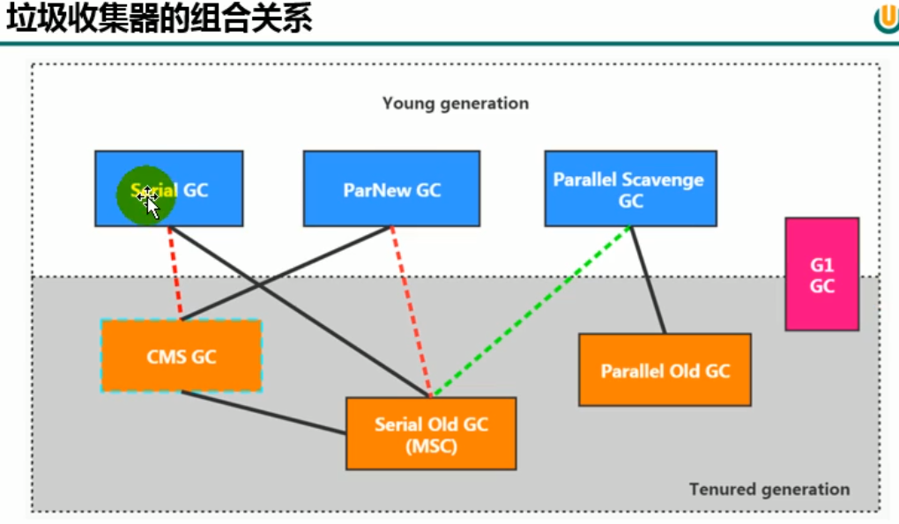
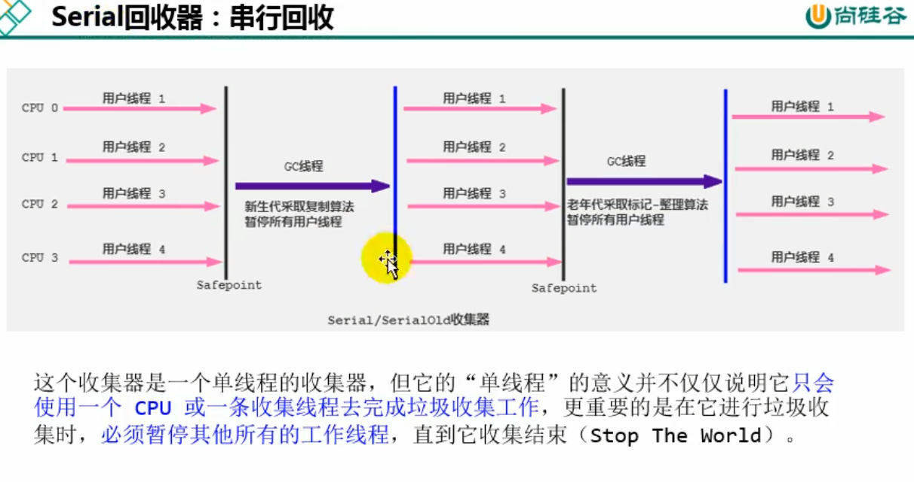
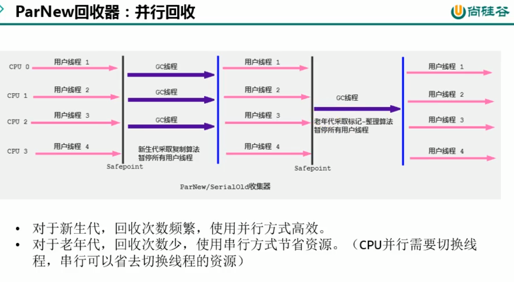
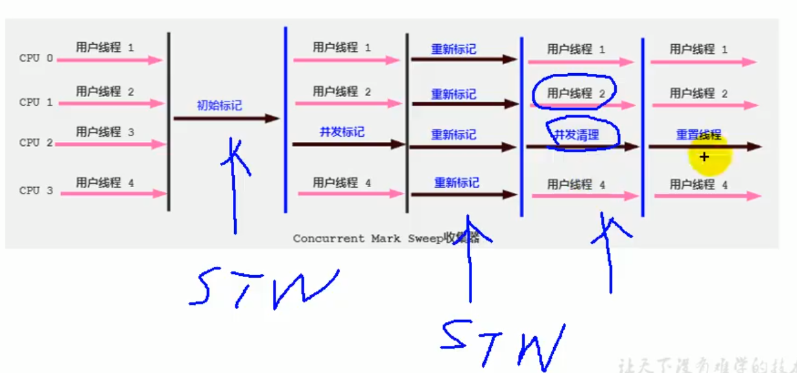
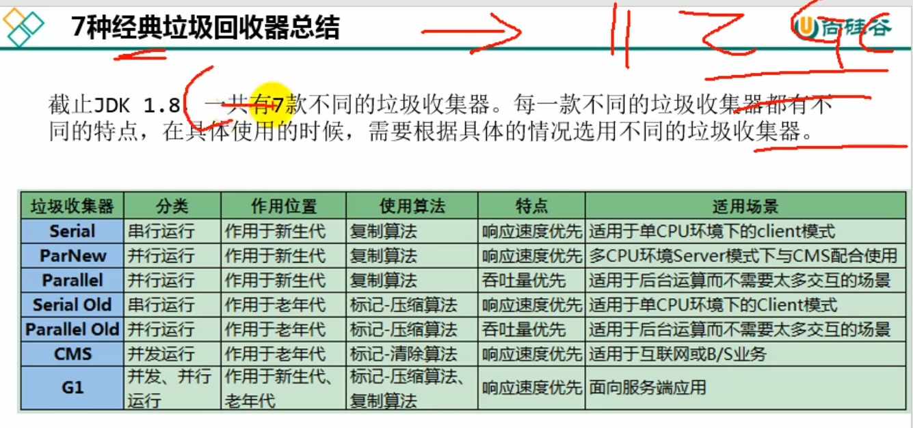
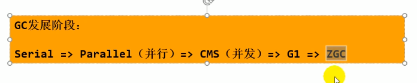

## GC Roots

### 定义：

根对象集合。一组必须活跃度引用。

### 可达性分析算法：

可达性分析算法也叫根搜索算法、追踪性垃圾收集。

* 可达性分析算法是以GC Roots为起始点，安装从上而下的方法[搜索被GC Roots所连接的目标对象是否可达。]()
* 可达性分析算法以后，内存中的存活对象都会被根对象集合直接或间接连接着，搜索所走的路径称为[引用链（Reference Chain）]()
* 如果目标对象没有任何引用链相连，则是不可达，就意味对象已经死亡，可以标记为垃圾对象。可达才是存活对象。

### GC Roots包括：

1. 栈中引用的对象：[方法参数引用的对象、局部变量引用的对象]()
2. 方法区中类静态属性引用的对象：类静态成员变量引用的对象
3. 方法区中常量引用的对象：字符串常量池（string table)里的引用
4. 所有被同步锁synchronized持有的对象
5. Java虚拟机内部的引用：基本数据类型对象的Class对象，常驻的异常对象
6. 反应java虚拟机内部情况的JMXBean、JVMTI中注册的回调、本地代码缓存等

小技巧：由于Root采用栈方式存放变量和指针，所以如果一个指针，它保存了堆内存里面的对象，但是自己又不存放在堆内存里面，那么他就是一个Root.(一个对象引用了堆对象而自己又不存放在堆中)

### finalization机制

1. 垃圾回收对象之前，如果finalize()方法被重写了，总会先调用这个对象的finalize()方法。【Object方法】
2. finalize()方法用于在对象被回收时进行资源释放和清理工作。比如关闭文件、套接字和数据库链接等。
3. finalize()方法是用于垃圾回收机制调用的，不推荐主动调用。理由如下：
    - finalize()方法可能导致对象复活
    - finalize()方法执行时间没有保障
    - finalize()方法有可能影响GC性能
4. 由于finalize()方法的存在，虚拟机中对象一般处于3中可能都状态：
    - 可触及的：不是垃圾对象
    - 可复活点：对象的所有引用被释放，但是对象有可能在finalize()中复活
    - 不可触及的：对象的finalize()方法被调用，并且没有复活（只有对象在不可触及才可以被回收）

## 常见的垃圾回收算法

1. 标记-清除算法（mark-sweep)
    - 缺点：效率不高、STW、清理出来的空闲内存是不连续的
    - 优点：非常基础、非常常见
    - 适用场景：垃圾少点老年代
2. 复制算法（copying)
    - 优点：没有标记-清楚过程，实现简单，运行高效；空间连续不存在”碎片“问题。
    - 缺点：需要两倍的内存空间；对于G1这种拆分成大量Region的GC，复制不是移动，需要维护region之间对象引用关系，不管是内存占用或者时间开销也不小
    - 适用场景：垃圾多的新生代
3. 标记-压缩算法（mark-compact)
    - 适用场景：垃圾少点老年代
    - 优点：不存在内存碎片、不需要复制算法中，内存加倍的高额代价
    - 缺点：效率上低于复制算法；STW

<big><mark>没有最好的算法，只有最合适的算法。</mark></big>

## 分代收集算法

[不同的对象生命周期不同。因此，不同生命周期的对象可以采取不同的收集方式，以便提高回收效率。一般把JAVA堆分成新生代和老年代，这样就可以根据各个年代的特点使用不同的回收算法，以提高垃圾回收的效率。]()

<big>目前几乎所有的GC都是采用分代收集算法执行垃圾回收的。</big>

## 强软弱虚引用

- 强引用：new对象，无论任何情况下，只要强引用关系还存在，就不会被GC。**（不回收）**
- 软引用：系统将要发生内存溢出前，会把这些对象列入回收范围中进行第二次回收。**（内存不足即回收,缓存）**
- 弱引用：被弱引用关联的对象，只能生存到下一次垃圾回收之前。**（发现即回收）**
- 虚引用：也称为幽灵引用。所有引用类型中最弱的一个。如果一个对象进持有虚引用，和没有引用几乎一样。（随时回收）

 
## 垃圾回收器

### 查看默认的垃圾收集器

-XX:+PrintCommandLineFlags 查看命令行相关参数，包含使用的垃圾收集器
jinfo -flag 相关垃圾收集器参数 pid

### Serial回收器：串行回收

Serial回收器是最基本、历史最悠久的垃圾回收器。JDK1.3之前回收新生代唯一的选择。

Serial收集器作为HotSpot中Client模式下的默认新生代垃圾收集器。

Serial收集器采用复制算法、串行回收和“Stop-The-World"机制执行内存回收。

除了年轻代以外，Serial收集器还提供用于执行老年代收集的Serial Old收集器，Serial Old收集器同样也采用了串行回收和”Stop-The-World"机制，只不过内存回收算法采用的事标记-压缩算法。

Serial-年轻代-复制算法
SerialOld-老年代-标记-压缩算法

Serial Old是运行在Client模式下默认的老年代垃圾收集器

总结：
这种垃圾收集器大家了解，现在已经不用串行的了，而且在限定单核cpu才可以用，现在都不是单核的了。
对于交互交强的应用而言，这种垃圾收集器是不能接受的。一般在java web应用程序中是不会采用串行垃圾收集器的。

### ParNew回收器：并行回收

Serial GC是年轻代单线程垃圾收集器，ParNew收集器是Serial收集器的多线程版本。

- 新生代
- 复制算法
- 很多JVM在server模式下新生代的默认垃圾收集器

 
### Parallel和Parallel Old

Parallel:

- 复制算法
- 并行回收
- stw
- 吞吐量优先
- 年轻代
- jdk8默认

Parallel old

- 标记-压缩算法
- 并行回收
- stw
- jdk1.6
- 老年代
- jdk8默认

互相激活

### CMS

- 并发收集器(用户线程和垃圾线程同时工作)
- 标记-清除算法
- 缩短STW(低延迟)
- JDK9废弃了
- JDK14删除

缺点：

1. 会产生内存碎片
2. 对CPU资源非常敏感
3. 无法处理浮动垃圾

### SerialGC ParallelGC 和CMS不同

如果你想最小化的使用内存和并行开销，请选Serial GC;
如果你想最大化应用程序的吞吐量，请选Parallel GC;
如果你想最小化GC的中断或停顿时间，请选择CMS GC；

吞吐量=应用线程工作时间/应用线程工作时间+GC线程工作时间

### G1 区域化分代式

