# JVM系列之一：内存和垃圾回收篇

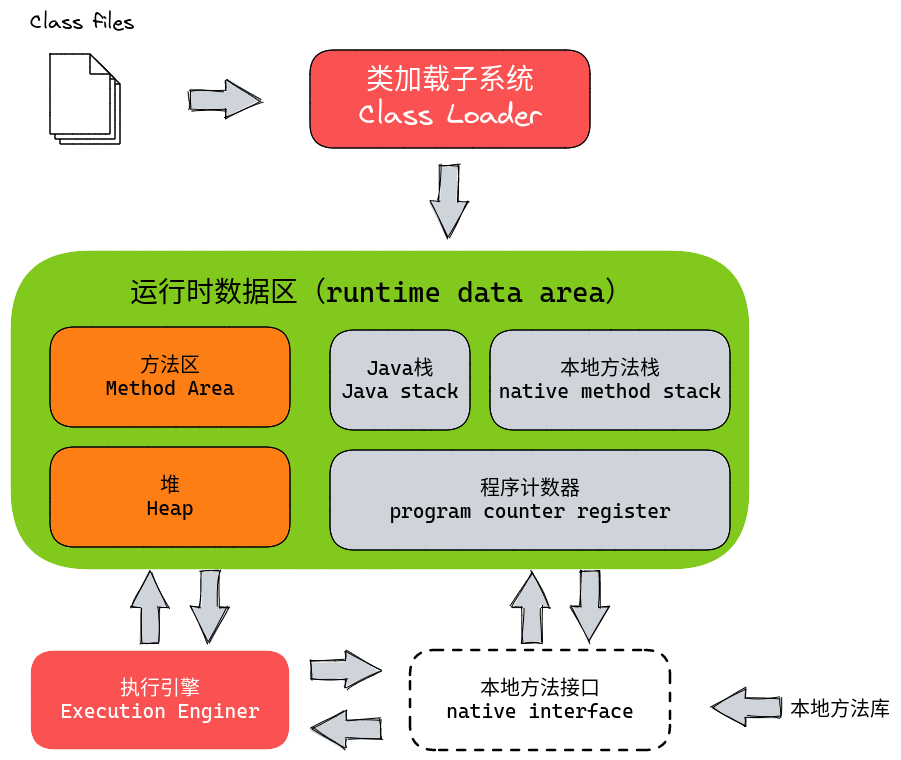

-----

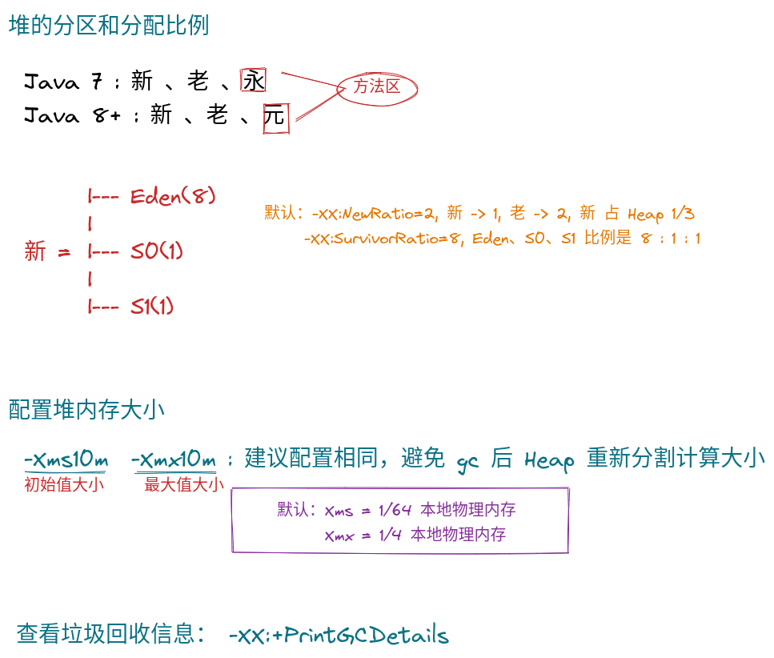

-----

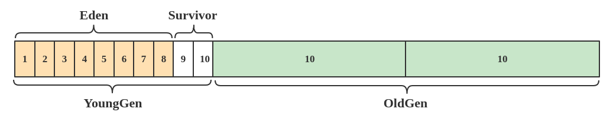

-----

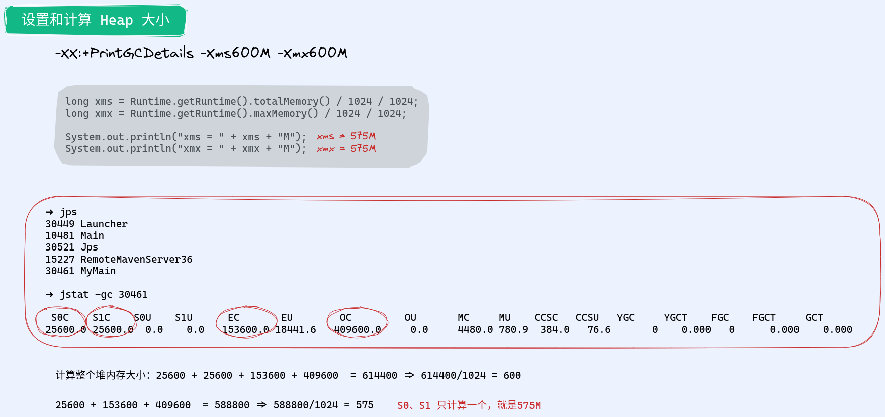

-----
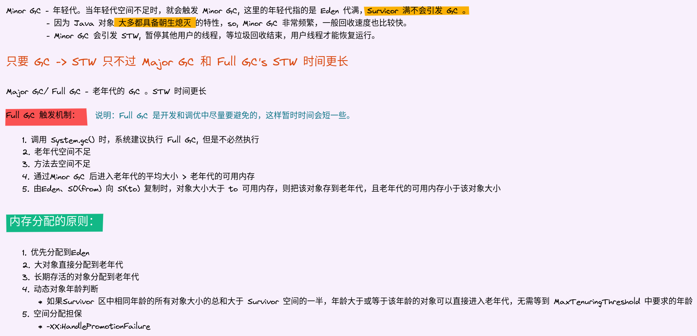

-----
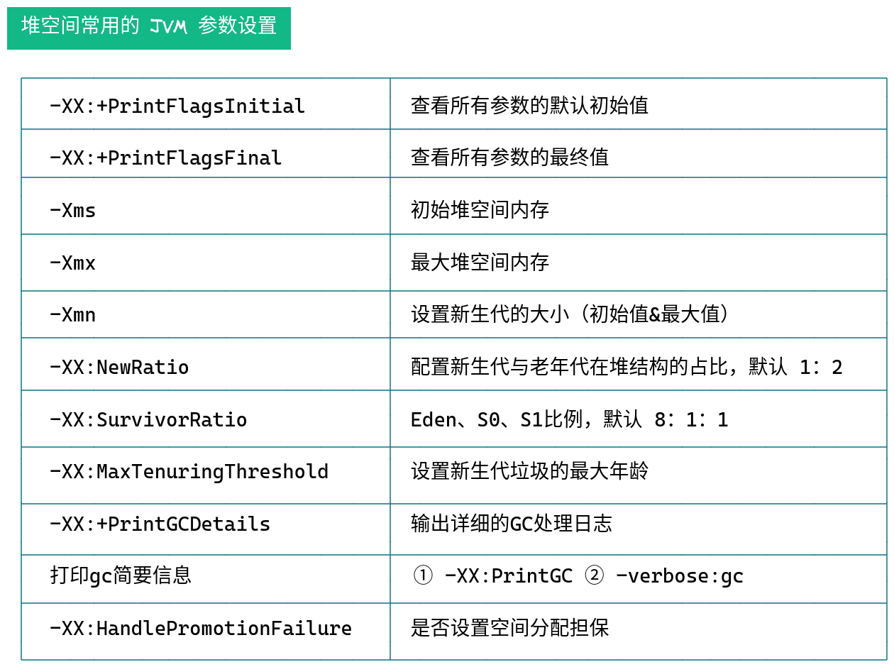

-----

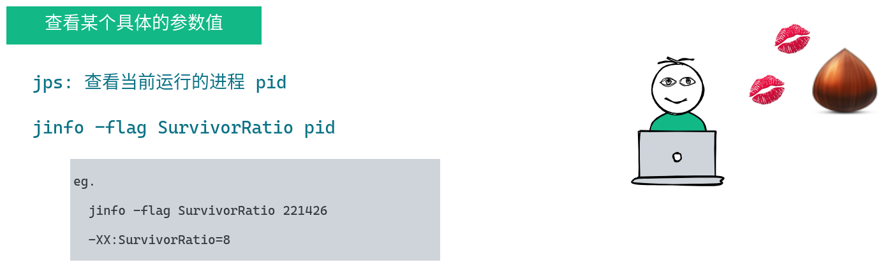

-----
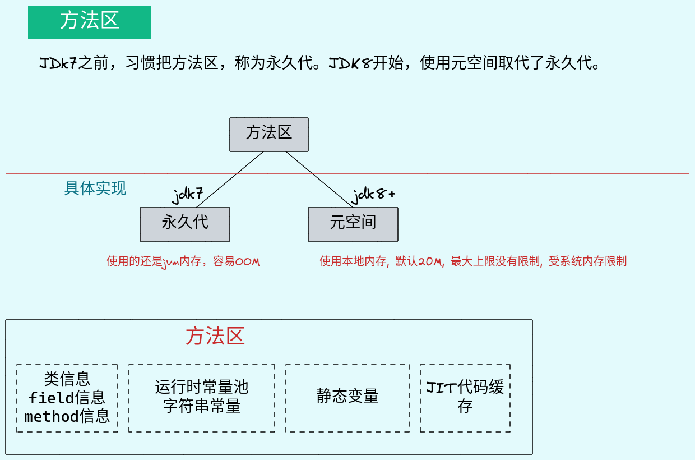

-----

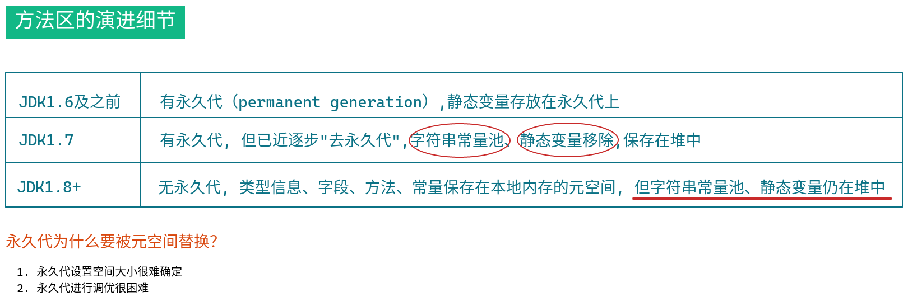

-----

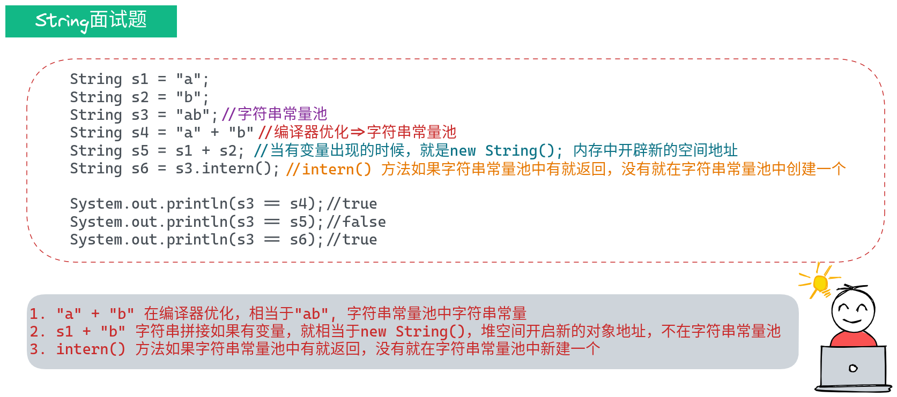

-----

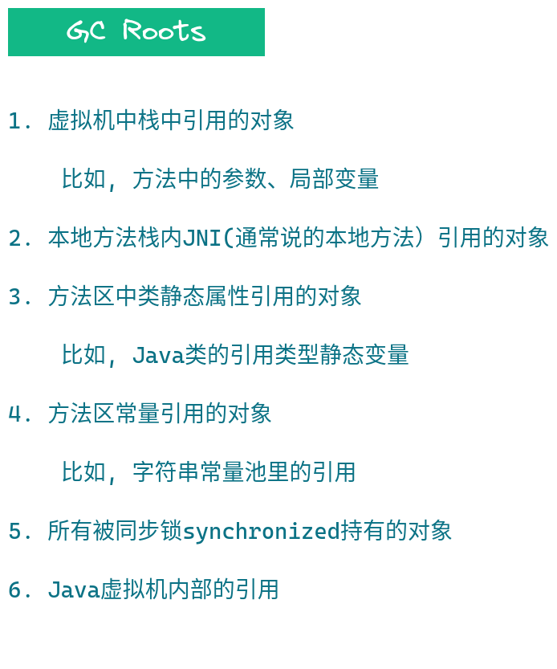

-----

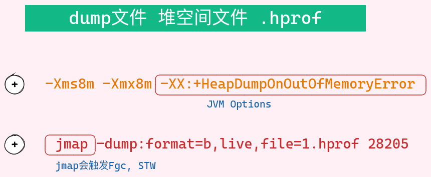

------

------

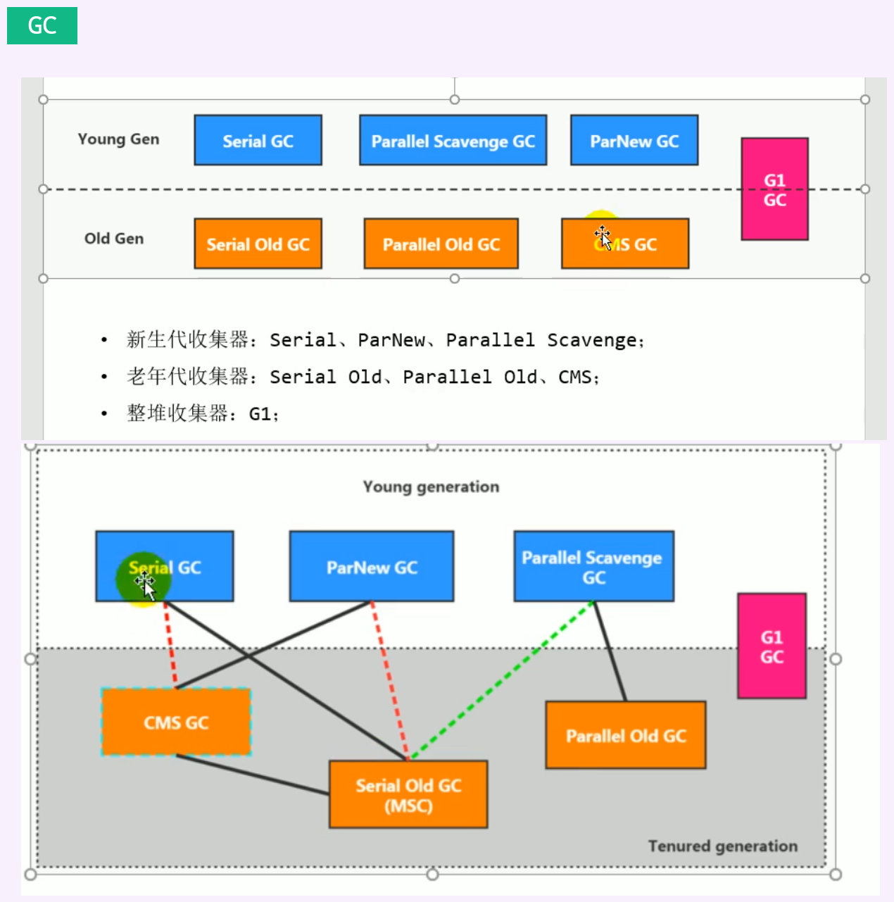

* 查看当前使用的垃圾收集器：

  * -XX:+PrintCommandLineFlags
  * jinfo -flag 相关的垃圾回收器参数 进程ID

