## 运行时数据区域概述及线程


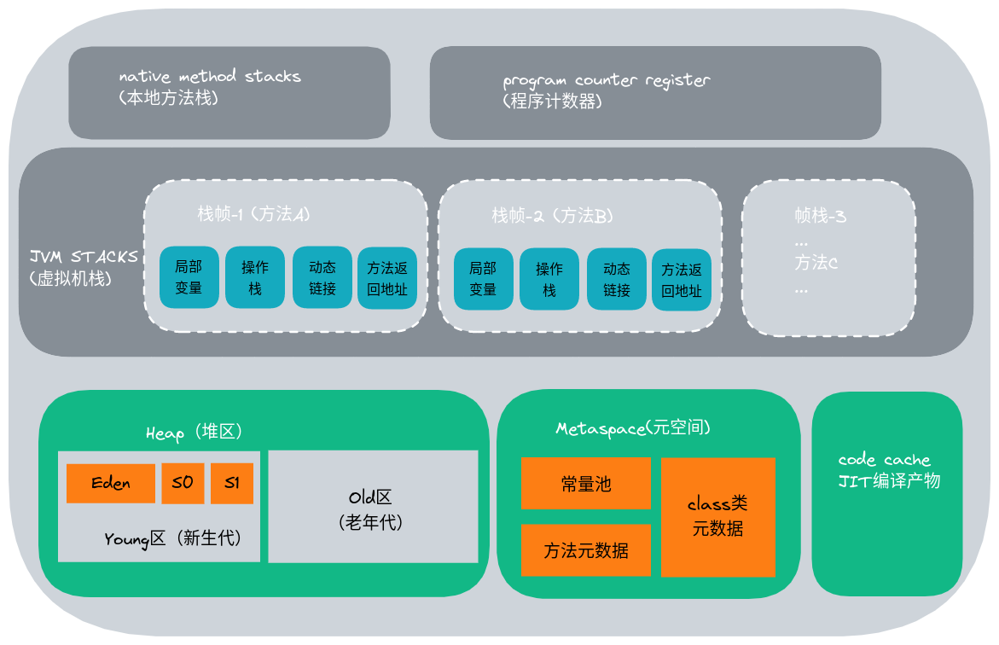     


1. Heap(堆)、方法区(元空间(JDK8及之后)、永久代(JDK1.7及之前)和代码缓存)随着虚拟机启动而创建，随虚拟机退出而销毁；多个线程共享。
2. NMS(native method stack)、VMS(VM stack)和PC(program counter)随着线程的开始和结束而创建和销毁；每个线程一份，线程私有。


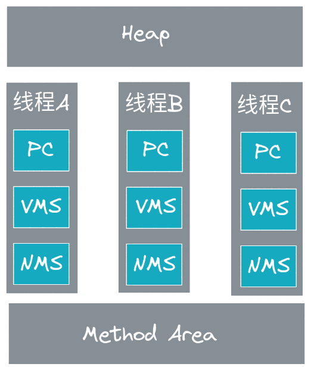


### 方法区、永久代和元空间关系

**方法区：**

- 逻辑上的东西，是JVM 的规范，所有虚拟机必须遵守的。
- 是JVM 所有线程共享的、用于存储类的信息、常量池、方法数据、方法代码等。


**永久代：**

- hotspot在jdk1.7及之前对方法区的一个实现
- 使用虚拟机内存


**元空间：**

- hotspot在jdk1.8及之后对方法区的一个实现
- 使用本地内存


## pc 

定义：program counter register：程序寄存器也叫指令计数器。

作用 ：用来指示程序执行到那一个指令（那一行代码）。因为cpu在多线程之间切换。

特点：

- 很小的内存空间，几乎可以忽略不计。
- 每个线程都有自己的程序计数器，线程私有，生命周期同线程生命周期。
- 唯一一个没有OOM的区域


## VM Stack

栈是运行时单位，堆是存储的单位。
栈是解决程序的运行问题，程序如何执行；堆是解决数据存储的问题，数据怎么放，放在哪。

**java虚拟机栈是什么？**

1. 每个线程创建时都会创建一个虚拟机栈，内部保存一个个的栈帧，对应着一次次的java方法调用。
2. 是线程私有的

**生命周期：**

生命周期和线程一致

**作用：**

主管java程序的运行，保存方法的局部变量，部分结果，并参与方法的调用和返回。

**特点：**

1. 每个方法执行压栈，执行结束出栈
2. 栈不存在垃圾回收问题

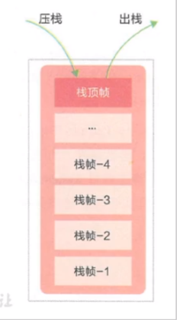


### 栈空间大小设置

虚拟机栈可以设置成固定大小也可以设置成动态调整的：

- 当采用固定大小时， 如果线程请求分配的栈容量超过Java虚拟机栈允许的最大容量，StackOverflowError 异常。
- 当采用动态扩展时，并且在尝试扩展的时候无法申请到足够的内存，或者创建新的线程时没有足够的内存去创建对应的虚拟机栈，OutOfMemoryError 异常。

默认是动态调整的，如果设置成固定大小呢?

- -Xss 设置虚拟机栈大小。单位：byte
- 默认大小：1024kb


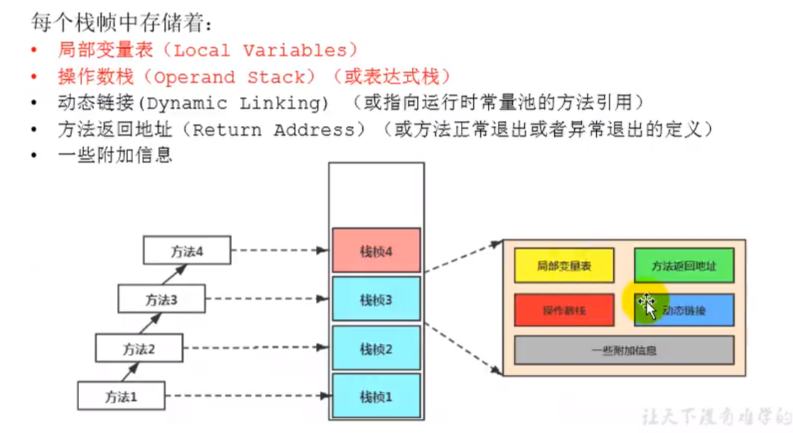

## Heap

### 概述

1. 一个JVM实例只有一个堆内存
2. 堆区随JVM启动而创建,是JVM管理最大的一块内存空间
3. 堆可以处理物理上不连续，逻辑上是连续的一块空间
4. 多线程共享堆内存空间(线程不安全)
5. 几乎所有的<font color="red">**对象实例**</font>和<font color="red">**数组**</font>都应当在运行时分配在堆上
6. 堆中的对象只有在垃圾回收的时候才会被移除,堆是GC回收的重点区域

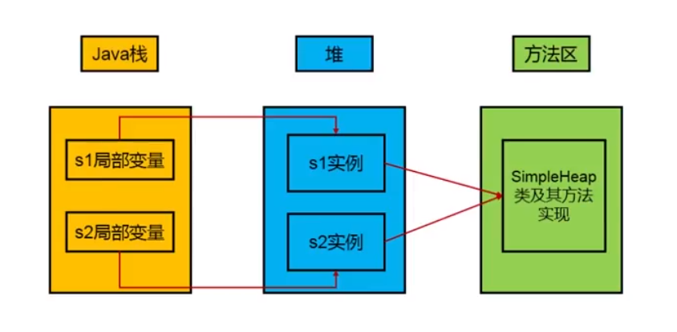

### java8的改变

<big><mark>java8以后方法区的实现由永久代改为了元空间，内存也由堆内存改为了本地内存。</mark></big>

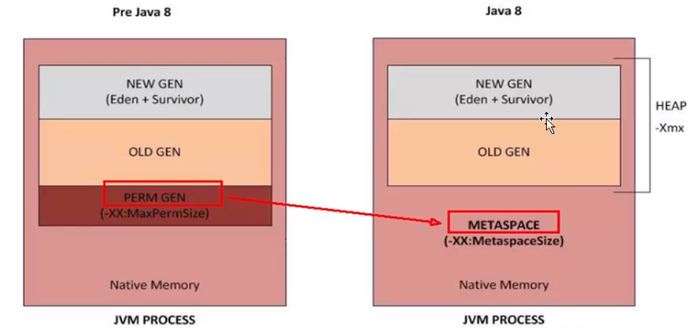


通过以下参数可以看到当前jvm堆内存划分

```bash
java -XX:+PrintGCDetails

Heap
 PSYoungGen      total 74752K, used 3871K [0x000000076d500000, 0x0000000772800000, 0x00000007c0000000)
  eden space 64512K, 6% used [0x000000076d500000,0x000000076d8c7c70,0x0000000771400000)
  from space 10240K, 0% used [0x0000000771e00000,0x0000000771e00000,0x0000000772800000)
  to   space 10240K, 0% used [0x0000000771400000,0x0000000771400000,0x0000000771e00000)
 ParOldGen       total 171008K, used 0K [0x00000006c7e00000, 0x00000006d2500000, 0x000000076d500000)
  object space 171008K, 0% used [0x00000006c7e00000,0x00000006c7e00000,0x00000006d2500000)
 Metaspace       used 3198K, capacity 4554K, committed 4864K, reserved 1056768K
  class space    used 353K, capacity 386K, committed 512K, reserved 1048576K


```


### 堆空间大小设置

- -Xms10m 设置堆初始值
- -Xmx10m 设置堆最大值

> 通常会将-Xms 和 -Xmx 两个参数配置相同的值，其目的是为了能够在java垃圾回收机制清理完堆区后不需要重新分割计算堆区的大小(设置成固定大小，防止频繁的扩容和释放，减小系统压力)，从而提高性能

默认情况下：

初始堆内存大小：本地物理内存大小/64
最大堆内存大小：本地物理内存大小/4


### 年轻代和老年代

JVM中的JAVA对象可以被划分两类：

- 一类是生命周期较短的瞬时对象，这类对象的创建和消亡都非常迅速；
- 一类是生命周期较长的长久对象，在某些极端情况下能够与JVM生命周期保持一致。

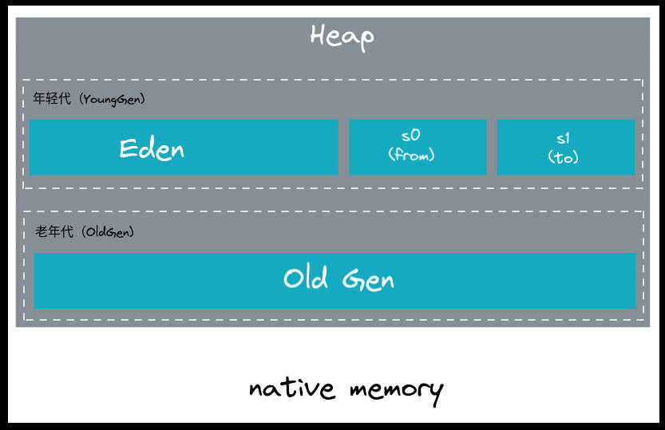


新生代和老年代的结构占比：

- 默认 **-XX:NewRatio=2**, 表示新生代占1,老年代占2,新生代占整个堆的1/3
- 默认 **-XX:SurvivorRatio=8**, 表示Eden(伊甸园区)和另外两个Survivor(幸存者区)所占的比例是8：1：1


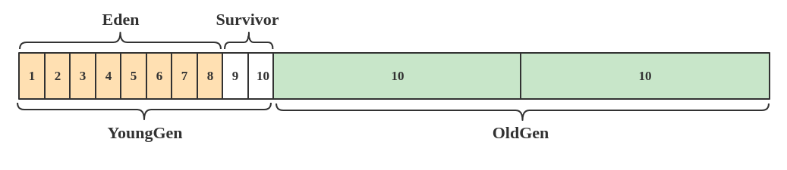


1. 几乎所有的java对象都是在Eden区被new出来的。(<mark>如果对象特别大，Eden放不下，会直接进入老年代</mark>)
2. 绝大部分的java对象的销毁都是在新生代进行了。（<mark>新生代中80%的对象都是”朝生夕死“的</mark>）
3. 可以使用`-Xmn`设置新生代最大内存大小(<mark>这个参数一般不设置)</mark>


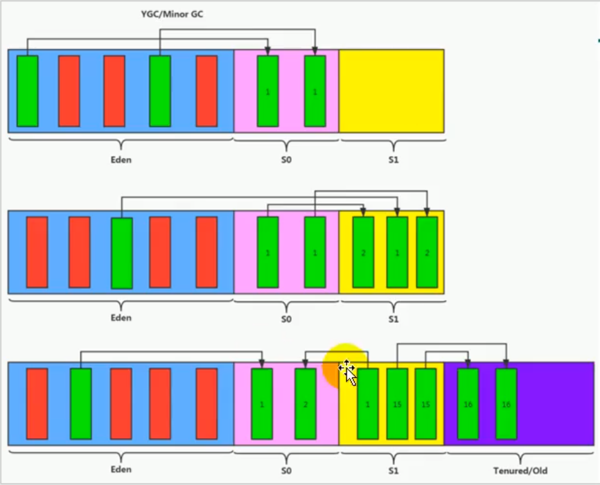

总计：

幸存者S0、S1区：复制之后有交换，谁空谁是to.
GC：频繁在年轻代收集，很少在老年代收集，几乎不在永久区、元空间收集（jdk8+）（方法区）
Eden空间不足会触发MinorGC(YGC),Survivor空间不足不会触发YGC（对象会直接进入老年代），但是YGC会回收Survivor区


## Minor GC(YGC)、Major GC、Full GC


JVM在进行GC时，并非每次都对（新生代、老年代、方法区）区域一起回收的，大部分时候回收的都是指新生代。

HotSpot VM的实现，GC按照回收区域分两类：

- 部分收集（partial GC)
- 整体手机 (Full GC)

部分收集又分为：
- 新生代收集（Minor GC/Young GC):只是新生代（Eden、Survivor）的垃圾收集
- 老年代收集（Major GC/Old GC):只是老年代的垃圾收集。（只有CMS GC会单独收集老年代）
- 混合收集（Mixed GC):收集整个新生代和部分老年代的垃圾收集。（目前只有G1 GC支持）
整堆收集：Full GC, 收集整个java堆和方法区的垃圾收集。


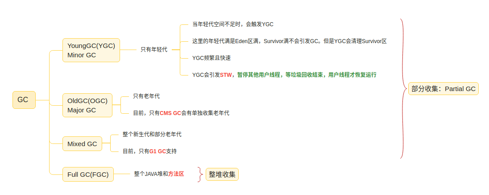


### MinorGC/YGC

- 年轻代Eden空间不足会触发YGC，YGC会清理Survivor区
- 频繁且快速
- STW


###　老年代GC（Major GC/Full GC）触发机制：

- 指发生在老年代的GC，对象从老年代消失时，我们说”Major GC"或“Full GC"发生了
- 出现Major GC,经常会伴随至少一次的Minor GC（但非绝对，平行垃圾回收器有直接进行Major GC策略选择过程）
- Major GC的速度一般会比MinorGC慢10倍以上，STW的时间更长
- 如果Major GC后内存还不足就报OOM了


### FullGC

- System.gc()
- 老年代空间不足
- 方法区空间不足
- 通过MinorGC后进入老年代的平均大小大于老年代的可用内存
- to区空间不足对象到老年代，老年代空间也不足


## 方法区

### 栈、堆和方法区的交互关系

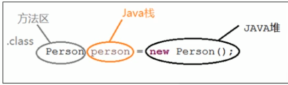

### 理解

1. 多线程共享区域
2. 存储类元数据信息（例如：运行时常量池、字段、方法元数据)
3. 逻辑上可以认为方法区是堆空间的一部分，实际上方法区可以不进行垃圾回收也不进行压缩
4. 方法区规范没有指定具体位置，和存储数据。（jdk8+由堆内存升级到了本地内存）
5. 可以固定大小，也可以动态扩缩。

> 《Java虚拟机规范》中明确说明：尽管所有的方法区在逻辑上是属于堆的一部分，但一些简单的实现可能不会选择去进行垃圾回收或者压缩
> HotSpot VM 而言，方法区还有一个别名叫Non-Heap(非堆)，目地就是要和堆分开。


JDK7及以前，习惯上把方法区，称为永久代。JDK8开始，使用元空间取代了永久代。（仅对HotSpot而言，永久代和元空间都是对方法区的实现。其他虚拟机不存在永久代，实践证明，当年使用永久代不是一个好的idea,导致java程序更容易OOM）


到了JDK8，终于完全废弃了永久代的概念，使用本地内存中实现的元空间（Metaspace)来代替。

元空间的本质和永久代类似，都是对JVM规范中方法区的实现。不过元空间和永久代最大的区别在于：<font color="red">元空间不在虚拟机设置的内存中，而是使用本地内存。</font>

永久代、元空间不只是名字变了，内部结构也调整了。

根据《Java虚拟机规范》的规定，如果方法区无法满足新的内存分配需求时，将抛出OOM异常。


### 设置大小

- 默认
    - 寄宿在本地内存，动态扩容和压缩的。
- 设置固定大小
    - -XX:MetaspaceSize   初始大小。默认21M
    - -XX:MaxMetaspaceSize  最大大小。默认-1,即没有限制。

### 垃圾回收

方法区的垃圾回收主要回收两部分内容：常量池中废弃的常量和不再使用的类型。
《Java虚拟机规范》对方法区的约束是非常宽松的，不要求虚拟机在方法区中实现垃圾回收。这个区域的回收效果比较难以令人满意，尤其是类型的卸载，条件相当苛刻。


