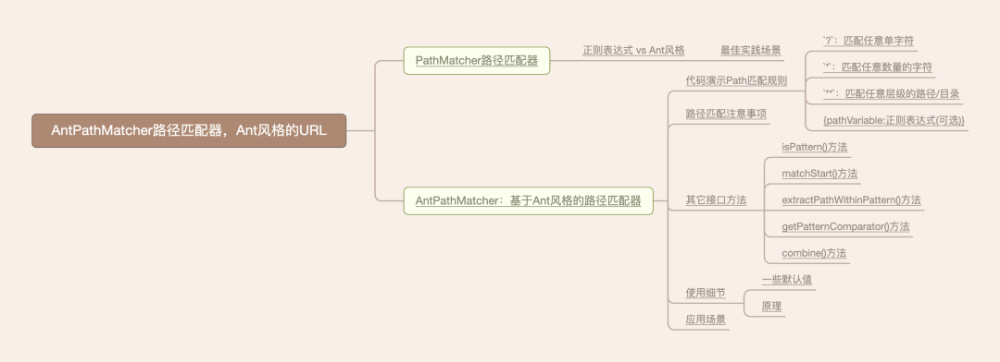

> ❝ 用几个小时来制定计划，可以节省几周的编程时间。本文已被https://yourbatman.cn收录；公号后台回复“**专栏列表**”获取全部小而美的**原创**技术专栏 ❞

你好，我是**YourBatman**。

- @RequestMapping的URL是支持Ant风格的
- @ComponentScan的扫描包路径是支持Ant风格的
- @PropertySource导入资源是支持Ant分隔的（如：classpath:app-\*.properties）
- ...

在描述路径时有个常见叫法：**Ant风格的URL**。那么到底什么是Ant风格？关于这个概念，我特地的谷歌一下、百度一下、bing一下，无一所获（没有一个确切的定义），难道这个盛行的概念真的只能意会吗？

直到我在Spring中`AntPathMatcher`的描述中看到一句话：这是从Apache Ant借用的一个概念。“年轻”的朋友可能从没用过甚至没听过Ant，它是一个构建工具，在2010年之前发挥着大作用，但之后逐渐被Maven/Gradle取代，现已几乎销声匿迹。虽然Ant“已死”，但Ant风格似乎要千古。借助Spring强大的号召力，该概念似乎已是规范一样的存在，大家在不成文的约定着、交流着、书写着。

那么，既然Ant风格贯穿于开发的方方面面，怀着一知半解的态度使用着实为不好。今天咱们就深入聊聊，进行全方位的讲解。

## 所属专栏

-   [点拨-Spring技术栈](https://mp.weixin.qq.com/mp/appmsgalbum?__biz=MzI0MTUwOTgyOQ==&action=getalbum&album_id=1914508501259730944#wechat_redirect)
    

## 本文提纲



## 版本约定

-   JDK：**8**
-   Spring Framework：**5.3.x**

在Spring 5之前，Spring技术栈体系内几乎所有的Ant风格均由AntPathMatcher提供支持。

## PathMatcher路径匹配器

PathMatcher是抽象接口，该接口抽象出了**路径匹配器**的概念，用于对path路径进行匹配。它提供如下方法：

> 细节：PathMatcher所在的包为`org.springframework.util.PathMatcher`，属于spring-core核心模块，表示它可运用在任意模块，**not only for web**。

```java
// Since: 1.2  
public interface PathMatcher {

 boolean isPattern(String path);  
 boolean match(String pattern, String path);  
 boolean matchStart(String pattern, String path);  
 String extractPathWithinPattern(String pattern, String path);  
 Map<String, String> extractUriTemplateVariables(String pattern, String path);  
 Comparator<String> getPatternComparator(String path);  
 String combine(String pattern1, String pattern2);  
}

```

一个路径匹配器提供这些方法在情理之中，这些方法见名知意理解起来也不难，下面稍作解释：

-   **boolean isPattern(String path)**：判断path是否是一个模式字符串（一般含有指定风格的特殊通配符就算是模式了）
-   **boolean match(String pattern, String path)**：最重要的方法。判断path和模式pattern是否匹配（注意：二者都是字符串，传值不要传反了哈）
-   **boolean matchStart(String pattern, String path)**：判断path是否和模式pattern前缀匹配（前缀匹配：path的前缀匹配上patter了即可，当然全部匹配也是可以的）
-   **String extractPathWithinPattern(String pattern, String path)**：返回和pattern模式真正匹配上的那部分字符串。举例：`/api/yourbatman/*.html`为pattern，`/api/yourbatman/form.html`为path，那么该方法返回结果为`form.html`（注意：返回结果永远不为null，可能是空串）
-   **Map<String, String> extractUriTemplateVariables(String pattern, String path)**：提取path中模板变量。举例：`/api/yourbatman/{age}`为pattern，`/api/yourbatman/18`为path，那么该方法返回结果为Map值为`{"age" : 18}`
-   **ComparatorgetPatternComparator(String path)**：路径比较器，用于排序确定优先级高低
-   **String combine(String pattern1, String pattern2)**：合并两个pattern模式，组合算法由具体实现自由决定

该接口规定了作为路径匹配器一些必要的方法，同时也开放了一些行为策略如`getPatternComparator、combine`等由实现类自行决定。或许你还觉得这里某些方法有点抽象，那么下面就开始实战。

### 正则表达式 vs Ant风格


**正则表达式(regular expression)**：描述了一种字符串匹配的模式（pattern），可以用来检查一个串是否含有某种子串、将匹配的子串替换或者从某个串中取出符合某个条件的子串等。

正则表达式是由普通字符（例如字符a到z）以及特殊字符（又称"元字符"）组成的文字模式。重点是它的元字符，举例说明：

-   `?`：匹配前面的子表达式零次或一次
-   `*`：匹配前面的子表达式零次或多次
-   `+`：匹配前面的子表达式一次或多次
-   `.`：匹配除换行符 \\n 之外的任何**单**字符
-   ...

正则表达式几乎所有编程语言都支持的通用模式，具有普适性（适用于任意字符串的匹配）、功能非常强大等特点。除此之外正则表达式还有“重”、“难”等特点，具有一定上手门槛、高并发情况下执行效率低也都是它摆脱不了的“特性”。


**Ant风格（Ant Style）**：该风格源自Apache的Ant项目，若你是个“老”程序员或许你还用过Apache Ant，若你是个小鲜肉也许闻所未闻，毕竟现在是Maven（Gradle）的天下。

Ant风格简单的讲，它是一种精简的匹配模式，仅用于匹配**路径or目录**。使用**大家熟悉的**（这点很关键）的通配符：

| 通配符 | 说明                        |
|--------|-----------------------------|
| `?`    | 匹配任意**单**字符          |
| `*`    | 匹配**任意数量**的字符      |
| `**`   | 匹配**任意层级**的路径/目录 |

看到没，这才比较符合咱们的习惯：`*`代表任意通配符才是正解嘛，而不是像正则一样代表匹配的数量来得让人“费解”。

> `**`直接用于目录级别的匹配，可谓对URL这种字符串非常友好

#### 最佳实践场景

正则表达式具有功能非常强大的特性，从理论上来讲，它可以用于任何场景，但是有些场景它**并非**最佳实践。

举个例子：在自定义的登录过滤器中，经常会放行一些API接口让免登录即可访问，这是典型的URL白名单场景，这个时候就会涉及到URL的匹配方式问题，一般会有如下方案：

-   精确匹配：`url.equals("/api/v1/yourbatman/adress")`。缺点：硬编码式一个个罗列，易造成错误且不好维护
-   前缀匹配：`url.startsWith("/api/v1/yourbatman")`。这也算一种匹配模式，可以批量处理某一类URL。缺点是：匹配范围过大易造成误伤，或者范围过小无法形成有效匹配，总之就是欠缺灵活度
-   包含匹配：`url.contains("/yourbatman")`。这个缺点比较明显：强依赖于URL的书写规范（如白名单的URL都必须包含指定子串），并且**极易**造成误伤
-   正则表达式匹配：`Pattern.compile("正则表达式")..matcher(url).find()`。它的最大优点是可以满足几乎任意的URL（包括精确、模式等），但最大的缺点是书写比较复杂，用时多少这和coder的水平强相关，另外这对后期维护也带来了一定挑战~

经常会听到这样一句话：“通过正则表达式或者Ant风格的路径表达式来做URL匹配”。正所谓“杀鸡何必用牛刀”，**URL相较于普通的字符串具有很强的规律性**：标准的分段式。因此，使用轻量级Ant风格表达式作为URL的匹配模式更为合适：

1.  轻量级执行效率高
2.  通配符（模式）符合正常理解，使用门槛非常低
3.  `*`和`**`对层级路径/目录的支持感觉就是为此而生的
4.  对于复杂场景亦可包含正常表达式来达到通用性

总的来讲，所谓为谁更好。Ant风格和正则表达式都有它们场景的最佳实践：

-   **Ant风格**：用于URL/目录这种标准分段式路径匹配
-   **正则表达式**：用于几乎没规律（或者规律性不强）的普通字符串匹配

## AntPathMatcher：基于Ant风格的路径匹配器

PathMatcher接口并未规定路径匹配的具体方式，在Spring的整个技术栈里（包括Spring Boot和Cloud）**有且仅有一个**实现类AntPathMatcher：基于Ant风格的路径匹配器。它运用在Spring技术栈的方方面面，如：URL路径匹配、资源目录匹配等等。

这里有个有趣的现象：**AntPathMatcher**是Since:16.07.2003，而其接口**PathMatcher**是Since:1.2（2005.12）整整晚了2年+才出现。Spring当初的设想是把路径匹配抽象成为一种模式（也就是PathMatcher）而不限定具体实现，但奈何近20年过去了**AntPathMatcher**仍旧为**PathMatcher**接口的唯一实现。

> 说明：Spring 5新增了更高效的、设计更好的、全新的路径匹配器`PathPattern`，但它并未实现PathMatcher接口而是一套全新“生态”，用于逐步替换掉AntPathMatcher。关于此，下篇文章有详尽分析

说一千，道一万。了解**PathMatcher/AntPathMatcher**最为重要的是什么？当然是了解它的匹配规则，做到心里有数。安排，下面我就通过代码示例方式演示其匹配，尽量做到全乎，让你一文在手全部都有。

### 代码演示Path匹配规则

要什么记忆，有这些代码示例收藏起来就足够了。

在具体代码示例之前，公示所有示例的公有代码如下：

```java
private static final PathMatcher MATCHER = new AntPathMatcher();  
```

使用**缺省的** AntPathMatcher实例，并且API的使用全部面向`PathMatcher`接口而非具体实现类。

```java
private static void match(int index, PathMatcher matcher, String pattern, String reqPath) {  
    boolean match = matcher.match(pattern, reqPath);  
    System.out.println(index + "\tmatch结果：" + pattern + "\t" + (match ? "【成功】" : "【失败】") + "\t" + reqPath);  
}

private static void extractUriTemplateVariables(PathMatcher matcher, String pattern, String reqPath) {  
    Map<String, String> variablesMap = matcher.extractUriTemplateVariables(pattern, reqPath);  
    System.out.println("extractUriTemplateVariables结果：" + variablesMap + "\t" + pattern + "\t" + reqPath);  
}

```

对`PathMatcher`最常用的match方法、extractUriTemplateVariables方法做简易封装，主要为了输出日志，方便控制台里对应着查看。

#### `?`：匹配任意单字符

因为是匹配单字符，所以一般“夹杂”在某个path片段内容**中间**

```java
@Test  
public void test1() {  
    System.out.println("=======测试?：匹配任意单个字符=======");  
    String pattern = "/api/your?atman";

    match(MATCHER, pattern, "/api/youratman");  
    match(MATCHER, pattern, "/api/yourBatman");  
    match(MATCHER, pattern, "/api/yourBatman/address");  
    match(MATCHER, pattern, "/api/yourBBBatman");  
}

=======匹配任意单字符=======  
1 match结果：/api/your?atman 【失败】 /api/youratman  
2 match结果：/api/your?atman 【成功】 /api/yourBatman  
3 match结果：/api/your?atman 【失败】 /api/yourBatman/address  
4 match结果：/api/your?atman 【失败】 /api/yourBBBatman

```

关注点：

1.  ?表示匹配精确的1个字符，所以0个不行（如结果1）
2.  即使?匹配成功，但“多余”部分和pattern并不匹配最终结果也会是false（如结果3,4）

#### `*`：匹配任意数量的字符

因为是匹配任意数量的字符，所以一般使用`*`来代表URL的**一个**层级

```java
@Test  
public void test2() {  
    System.out.println("=======*:匹配任意数量的字符=======");  
    String pattern = "/api/*/yourbatman";

    match(1, MATCHER, pattern, "/api//yourbatman");  
    match(2, MATCHER, pattern, "/api/ /yourbatman");  
    match(2, MATCHER, pattern, "/api/yourbatman");  
    match(3, MATCHER, pattern, "/api/v1v2v3/yourbatman");  
}

=======*:匹配任意数量的字符=======  
1 match结果：/api/*/yourbatman 【失败】 /api//yourbatman  
2 match结果：/api/*/yourbatman 【成功】 /api/ /yourbatman  
3 match结果：/api/*/yourbatman 【失败】 /api/yourbatman  
4 match结果：/api/*/yourbatman 【成功】 /api/v1v2v3/yourbatman

```

关注点：

1.  路径的//间必须有内容（即使是个空串）才能被\*匹配到
2.  `*`只能匹配具体某一层的路径内容

#### `**`：匹配任意层级的路径/目录

匹配任意层级的路径/目录，这对URL这种类型字符串及其友好。

```java
@Test  
public void test3() {  
    System.out.println("=======**:匹配任意层级的路径/目录=======");  
    String pattern = "/api/yourbatman/**";

    match(1, MATCHER, pattern, "/api/yourbatman");  
    match(2, MATCHER, pattern, "/api/yourbatman/");  
    match(3, MATCHER, pattern, "/api/yourbatman/address");  
    match(4, MATCHER, pattern, "/api/yourbatman/a/b/c");  
}

=======**:匹配任意层级的路径/目录=======  
1 match结果：/api/yourbatman/** 【成功】 /api/yourbatman  
2 match结果：/api/yourbatman/** 【成功】 /api/yourbatman/  
3 match结果：/api/yourbatman/** 【成功】 /api/yourbatman/address  
4 match结果：/api/yourbatman/** 【成功】 /api/yourbatman/a/b/c  


```

`**`其实不仅可以放在末尾，还可放在中间。

```
@Test  
public void test4() {  
    System.out.println("=======**:匹配任意层级的路径/目录=======");  
    String pattern = "/api/**/yourbatman";

    match(1, MATCHER, pattern, "/api/yourbatman");  
    match(2, MATCHER, pattern, "/api//yourbatman");  
    match(3, MATCHER, pattern, "/api/a/b/c/yourbatman");  
}

=======**:匹配任意层级的路径/目录=======  
1 match结果：/api/**/yourbatman 【成功】 /api/yourbatman  
2 match结果：/api/**/yourbatman 【成功】 /api//yourbatman  
3 match结果：/api/**/yourbatman 【成功】 /api/a/b/c/yourbatman  


```

关注点：

1.  `**`的匹配“能力”非常的强，几乎可以匹配一切：任意层级、任意层级里的任意“东西”
2.  `**`在AntPathMatcher里即可使用在路径中间，也可用在末尾

#### {pathVariable:正则表达式(可选)}

该语法的匹配规则为：将**匹配到的path内容**赋值给pathVariable。

```java
@Test  
public void test5() {  
    System.out.println("======={pathVariable:可选的正则表达式}=======");  
    String pattern = "/api/yourbatman/{age}";

    match(1, MATCHER, pattern, "/api/yourbatman/10");  
    match(2, MATCHER, pattern, "/api/yourbatman/Ten");

    // 打印提取到的内容  
    extractUriTemplateVariables(MATCHER, pattern, "/api/yourbatman/10");  
    extractUriTemplateVariables(MATCHER, pattern, "/api/yourbatman/Ten");  
}

======={pathVariable:可选的正则表达式}=======  
1 match结果：/api/yourbatman/{age} 【成功】 /api/yourbatman/10  
2 match结果：/api/yourbatman/{age} 【成功】 /api/yourbatman/Ten  
extractUriTemplateVariables结果：{age=10} /api/yourbatman/{age} /api/yourbatman/10  
extractUriTemplateVariables结果：{age=Ten} /api/yourbatman/{age} /api/yourbatman/Ten

```

> 熟不熟悉？一不小心，这不碰到了Spring-Web中`@PathVariable`的底层原理（之一）么？

可能你能察觉到，age是int类型，不应该匹配到Ten这个值呀。这个时候我们就可以结合正则表达式来做进一步约束啦。

```java
@Test  
public void test6() {  
    System.out.println("======={pathVariable:可选的正则表达式}=======");  
    String pattern = "/api/yourbatman/{age:[0-9]*}";

    match(1, MATCHER, pattern, "/api/yourbatman/10");  
    match(2, MATCHER, pattern, "/api/yourbatman/Ten");

    // 打印提取到的内容  
    extractUriTemplateVariables(MATCHER, pattern, "/api/yourbatman/10");  
    extractUriTemplateVariables(MATCHER, pattern, "/api/yourbatman/Ten");  
}

======={pathVariable:可选的正则表达式}=======  
1 match结果：/api/yourbatman/{age:[0-9]*} 【成功】 /api/yourbatman/10  
2 match结果：/api/yourbatman/{age:[0-9]*} 【失败】 /api/yourbatman/Ten  
extractUriTemplateVariables结果：{age=10} /api/yourbatman/{age:[0-9]*} /api/yourbatman/10  
java.lang.IllegalStateException: Pattern "/api/yourbatman/{age:[0-9]*}" is not a match for "/api/yourbatman/Ten"

```

关注点：

1.  该匹配方式可以结合正则表达式一起使用对具体值做约束，但正则表示式是可选的
2.  只有匹配成功了，才能调用`extractUriTemplateVariables(...)`方法，否则抛出异常

### 路径匹配注意事项

请确保模式和路径都属于同一种类型的路径才有匹配的意义：要么都是绝对路径，要么都是相对路径。当前，强烈建议是绝对路径（以/开头）。

在实操中，建议在调用匹配逻辑之前统一对path路径进行“清理”（如Spring提供的`StringUtils#cleanPath`方法的做法）：使得确保其均以`/`开头，因为这样在其上下文中匹配才是有意义的。

### 其它接口方法

对于路径匹配器接口`PathMatcher`来讲最最最重要的当属match方法。为了雨露均沾，下面对其它几个方法捎带解释以及用代码示例一波。

#### isPattern()方法

```java
@Test  
public void test7() {  
    System.out.println("=======isPattern方法=======");

    System.out.println(MATCHER.isPattern("/api/yourbatman"));  
    System.out.println(MATCHER.isPattern("/api/your?atman"));  
    System.out.println(MATCHER.isPattern("/api/*/yourBatman"));  
    System.out.println(MATCHER.isPattern("/api/yourBatman/**"));  
}

false  
true  
true  
true

```

关注点：

1.  只要含有`? * ** {xxx}`这种特殊字符的字符串都属于模式

#### matchStart()方法

它和match方法非常像，区别为：

-   match：要求全路径**完全匹配**
-   matchStart：模式部分匹配上，然后其它部分（若还有）是空路径即可

```java
@Test  
public void test8() {  
    System.out.println("=======matchStart方法=======");  
    String pattern = "/api/?";

    System.out.println("match方法结果：" + MATCHER.match(pattern, "/api/y"));  
    System.out.println("match方法结果：" + MATCHER.match(pattern, "/api//"));  
    System.out.println("match方法结果：" + MATCHER.match(pattern, "/api////"));  
    System.out.println("matchStart方法结果：" + MATCHER.matchStart(pattern, "/api//"));  
    System.out.println("matchStart方法结果：" + MATCHER.matchStart(pattern, "/api////"));  
    System.out.println("matchStart方法结果：" + MATCHER.matchStart(pattern, "/api///a/"));

}

=======matchStart方法=======  
match方法结果：true  
match方法结果：false  
match方法结果：false  
matchStart方法结果：true  
matchStart方法结果：true  
matchStart方法结果：false

```

关注点：

1.  请对比结果，看出和match方法的差异性

matchStart方法的使用场景少之又少，即使在代码量巨大的Spring体系中，也只有唯一使用处：`PathMatchingResourcePatternResolver#doRetrieveMatchingFiles`


#### extractPathWithinPattern()方法

该方法通过一个实际的模式来确定路径的哪个部分是**动态匹配**的，换句话讲：该方法用户提取出动态匹配的那部分

> 说明：该方法永远不可能返回null

```java
@Test  
public void test9() {  
    System.out.println("=======extractPathWithinPattern方法=======");  
    String pattern = "/api/*.html";

    System.out.println("是否匹配成功：" + MATCHER.match(pattern, "/api/yourbatman/address")  
            + "，提取结果：" + MATCHER.extractPathWithinPattern(pattern, "/api/yourbatman/address"));  
    System.out.println("是否匹配成功：" + MATCHER.match(pattern, "/api/index.html")  
            + "，提取结果：" + MATCHER.extractPathWithinPattern(pattern, "/api/index.html"));  
}

=======extractPathWithinPattern方法=======  
是否匹配成功：false，提起结果：yourbatman/address  
是否匹配成功：true，提起结果：index.html

```

关注点：

1.  该方法和extractUriTemplateVariables()不一样，即使匹配不成功也能够返回**参与匹配**的那部分，有种“重在参与”的赶脚

下面再看个复杂点pattern情况（pattern里具有多个模式）表现如何：

```java
@Test  
public void test10() {  
    System.out.println("=======extractPathWithinPattern方法=======");  
    String pattern = "/api/**/yourbatman/*.html/temp";

    System.out.println("是否匹配成功：" + MATCHER.match(pattern, "/api/yourbatman/address")  
            + "，提取结果：" + MATCHER.extractPathWithinPattern(pattern, "/api/yourbatman/address"));  
    System.out.println("是否匹配成功：" + MATCHER.match(pattern, "/api/yourbatman/index.html/temp")  
            + "，提取结果：" + MATCHER.extractPathWithinPattern(pattern, "/api/yourbatman/index.html/temp"));  
}

=======extractPathWithinPattern方法=======  
是否匹配成功：false，提取结果：yourbatman/address  
是否匹配成功：true，提取结果：yourbatman/index.html/temp

```

关注点：

1.  该方法会返回**所有**参与匹配的片段，即使这匹配不成功
2.  若有多个模式（如本例中的\*\*和\*），返回的片段不会出现跳跃现象（只截掉前面的非pattern匹配部分，中间若出现非pattern匹配部分是不动的）

#### getPatternComparator()方法

此方法用于返回一个`Comparator<String>`比较器，用于对多个path之间进行排序。目的：让**更具体的** path出现在最前面，也就是所谓的精确匹配优先原则（也叫最长匹配规则（has more characters））。

```java
@Test  
public void test11() {  
    System.out.println("=======getPatternComparator方法=======");  
    List<String> patterns = Arrays.asList(  
            "/api/**/index.html",  
            "/api/yourbatman/*.html",  
            "/api/**/*.html",  
            "/api/yourbatman/index.html"  
    );  
    System.out.println("排序前：" + patterns);

    Comparator<String> patternComparator = MATCHER.getPatternComparator("/api/yourbatman/index.html");  
    Collections.sort(patterns, patternComparator);  
    System.out.println("排序后：" + patterns);  
}

=======getPatternComparator方法=======  
排序前：[/api/**/index.html, /api/yourbatman/*.html, /api/**/*.html, /api/yourbatman/index.html]  
排序后：[/api/yourbatman/index.html, /api/yourbatman/*.html, /api/**/index.html, /api/**/*.html]  


```

关注点：

1. 该方法拥有一个入参，作用为：用于判断是否是精确匹配，也就是用于确定**精确值的界限**的（根据此界限值进行排序）
2. 越精确的匹配在越前面。其中路径的匹配原则是**从左至右**（也就是说左边越早出现精确匹配，分值越高）

#### combine()方法

将两个方法“绑定”在一起。PathMatcher接口并未规定绑定的“规则”，完全由底层实现自行决定。如基于Ant风格的匹配器的拼接原则如下：记得`@RequestMapping`这个注解吧，它既可以标注在类上，亦可标注在方法上。把Pattern1比作标注在类上的path（若木有标注值就是null嘛），把Pattern2比作标注在方法上的path，它俩的**结果**不就可以参考上图了麽。一不小心又加深了点对`@RequestMapping`注解的了解有木有。

### 使用细节

AntPathMatcher作为PathMatcher路径匹配器模式的**唯一实现**，这里有些使用细节可以帮你加深对AntPathMatcher的了解。

#### 一些默认值

默认决定了AntPathMatcher的一些缺省行为，了解一下：

```java
public static final String DEFAULT_PATH_SEPARATOR = "/";  
```

默认使用`/`作为路径分隔符。若是请求路径（如http、RPC请求等）或者是Linux的目录名，一切相安无事。但若是Windows的目录地址呢？

> 说明：windows目录分隔符是`\`，如C:\\ProgramData\\Microsoft\\Windows\\Start Menu\\Programs\\7-Zip

```java
private static final Pattern VARIABLE_PATTERN = Pattern.compile("\\{[^/]+?}");  
```

当路径/目录里出现`{xxx:正则表达式}`这种模式的字符串就被认定为是VARIABLE\_PATTERN

```java
private static final char[] WILDCARD_CHARS = {'*', '?', '{'};  
```

不解释

#### 原理

AntPathMatcher采用**前缀树（trie树）** 算法对URL进行拆分、匹配。本类代码量还是不少的，整体呈现出比较臃肿的状态，代码行数达到了近1000行：或许可以对它进行关注点的拆分，但这似乎已无必要。因为Spring 5已新增的PathPattern能以更高的运行效率、更优雅的代码设计来替代扎根已久的AntPathMatcher，不知这是否能勾起你对PathPattern兴趣呢？

> 说明：这里对原理实现点到即止，对**前缀树（trie树）** 感兴趣的同学可专门研究，至少我也只了解个大概即止，这里就不班门弄斧了

## 应用场景

AntPathMatcher作为PathMatcher的**唯一实现**，所以Spring框架的逻辑处理里随处可见：

> 说明：AntPathMatcher默认使用`/`作为分隔符。你可根据实际情况在构造时自行指定分隔符（如windows是`\`，Lunux是`/`，包名是`.`）

在应用层面，Ant风格的URL、目录地址、包名地址也是随处可见：

- 扫包：@ComponentScan(basePackages = "cn.yourbatman.\*\*.controller")
- 加载资源：classpath: config/application-\*.yaml
- URL映射：@RequestMapping("/api/v1/user/{id}")
- ...

PathMatcher路径匹配器是spring-core核心包的一个基础组件，它带来的能力让Spring框架在路径/目录匹配上**极具弹性**，使用起来也是非常的方便。

> 再次强调：PathMatcher它属于spring-core，所以**not only for web**.

Ant风格虽然概念源自Apache Ant，但是借由Spring“发扬光大”。在整个Spring体系内，涉及到的URL匹配、资源路径匹配、包名匹配均是支持Ant风格的，底层由接口PathMatcher的唯一实现类`AntPathMatcher`提供实现。

AntPathMatcher不仅可以匹配Spring的@RequestMapping路径，也可以用来匹配各种字符串，包括文件资源路径、包名等等。由于它所处的模块是spring-core无其它多余依赖，因此若有需要（比如自己在写框架时）我们也可以把它当做**工具**来使用，简化开发。

## 推荐阅读

-   [2个周末，历时100+小时，YourBatman新版Blog正式上线](https://mp.weixin.qq.com/s?__biz=MzI0MTUwOTgyOQ==&mid=2247494239&idx=1&sn=c0eba8e7e43ab3c3825153f237427b44&scene=21#wechat_redirect)
-   [IDEA跟Eclipse险些打一架。Maven：都住手，我来一统天下](https://mp.weixin.qq.com/s?__biz=MzI0MTUwOTgyOQ==&mid=2247493739&idx=1&sn=0c8d4c00ec41862d033c93662cab554e&scene=21#wechat_redirect)
-   [如果程序员和产品经理都用凡尔赛文学对话......](https://mp.weixin.qq.com/s?__biz=MzI0MTUwOTgyOQ==&mid=2247490601&idx=1&sn=0a59c6f3c61e77370b8eaac600f431dd&scene=21#wechat_redirect)


```java
System.out.println("点个赞吧");  
echo('关注【BAT的乌托邦】');  
console.log("私聊YourBatman：fsx1056342982");  
```

> 我是`YourBatman`：一个早在2013年就已毕业的[大龄程序员](https://mp.weixin.qq.com/s?__biz=MzI0MTUwOTgyOQ==&mid=2247483765&idx=1&sn=591d5e6503aed1af1eb5ed8a053aea7c&scene=21#wechat_redirect)。网瘾失足、清考、延期毕业、房产中介、送外卖、销售...是我不可抹灭的标签。
