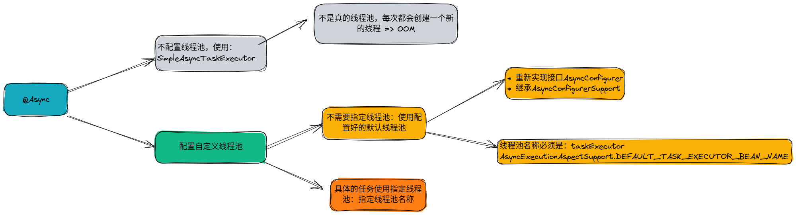
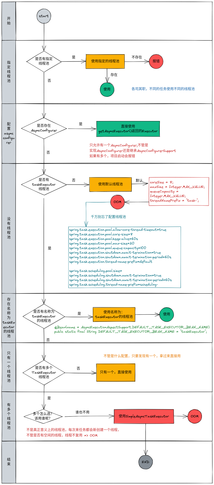
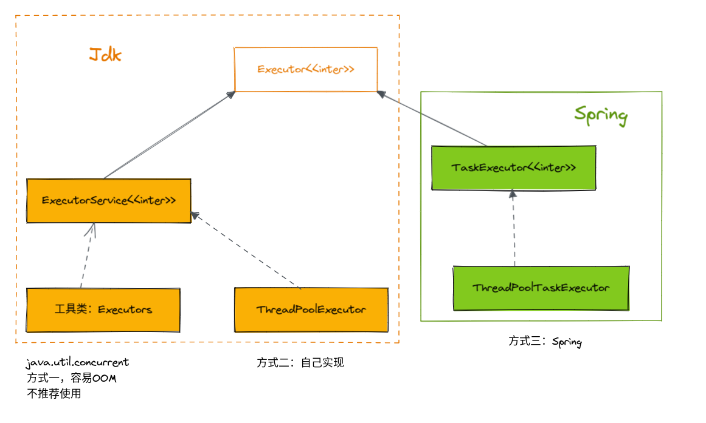
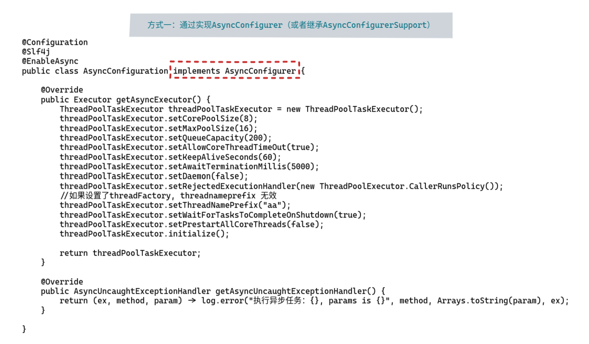
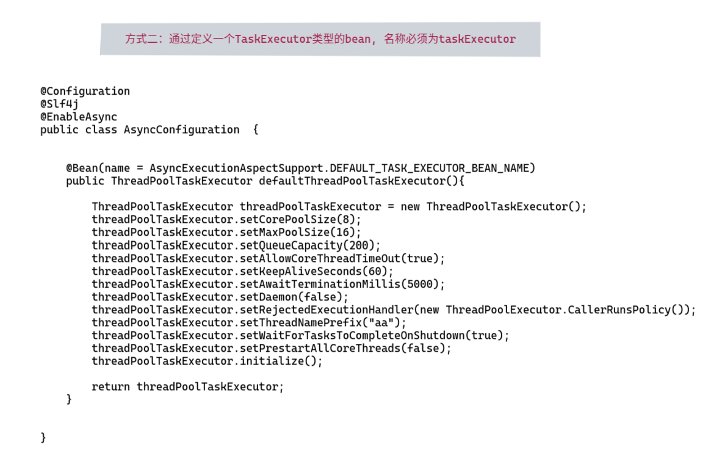
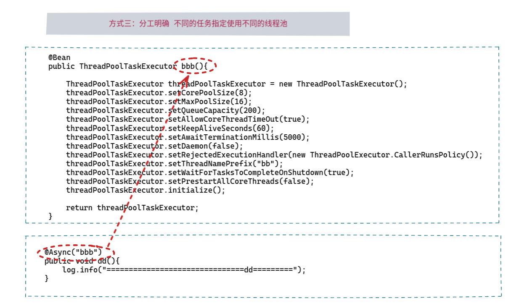

* 注意事项：

  1. 要使用`@EnableAsync`
  2. 由于实现原理是AOP, 因此私有方法、静态方法、类内部方法之间的相互调用(可以使用SpringUtil.getBean()获取代理类) 均无效
  3. 返回值只能是void和Future

> 上图不准确，请参照下图

对于异步方法调用，从Spring3开始提供了 **@Async** 注解，该注解可以被标在方法上，以便异步地调用该方法。调用者将在调用时立即返回，方法的实际执行将提交给Spring **TaskExecutor** 的任务中，由指定的线程池中的线程执行。

**在项目应用中，@Async调用线程池，推荐使用自定义线程池的模式。** 自定义线程池常用方案：重新实现接口AsyncConfigurer。

* 同步就是整个处理过程顺序执行，当各个过程都执行完毕，并返回结果。
* 异步调用则是只是发送了调用的指令，调用者无需等待被调用的方法完全执行完毕；而是继续执行下面的流程。

例如， 在某个调用中，需要顺序调用 A, B, C三个过程方法；如他们都是同步调用，则需要将他们都顺序执行完毕之后，方算作过程执行完毕；如B为一个异步的调用方法，则在执行完A之后，调用B，并不等待B完成，而是执行开始调用C，待C执行完毕之后，就意味着这个过程执行完毕了。

在Java中，一般在处理类似的场景之时，都是基于创建独立的线程去完成相应的异步调用逻辑，通过主线程和不同的业务子线程之间的执行流程，从而在启动独立的线程之后，主线程继续执行而不会产生停滞等待的情况。

## Spring 已经实现的线程池

- **SimpleAsyncTaskExecutor(默认)** ：不是真的线程池，这个类不重用线程，默认每次调用都会创建一个新的线程。
- SyncTaskExecutor：这个类没有实现异步调用，只是一个同步操作。只适用于不需要多线程的地方。
- ConcurrentTaskExecutor：Executor的适配类，不推荐使用。如果ThreadPoolTaskExecutor不满足要求时，才用考虑使用这个类。
- SimpleThreadPoolTaskExecutor：是Quartz的SimpleThreadPool的类。线程池同时被quartz和非quartz使用，才需要使用此类。
- **ThreadPoolTaskExecutor(推荐)：最常使用，推荐。其实质是对java.util.concurrent.ThreadPoolExecutor的包装。**

异步的方法有

-   最简单的异步调用，返回值为void
-   带参数的异步调用，异步方法可以传入参数
-   存在返回值，常调用返回Future

## Spring中启用@Async

* `@EnableAsync` 注解

## @Async应用默认线程池

Spring应用默认的线程池，指在@Async注解在使用时，不指定线程池的名称。查看源码，@Async的默认线程池为SimpleAsyncTaskExecutor。

* 无返回值调用: 基于@Async无返回值调用，直接在使用类，使用方法（建议在使用方法）上，加上注解。若需要抛出异常，需手动new一个异常抛出。
* 有返回值Future调用
* 有返回值CompletableFuture调用

### 默认线程池的弊端

在线程池应用中，参考阿里巴巴java开发规范：线程池不允许使用Executors去创建，不允许使用系统默认的线程池，推荐通过ThreadPoolExecutor的方式，这样的处理方式让开发的工程师更加明确线程池的运行规则，规避资源耗尽的风险。

Executors各个方法的弊端：

- newFixedThreadPool和newSingleThreadExecutor：主要问题是堆积的请求处理队列可能会耗费非常大的内存，甚至OOM。
- newCachedThreadPool和newScheduledThreadPool：要问题是线程数最大数是Integer.MAX_VALUE，可能会创建数量非常多的线程，甚至OOM。

@Async默认异步配置使用的是SimpleAsyncTaskExecutor，该线程池默认来一个任务创建一个线程，若系统中不断的创建线程，最终会导致系统占用内存过高，引发OutOfMemoryError错误。针对线程创建问题，SimpleAsyncTaskExecutor提供了限流机制，通过concurrencyLimit属性来控制开关，当concurrencyLimit>=0时开启限流机制，默认关闭限流机制即concurrencyLimit=-1，当关闭情况下，会不断创建新的线程来处理任务。基于默认配置，SimpleAsyncTaskExecutor并不是严格意义的线程池，达不到线程复用的功能。

## @Async应用自定义线程池

自定义线程池，可对系统中线程池更加细粒度的控制，方便调整线程池大小配置，线程执行异常控制和处理。在设置系统自定义线程池代替默认线程池时，虽可通过多种模式设置，但替换默认线程池最终产生的线程池有且只能设置一个（不能设置多个类继承AsyncConfigurer）自定义线程池有如下模式：

- 重新实现接口AsyncConfigurer
- 继承AsyncConfigurerSupport
- 配置由自定义的TaskExecutor替代内置的任务执行器

**通过查看Spring源码关于@Async的默认调用规则，会优先查询源码中实现AsyncConfigurer这个接口的类，实现这个接口的类为AsyncConfigurerSupport。但默认配置的线程池和异步处理方法均为空，所以，无论是继承或者重新实现接口，都需指定一个线程池。且重新实现 public Executor getAsyncExecutor()方法。**

1. 实现接口AsyncConfigurer
2. 继承AsyncConfigurerSupport
3. 配置自定义的TaskExecutor

**由于AsyncConfigurer的默认线程池在源码中为空，Spring通过beanFactory.getBean(TaskExecutor.class)先查看是否有线程池，未配置时，通过beanFactory.getBean(DEFAULT_TASK_EXECUTOR_BEAN_NAME, Executor.class)，又查询是否存在默认名称为TaskExecutor的线程池。所以可在项目中，定义名称为TaskExecutor的bean生成一个默认线程池。也可不指定线程池的名称，申明一个线程池，本身底层是基于TaskExecutor.class便可。**

这样的模式，最终底层为TaskExecutor.class，在替换默认的线程池时，可不指定线程池名称。
