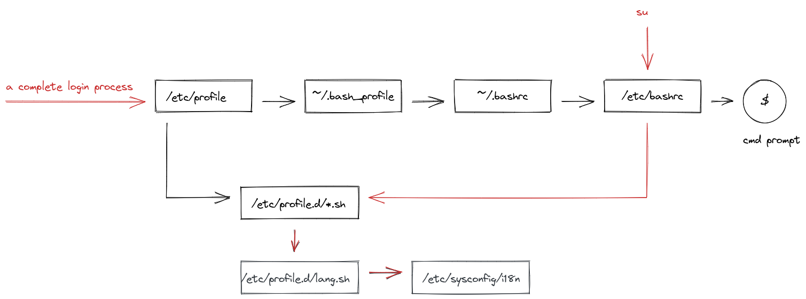

## source 文件

* `/etc/profile`
* `/etc/profile.d/*.sh`
* `/etc/bashrc`
* `~/.bashrc`
* `~/.bash_profile`

| 文件                  | scope          |
|-----------------------|----------------|
| `/etc/profile`        | 对所有用户生效 |
| `/etc/profile.d/*.sh` | 对所有用户生效 |
| `/etc/bashrc`         | 对所有用户生效 |
| `~/.bashrc`           | 对当前用户生效 |
| `~/.bash_profile`     | 对当前用户生效 |

## 登录过程

