#### Docker网络原理

容器是相对独立的环境，相当于一个小型的Linux系统，外界无法直接访问，那他是怎么做的呢，这里我们先了解下Linux veth pair。

### 1. Linux veth pair

veth pair是成对出现的一种虚拟网络设备接口，一端连着网络协议栈，一端彼此相连。如下图所示：

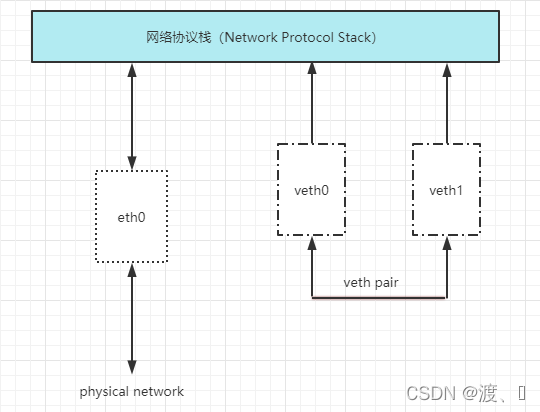

veth pair将两个网络veth0和veth1连通。

### 2. 理解Docker0

我们先查看本地ip

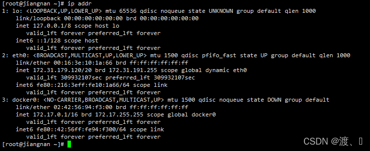

这里我们分析可得，有三个网络：

```
lo      127.0.0.1        # 本机回环地址eth0    
172.31.179.120   # 阿里云的私有IP（如果你是虚拟机就是虚拟机的ip）
docker0 172.17.0.1       # docker网桥
```

lo和eth0在我们的虚拟机启动的时候就会创建，但是docker0在我们安装了docker的时候就会创建。docker0用来和虚拟机之间通信。

**问题：Docker 是如何处理容器网络访问的？**

我们先启动一个tomcat容器来说明。

```
# docker pull tomcat
# docker images
REPOSITORY   TAG       IMAGE ID       CREATED        SIZE
tomcat       latest    fb5657adc892   2 months ago   680MB
# docker run -d -p 8081:8080 --name tomcat01 tomcat
914a7d82b017f63f81c6eba49af5471441f1946c9d45509b69ab2c50c2713b6f
```

这里启动了tomcat01，我们再来查看网络
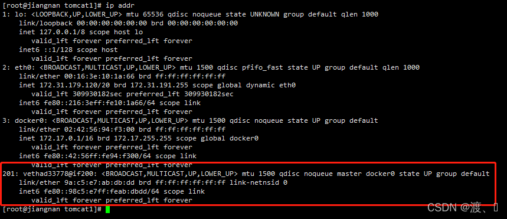

发现：我们前面查看的时候还是三组网卡，当启动了一个tomcat容器之后，多了一组网卡201: vethad33778@if200，而且还是成对的。同样我们再来启动一个tomcat02会又多出一对网卡。

进入了tomcat01容器内可以看到tomcat01对应的ip地址为：172.17.0.2
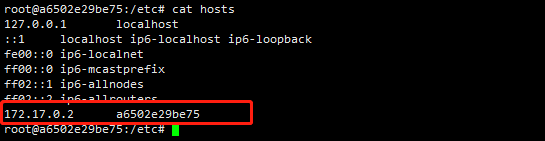

在宿主机上也可ping通。
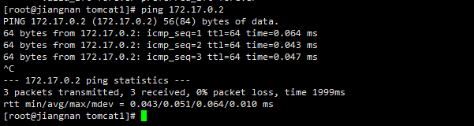

说明：tomcat02对应的ip为172.17.0.3，也可以ping通。

结论：我们每启动一个容器，就会多出一对网卡，同时他们被连接到docker0上，而docker0又和虚拟机之间连通。
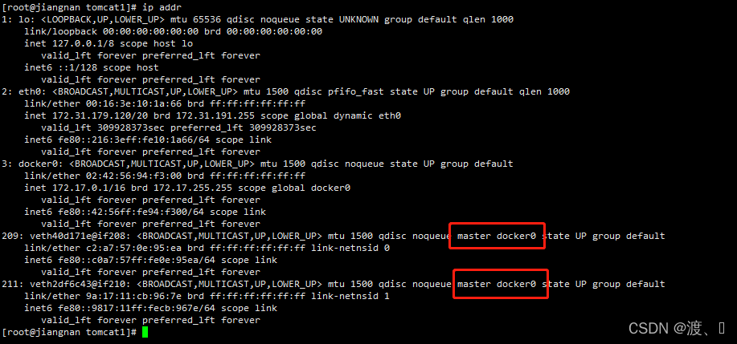

也可以通过inspect查看。

```
# docker network ls
NETWORK ID     NAME      DRIVER    SCOPE
4d3e75606593   bridge    bridge    local   # 这个就是docker0
8e92ee24e5f6   host      host      local
e85ffb1f2cc3   none      null      local
[root@jiangnan tomcat1]# docker inspect 4d3e75606593
"IPAM": {   
            "Driver": "default",
            "Options": null,
            "Config": [
                {
                    "Subnet": "172.17.0.0/16",
                    "Gateway": "172.17.0.1"    # 网关
                }
            ]
        },


"Containers": {   # 容器
            "15910ee083965d60c46bf9b3b292570fef9b8925905aa4df90c6d48142bb2eee": {
                "Name": "tomcat01",
                "EndpointID": "9c7a5ab65f1fc91b1d92ad61dec9b2f518f67f69f662522483dca789616f42aa",
                "MacAddress": "02:42:ac:11:00:02",
                "IPv4Address": "172.17.0.2/16",
                "IPv6Address": ""
            },
            "6c9a6a5d8eca9ad52926008c7b30516d23293ff8ad1f38947957d571431d5297": {
                "Name": "tomcat02",
                "EndpointID": "f83c1e643236cd65f50fba03929ca14d5df8d135b1f6cb8adf203cf96084f7aa",
                "MacAddress": "02:42:ac:11:00:03",
                "IPv4Address": "172.17.0.3/16",
                "IPv6Address": ""
            }
        },
```

我们可以抽象为这样一个网络模型。

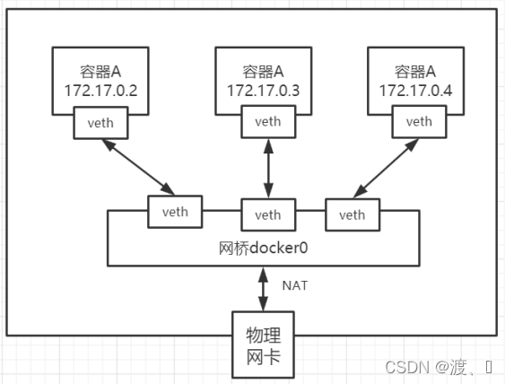

在这里，我们可以看到Docker0相当于一个路由器的作用，任何一个容器启动默认都是docker0网络。

docker默认会给容器分配一个可用ip，并把它同docke0相连。使用到的就是veth pair技术。

### 3. 容器互联–Link

在网络模型图中可以看出，容器和容器之间不能直接连通。
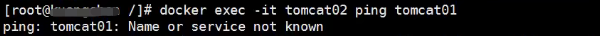

前面我们启动的两个tomcat对应的hosts如下：

```
[root@jiangnan tomcat1]# docker exec -it tomcat01 cat /etc/hosts
127.0.0.1  localhost
::1  localhost ip6-localhost ip6-loopback
fe00::0  ip6-localnet
ff00::0  ip6-mcastprefix
ff02::1  ip6-allnodes
ff02::2  ip6-allrouters
172.17.0.2  3ecb3204e2dc
root@3ecb3204e2dc:/usr/local/tomcat# 
[root@jiangnan tomcat1]# docker exec -it tomcat02 cat /etc/hosts
127.0.0.1  localhost
::1  localhost ip6-localhost ip6-loopback
fe00::0  ip6-localnet
ff00::0  ip6-mcastprefix
ff02::1  ip6-allnodes
ff02::2  ip6-allrouters
172.17.0.3  6c9a6a5d8eca
```

发现：他们的hosts中只有各自的ip地址。

但是在实际的工作中，容器使用的是虚拟ip，每次启动ip都会变化，思考一个场景，我们编写一个微服务，数据库连接地址原来是使用ip的，如果ip变化就不行了，那我们能不能使用服务名访问呢？

我们在启动一个tomcat03，使用--link绑定到tomcat02上。然后看它的hosts是什么样的。

```
[root@jiangnan tomcat1]# docker run -d -p 8083:8080 --name tomcat03 --link tomcat02 tomcat
db75c42f7f7f609218deb290d3e923e3c7da6bcf8c0b38cde27962fb2b9e9a54
[root@jiangnan tomcat1]# docker exec -it tomcat03 cat /etc/hosts
127.0.0.1  localhost
::1  localhost ip6-localhost ip6-loopback
fe00::0  ip6-localnet
ff00::0  ip6-mcastprefix
ff02::1  ip6-allnodes
ff02::2  ip6-allrouters
172.17.0.3  tomcat02 e4060ea4ee28   # 发现tomcat2直接被写在这里
172.17.0.4  db75c42f7f7f
root@db75c42f7f7f:/usr/local/tomcat# 
```

发现：使用了–link，不但有了自己的ip，而且还有了tomcat02的服务名。但是tomcat02中并没有tomcat03的，因为–link是单向的。
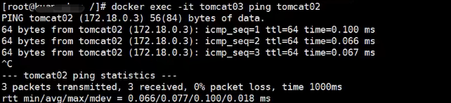

这样就实现了容器和容器之间的连通。不需要通过ip地址连通，而是通过服务名就可以。

但是使用--link的方法过时了，我们一般使用自定义网络。

### 4. 自定义网络（推荐）

docker0的特点：

-   它是默认的
-   域名访问不通
-   –link 域名通了，但是删了又不行

docker为我们提供了三种网络模式

```
# docker network ls
NETWORK ID     NAME      DRIVER    SCOPE
4d3e75606593   bridge    bridge    local
8e92ee24e5f6   host      host      local
e85ffb1f2cc3   none      null      local
```

这其中默认使用的是bridge，也就是我们的docker0网卡。

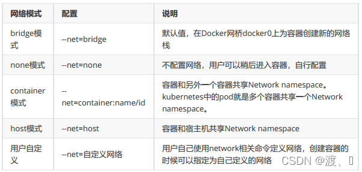

在我们启动容器的时候，实际上是如下命令

```
# docker run -d -P --name tomcat01 --net bridge tomcat
```

这个--net是默认的，所以被省略了。

下面我们自定义一个网络mynet。

```
# 自定义创建的默认default "bridge"
[root@jiangnan tomcat1]# docker network create --driver bridge --subnet 192.168.0.0/16 --gateway 192.168.0.1 mynet
3136d64109c6f285bc69d3ee4be901524292d0e5ddd9e414d49197dfa6c19ba1
[root@jiangnan tomcat1]# docker network ls
NETWORK ID     NAME      DRIVER    SCOPE
4d3e75606593   bridge    bridge    local
8e92ee24e5f6   host      host      local
3136d64109c6   mynet     bridge    local   # 多了一个mynet
e85ffb1f2cc3   none      null      local

[root@jiangnan tomcat1]# docker network inspect mynet
[
    {
        "Name": "mynet",
        "Id": "3136d64109c6f285bc69d3ee4be901524292d0e5ddd9e414d49197dfa6c19ba1",
        "Created": "2022-02-27T14:15:44.676693958+08:00",
        "Scope": "local",
        "Driver": "bridge",
        "EnableIPv6": false,
        "IPAM": {
            "Driver": "default",
            "Options": {},
            "Config": [
                {
                    "Subnet": "192.168.0.0/16",  # 子网地址
                    "Gateway": "192.168.0.1"   # 网关
                }
            ]
        },
        "Internal": false,
        "Attachable": false,
        "Ingress": false,
        "ConfigFrom": {
            "Network": ""
        },
        "ConfigOnly": false,
        "Containers": {},
        "Options": {},
        "Labels": {}
    }
]
```

下面我们使用自定义的网络启动tomcat

```
[root@jiangnan tomcat1]# docker run -d  -p 8081:8080 --name tomcat-net-01 --net mynet tomcat
675439c851dc29355c03f82bb163f9e5a326e230447d86d40d53ff08766cfd06
[root@jiangnan tomcat1]# docker run -d  -p 8082:8080 --name tomcat-net-02 --net mynet tomcat
31f12c9332e8b4b6e66619dc988533f2863b80e71dbf490c8313694637814ca1
[root@jiangnan tomcat1]# docker ps
CONTAINER ID   IMAGE     COMMAND             CREATED          STATUS          PORTS                                       NAMES
31f12c9332e8   tomcat    "catalina.sh run"   3 seconds ago    Up 2 seconds    0.0.0.0:8082->8080/tcp, :::8082->8080/tcp   tomcat-net-02
675439c851dc   tomcat    "catalina.sh run"   12 seconds ago   Up 12 seconds   0.0.0.0:8081->8080/tcp, :::8081->8080/tcp   tomcat-net-01
```

查看网络

```
# docker inspect mynet
[
    {
        "Name": "mynet",
        "Id": "3136d64109c6f285bc69d3ee4be901524292d0e5ddd9e414d49197dfa6c19ba1",
        "Created": "2022-02-27T14:15:44.676693958+08:00",
        "Scope": "local",
        "Driver": "bridge",
        "EnableIPv6": false,
        "IPAM": {
            "Driver": "default",
            "Options": {},
            "Config": [
                {
                    "Subnet": "192.168.0.0/16",
                    "Gateway": "192.168.0.1"
                }
]
        },
        "Internal": false,
        "Attachable": false,
        "Ingress": false,
        "ConfigFrom": {
            "Network": ""
        },
        "ConfigOnly": false,
        "Containers": {
            "31f12c9332e8b4b6e66619dc988533f2863b80e71dbf490c8313694637814ca1": {
                "Name": "tomcat-net-02",
                "EndpointID": "1c0e9dbffff295f2326bfd1e2847c0f1d9136ff00519101bb11d922e7da4f818",
                "MacAddress": "02:42:c0:a8:00:03",
                "IPv4Address": "192.168.0.3/16",
                "IPv6Address": ""
            },
            "675439c851dc29355c03f82bb163f9e5a326e230447d86d40d53ff08766cfd06": {
                "Name": "tomcat-net-01",
                "EndpointID": "2653da0a25d166f0d7222235e85d8231d9424e19949b6e6b7cfa1a3eddcc462b",
                "MacAddress": "02:42:c0:a8:00:02",
                "IPv4Address": "192.168.0.2/16",
                "IPv6Address": ""
            }
        },
        "Options": {},
        "Labels": {}
    }
]
```

___

```
# 我们来测试ping容器名和ip试试，都可以ping通
[root@jiangnan ~]# docker exec -it tomcat-net-01 ping 192.168.0.3
PING 192.168.0.3 (192.168.0.3) 56(84) bytes of data.
64 bytes from 192.168.0.3: icmp_seq=1 ttl=64 time=0.093 ms
[root@jiangnan ~]# docker exec -it tomcat-net-01 ping tomcat-net-02
PING tomcat-net-02 (192.168.0.3) 56(84) bytes of data.
64 bytes from tomcat-net-02.mynet (192.168.0.3): icmp_seq=1 ttl=64 time=0.063 ms
64 bytes from tomcat-net-02.mynet (192.168.0.3): icmp_seq=2 ttl=64 time=0.066 ms
```

发现：不用--link也可以直接通过服务名ping通了。

### 5. 网络连通

docker0和自定义网络肯定不通，我们使用自定义网络的好处就是网络隔离。

但是在实际的工作中，比如我们部署了mysql使用了一个网段。部署了tomcat使用了另一个网段，两个网段之间肯定是不能相互连通的，但是tomcat和mysql又需要相互连通，我们就要使用网络连通。原理图如下：
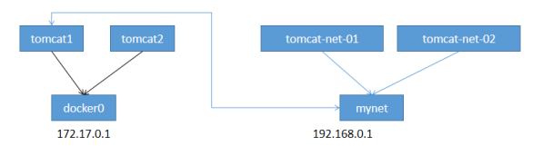
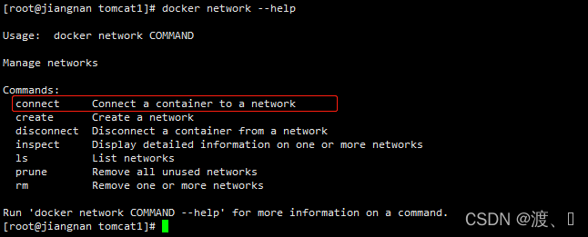
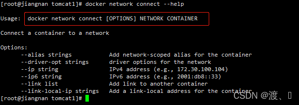

网络连通就是将一个容器和一个网段之间的连通。

比如我前面使用的默认docker0的tomcat01，需要连接到mynet网络。

```bash
# docker network connect 网络 容器
[root@jiangnan tomcat1]# docker network connect mynet tomcat01
[root@jiangnan tomcat1]# docker network inspect mynet
[
    {
        "Name": "mynet",
        "Id": "3136d64109c6f285bc69d3ee4be901524292d0e5ddd9e414d49197dfa6c19ba1",
        "Created": "2022-02-27T14:15:44.676693958+08:00",
        "Scope": "local",
        "Driver": "bridge",
        "EnableIPv6": false,
        "IPAM": {
            "Driver": "default",
            "Options": {},
            "Config": [
                {
                    "Subnet": "192.168.0.0/16",
                    "Gateway": "192.168.0.1"
                }
]
        },
        "Internal": false,
        "Attachable": false,
        "Ingress": false,
        "ConfigFrom": {
            "Network": ""
        },
        "ConfigOnly": false,
        "Containers": {
            "2e709013935463c29caf28771bb49925fee4e02842459b339d7dd1ad5dedf9b7": {
                "Name": "tomcat-net-01",
                "EndpointID": "9f3a46bad37ade7935e283715caa5699e9a7e22175b592f4a4792a37c351d969",
                "MacAddress": "02:42:c0:a8:00:02",
                "IPv4Address": "192.168.0.2/16",
                "IPv6Address": ""
            },
            "5c0c544f2507d9f5f456feceddbd853ebccc07cea8c39c8479693731e480bf55": {
                "Name": "tomcat01",
                "EndpointID": "d05abb2d31af4067c5a45f299ce7b4401b1fa81638a44b6c09f3de7f8f4221fe",
                "MacAddress": "02:42:c0:a8:00:04",
                "IPv4Address": "192.168.0.4/16",
                "IPv6Address": ""
            },
            "d6066db5fdd0b508514107a896ed20b639eaa47dbd97a025ad0c52250766c8a4": {
                "Name": "tomcat-net-02",
                "EndpointID": "3a5f6f2a07d900303382b290825c9f52640689c859608c741c7c7d81031e107e",
                "MacAddress": "02:42:c0:a8:00:03",
                "IPv4Address": "192.168.0.3/16",
                "IPv6Address": ""
            }
        },
        "Options": {},
        "Labels": {}
    }
]
```
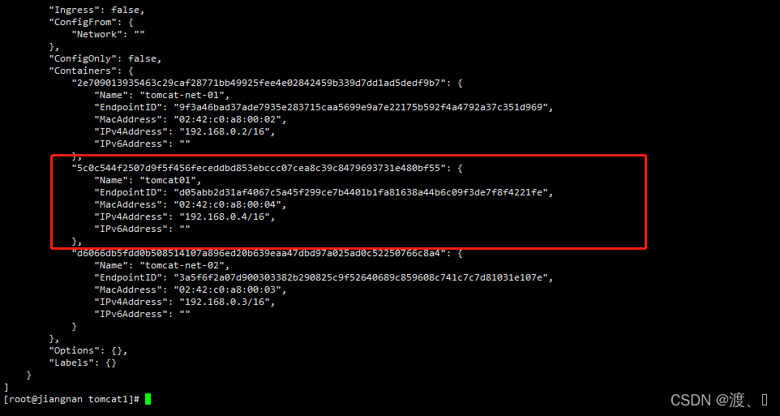

通过这种方式直接将tomcat01加到了mynet网络中。

### 6. 总结

-   veth pair是成对出现的一种虚拟网络设备接口，一端连着网络协议栈，一端彼此相连。
-   docker中默认使用docker0网络。
-   docker0相当于一个路由器的作用，任何一个容器启动默认都是docker0网络。
-   docker0是容器和虚拟机之间通信的桥梁。
-   推荐使用自定义网络，更好实现使用服务名的连通方式，避免ip改变的尴尬。
-   网络之间不能直接连通，网络连通是将一个容器和一个网络之间的连通，实现跨网络操作。

