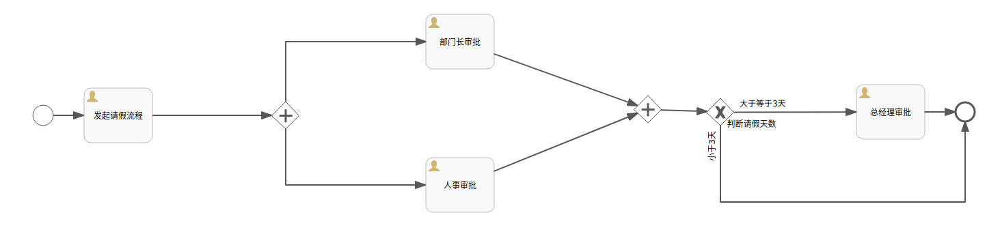
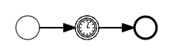

# Flowable


1. https://www.flowable.com/
2. https://github.com/flowable
3. https://tkjohn.github.io/flowable-userguide/


* RepositoryService
* RuntimeService
* TaskService
* HistoryService
* ManagementService
* FormService
* IdentityService
* DynamicBpmnService


## flowable-ui & mysql


> * IDM: 用户管理
> * ADMIN: 总界面
> * Modeler: 画图
> * Task: 任务
> * Rest: rest api

1. 需要手动添加驱动包到类路径下，默认使用的是h2内存数据库
2. 需要修改配置文件mysql连接参数

```properties
spring.datasource.driver-class-name=com.mysql.jdbc.Driver
spring.datasource.url=jdbc:mysql://127.0.0.1:3306/flowable?useUnicode=true&characterEncoding=UTF-8&useJDBCCompliantTimezoneShift=true&useLegacyDatetimeCode=false&serverTimezone=Asia/Shanghai&allowMultiQueries=true&nullCatalogMeansCurrent=true&useSSL=false
spring.datasource.username=root
spring.datasource.password=123456
```
> 有两个地方要特别注意：
> 1. nullCatalogMeansCurrent=true
> 2. useSSL=false


* 可以放在tomcat下面运行
* 也可以通过java -jar 直接运行war包（本质上是springboot项目）
  * jar xf flowable-ui.war   -> 解压
  * jar cvfM0 flowable-ui.war ./ -> 压缩


## 分配任务Assignee

1. 指定固定值（直接指定具体某个人）
2. 值表达式：`${assignee0}` 通过变量赋值
3. 监听器：任务监听器，监听到任务启动指定assignee

## 流程变量

1. 全局变量（流程实例变量）
2. 局部变量（执行实例变量、任务变量）

> 全局变量
> * global变量中变量名不允许重复，设置相同名称的变量，后设置的会覆盖前设置的

> 局部变量
> * 任务变量、执行实例变量作用域不同，互不影响。变量名相同互不影响
> * 局部变量和全局变量变量名相同，没有影响


```java
//流程发起人
IdentityService identityService = processEngine.getIdentityService();
identityService.setAuthenticatedUserId("wms");

//启动流程实例、流程实例变量
String processDefinitionId = "a002:1:32504";
String businessKey = "businessKey001";
Map<String, Object> vars = new HashMap<>(8);
vars.put("assignee0", "tom0");
vars.put("assignee1", "tom1");
vars.put("assignee2", "tom2");
vars.put("assignee3", "tom3");
RuntimeService runtimeService = processEngine.getRuntimeService();
runtimeService.startProcessInstanceById(processDefinitionId, businessKey, vars);
```


```java
TaskService taskService = processEngine.getTaskService();
List<Task> list = taskService.createTaskQuery()
        .processDefinitionId(processDefinitionId)
        .taskAssignee("tom3")
        .list();

for (Task task : list) {
    Map<String, Object> vars = new HashMap<>(8);
    taskService.complete(task.getId(), vars);
}
```


## 候选人和候选人组

多个候选人或者候选人组，可以从候选人中选择参与者来完成任务


* 一个候选人拾取了任务，其他候选人就查询不到这个任务了
* 候选人拾取了任务，不处理，可以退还任务

```java
TaskService taskService = processEngine.getTaskService();
List<Task> list = taskService.createTaskQuery()
        .processDefinitionId(processDefinitionId)
        .taskCandidateUser("lisi")
        .list();

for (Task task : list) {
    System.out.println("task.getName() = " + task.getName());

    //拾取任务
    taskService.claim(task.getId(), "lisi");
}
```

```java
TaskService taskService = processEngine.getTaskService();
List<Task> list = taskService.createTaskQuery()
        .processDefinitionId(processDefinitionId)
        .taskAssignee("lisi")
        .list();

for (Task task : list) {
    System.out.println("task.getName() = " + task.getName());

    //退还任务
    taskService.unclaim(task.getId());
}
```


添加用户

系统用户和flowable用户要同步

```java
IdentityService identityService = processEngine.getIdentityService();
User user = identityService.newUser("003");
user.setEmail("003@qq.com");
user.setFirstName("003");
user.setPassword("123456");
user.setLastName("003");
identityService.saveUser(user);
```

添加组

```java
IdentityService identityService = processEngine.getIdentityService();
Group group = identityService.newGroup("group002");
group.setName("group002");
group.setType("type1");
identityService.saveGroup(group);
```

用户和组的关联关系

```java
identityService.createMembership("001", "group001");
identityService.createMembership("002", "group001");
identityService.createMembership("003", "group001");
```

## 网关


1. 排他网关


> 1. 如果条件都满足，会走第一个路线
> 2. 如果条件都不满足，会有异常抛出，但是任务不会结束，还是原来的任务，我们可以重置任务变量，让流程有路可走
> 3. 如果不设置排他网关，直接在流程线上定义条件，如果条件都不满足，流程就结束了，而且是异常结束

2. 并行网关




3. 包容网关

排他网关和并行网关的结合体


4. 事件网关

## springboot


```xml
<?xml version="1.0" encoding="UTF-8"?>
<project xmlns="http://maven.apache.org/POM/4.0.0" xmlns:xsi="http://www.w3.org/2001/XMLSchema-instance"
         xsi:schemaLocation="http://maven.apache.org/POM/4.0.0 https://maven.apache.org/xsd/maven-4.0.0.xsd">
    <modelVersion>4.0.0</modelVersion>
    <parent>
        <groupId>org.springframework.boot</groupId>
        <artifactId>spring-boot-starter-parent</artifactId>
        <version>2.0.0.RELEASE</version>
        <relativePath/> <!-- lookup parent from repository -->
    </parent>
    <groupId>com.example</groupId>
    <artifactId>flowable-demo</artifactId>
    <version>0.0.1-SNAPSHOT</version>
    <name>flowable-demo</name>
    <description>Demo project for Spring Boot</description>
    <properties>
        <java.version>1.8</java.version>
    </properties>
    <dependencies>
        <dependency>
            <groupId>org.springframework.boot</groupId>
            <artifactId>spring-boot-starter-actuator</artifactId>
        </dependency>
        <dependency>
            <groupId>org.springframework.boot</groupId>
            <artifactId>spring-boot-starter-validation</artifactId>
        </dependency>
        <dependency>
            <groupId>org.springframework.boot</groupId>
            <artifactId>spring-boot-starter-web</artifactId>
        </dependency>
        <dependency>
            <groupId>org.springframework.boot</groupId>
            <artifactId>spring-boot-starter-aop</artifactId>
        </dependency>
        <dependency>
            <groupId>org.flowable</groupId>
            <artifactId>flowable-spring-boot-starter</artifactId>
            <version>6.3.0</version>
        </dependency>

        <dependency>
            <groupId>mysql</groupId>
            <artifactId>mysql-connector-java</artifactId>
            <scope>runtime</scope>
        </dependency>
        <dependency>
            <groupId>org.mybatis.spring.boot</groupId>
            <artifactId>mybatis-spring-boot-starter</artifactId>
            <version>2.0.0</version>
        </dependency>
        <dependency>
            <groupId>org.springframework.boot</groupId>
            <artifactId>spring-boot-configuration-processor</artifactId>
            <optional>true</optional>
        </dependency>
        <dependency>
            <groupId>org.projectlombok</groupId>
            <artifactId>lombok</artifactId>
            <optional>true</optional>
        </dependency>
        <dependency>
            <groupId>org.springframework.boot</groupId>
            <artifactId>spring-boot-starter-test</artifactId>
            <scope>test</scope>
        </dependency>
        <dependency>
            <groupId>com.google.guava</groupId>
            <artifactId>guava</artifactId>
            <version>31.1-jre</version>
        </dependency>
        <dependency>
            <groupId>org.apache.commons</groupId>
            <artifactId>commons-lang3</artifactId>
        </dependency>
        <dependency>
            <groupId>cn.hutool</groupId>
            <artifactId>hutool-all</artifactId>
            <version>5.7.22</version>
        </dependency>
        <dependency>
            <groupId>commons-beanutils</groupId>
            <artifactId>commons-beanutils</artifactId>
            <version>1.9.4</version>
        </dependency>
        <dependency>
            <groupId>commons-collections</groupId>
            <artifactId>commons-collections</artifactId>
            <version>3.2.2</version>
        </dependency>
        <dependency>
            <groupId>org.apache.commons</groupId>
            <artifactId>commons-collections4</artifactId>
            <version>4.4</version>
        </dependency>

    </dependencies>

    <build>
        <plugins>
            <plugin>
                <groupId>org.springframework.boot</groupId>
                <artifactId>spring-boot-maven-plugin</artifactId>
                <configuration>
                    <excludes>
                        <exclude>
                            <groupId>org.projectlombok</groupId>
                            <artifactId>lombok</artifactId>
                        </exclude>
                    </excludes>
                </configuration>
            </plugin>
        </plugins>
    </build>

</project>
```


```properties
### mybatis
mybatis.mapper-locations=classpath:/mybatis-mapper/*Mapper.xml
mybatis.type-aliases-package=com.example.flowabledemo.entity
mybatis.configuration.map-underscore-to-camel-case=true
mybatis.configuration.use-generated-keys=true
mybatis.configuration.use-column-label=true


### xxl-job, datasource
spring.datasource.url=jdbc:mysql://127.0.0.1:3306/flowable?useSSL=false&useUnicode=true&characterEncoding=UTF-8&allowMultiQueries=true&autoReconnect=true&serverTimezone=Asia/Shanghai
spring.datasource.username=root
spring.datasource.password=123456
spring.datasource.driver-class-name=com.mysql.jdbc.Driver

### datasource-pool
spring.datasource.type=com.zaxxer.hikari.HikariDataSource
spring.datasource.hikari.minimum-idle=10
spring.datasource.hikari.maximum-pool-size=30
spring.datasource.hikari.auto-commit=true
spring.datasource.hikari.idle-timeout=30000
spring.datasource.hikari.pool-name=HikariCP
spring.datasource.hikari.max-lifetime=900000
spring.datasource.hikari.connection-timeout=10000
spring.datasource.hikari.connection-test-query=SELECT 1
spring.datasource.hikari.validation-timeout=1000


### flowable
flowable.database-schema-update=true
flowable.async-executor-activate=false

## Actuator
management.endpoint.flowable.cache.time-to-live=0ms
management.endpoint.flowable.enabled=true

```


```java

import cn.hutool.core.bean.BeanUtil;
import com.google.common.collect.Maps;
import lombok.RequiredArgsConstructor;
import lombok.extern.slf4j.Slf4j;
import org.apache.commons.beanutils.BeanUtils;
import org.apache.commons.beanutils.PropertyUtils;
import org.flowable.engine.RepositoryService;
import org.flowable.engine.repository.Deployment;
import org.springframework.validation.annotation.Validated;
import org.springframework.web.bind.annotation.GetMapping;
import org.springframework.web.bind.annotation.RequestMapping;
import org.springframework.web.bind.annotation.RestController;

import java.util.HashMap;
import java.util.List;
import java.util.Map;
import java.util.stream.Collectors;

/**
 * @author user
 */
@RestController
@RequestMapping("repository")
@Slf4j
@Validated
@RequiredArgsConstructor
public class RepositoryController {

    private final RepositoryService repositoryService;

    @GetMapping("list")
    public Object list(){


        List<Deployment> list = repositoryService.createDeploymentQuery().list();
        return list.stream().map(e -> {
            Map<String, Object> map = new HashMap<>(8);
            map.put("id", e.getId());
            map.put("name", e.getName());
            return map;
        }).collect(Collectors.toList());
    }


}
```

## 事件

### 1. 空启动事件

1. 手动启动
2. 调用startProcessInstanceByXXX API方法启动


### 2. 定时器启动事件

在指定时间创建流程实例：

1. 在流程只需要启动一次
2. 或者流程需要在特定的时间间隔重复启动时


> 1. 子流程不能有定时器启动事件
> 2. 流程部署的同时开始计时
> 3. 不需要手动调用`startProcessInstanceByXXX`就会在时间启动，如果调用`startProcessInstanceByXXX`会在定时启动时间之外额外启动一个流程

### 3. 定时器捕获中间事件

定时器捕获中间事件（timer intermediate catching event）的行为像是跑表。当执行到达捕获事件时，启动定时器；当定时器触发时（例如在一段时间间隔后），沿定时器中间事件的出口顺序流继续执行。





### 4. 定时器边界事件

定时器边界事件（timer boundary event）的行为像是跑表与闹钟。当执行到达边界事件所依附的活动时，将启动定时器。当定时器触发时（例如在特定时间间隔后），可以中断活动，并沿着边界事件的出口顺序流继续执行。


> 任务如果在规定时间内还没有被执行，就会触发定时器边界事件，走定时器边界的流程


### 5. 定时器捕捉中间事件

定时器捕获中间事件（timer intermediate catching event）的行为像是跑表。当执行到达捕获事件时，启动定时器；当定时器触发时（例如在一段时间间隔后），沿定时器中间事件的出口顺序流继续执行。


