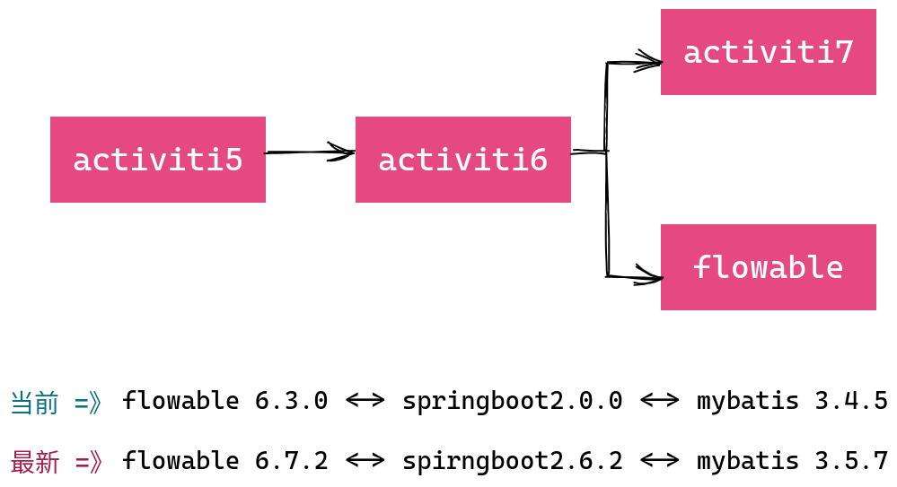

# Flowable




1. https://www.flowable.com/
2. https://github.com/flowable
3. https://tkjohn.github.io/flowable-userguide/


* RepositoryService
* RuntimeService
* TaskService
* HistoryService
* ManagementService
* FormService
* IdentityService
* DynamicBpmnService


## flowable-ui & mysql


> * IDM: 用户管理
> * ADMIN: 总界面
> * Modeler: 画图
> * Task: 任务
> * Rest: rest api

1. 需要手动添加驱动包到类路径下，默认使用的是h2内存数据库
2. 需要修改配置文件mysql连接参数

```properties
spring.datasource.driver-class-name=com.mysql.jdbc.Driver
spring.datasource.url=jdbc:mysql://127.0.0.1:3306/flowable?useUnicode=true&characterEncoding=UTF-8&useJDBCCompliantTimezoneShift=true&useLegacyDatetimeCode=false&serverTimezone=Asia/Shanghai&allowMultiQueries=true&nullCatalogMeansCurrent=true&useSSL=false
spring.datasource.username=root
spring.datasource.password=123456
```
> 有两个地方要特别注意：
> 1. nullCatalogMeansCurrent=true
> 2. useSSL=false


* 可以放在tomcat下面运行
* 也可以通过java -jar 直接运行war包（本质上是springboot项目）
  * jar xf flowable-ui.war   -> 解压
  * jar cvfM0 flowable-ui.war ./ -> 压缩


## 分配任务Assignee

1. 指定固定值（直接指定具体某个人）
2. 值表达式：`${assignee0}` 通过变量赋值
3. 监听器：任务监听器，监听到任务启动指定assignee

## 流程变量

1. 全局变量（流程实例变量）
2. 局部变量（执行实例变量、任务变量）

> 全局变量
> * global变量中变量名不允许重复，设置相同名称的变量，后设置的会覆盖前设置的

> 局部变量
> * 任务变量、执行实例变量作用域不同，互不影响。变量名相同互不影响
> * 局部变量和全局变量变量名相同，没有影响


```java
//流程发起人
IdentityService identityService = processEngine.getIdentityService();
identityService.setAuthenticatedUserId("wms");

//启动流程实例、流程实例变量
String processDefinitionId = "a002:1:32504";
String businessKey = "businessKey001";
Map<String, Object> vars = new HashMap<>(8);
vars.put("assignee0", "tom0");
vars.put("assignee1", "tom1");
vars.put("assignee2", "tom2");
vars.put("assignee3", "tom3");
RuntimeService runtimeService = processEngine.getRuntimeService();
runtimeService.startProcessInstanceById(processDefinitionId, businessKey, vars);
```


```java
TaskService taskService = processEngine.getTaskService();
List<Task> list = taskService.createTaskQuery()
        .processDefinitionId(processDefinitionId)
        .taskAssignee("tom3")
        .list();

for (Task task : list) {
    Map<String, Object> vars = new HashMap<>(8);
    taskService.complete(task.getId(), vars);
}
```


## 候选人和候选人组

多个候选人或者候选人组，可以从候选人中选择参与者来完成任务


* 一个候选人拾取了任务，其他候选人就查询不到这个任务了
* 候选人拾取了任务，不处理，可以退还任务

```java
TaskService taskService = processEngine.getTaskService();
List<Task> list = taskService.createTaskQuery()
        .processDefinitionId(processDefinitionId)
        .taskCandidateUser("lisi")
        .list();

for (Task task : list) {
    System.out.println("task.getName() = " + task.getName());

    //拾取任务
    taskService.claim(task.getId(), "lisi");
}
```

```java
TaskService taskService = processEngine.getTaskService();
List<Task> list = taskService.createTaskQuery()
        .processDefinitionId(processDefinitionId)
        .taskAssignee("lisi")
        .list();

for (Task task : list) {
    System.out.println("task.getName() = " + task.getName());

    //退还任务
    taskService.unclaim(task.getId());
}
```


添加用户

系统用户和flowable用户要同步

```java
IdentityService identityService = processEngine.getIdentityService();
User user = identityService.newUser("003");
user.setEmail("003@qq.com");
user.setFirstName("003");
user.setPassword("123456");
user.setLastName("003");
identityService.saveUser(user);
```

添加组

```java
IdentityService identityService = processEngine.getIdentityService();
Group group = identityService.newGroup("group002");
group.setName("group002");
group.setType("type1");
identityService.saveGroup(group);
```

用户和组的关联关系

```java
identityService.createMembership("001", "group001");
identityService.createMembership("002", "group001");
identityService.createMembership("003", "group001");
```

## 网关


1. 排他网关


> 1. 如果条件都满足，会走第一个路线
> 2. 如果条件都不满足，会有异常抛出，但是任务不会结束，还是原来的任务，我们可以重置任务变量，让流程有路可走
> 3. 如果不设置排他网关，直接在流程线上定义条件，如果条件都不满足，流程就结束了，而且是异常结束

2. 并行网关


3. 包容网关

排他网关和并行网关的结合体


4. 事件网关

## springboot


