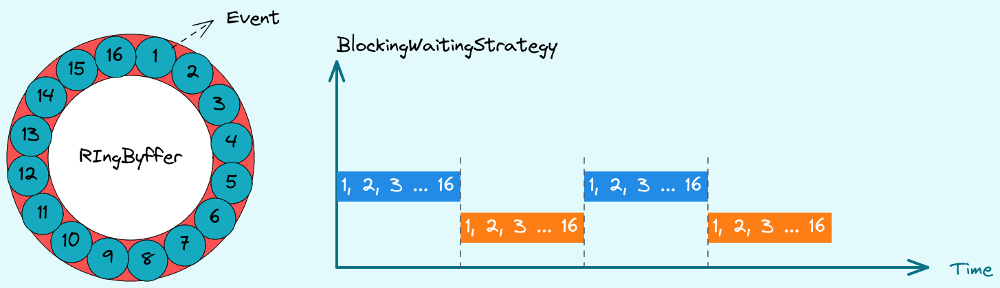
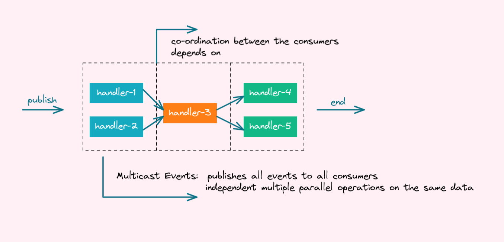

# Disruptor 学习笔记之 hello world

1. 基于内存的、同一进程不同线程之间传递数据的通道（生产者-消费者模式）
2. RingBuffer大小要设置成2的幂次方
3. 支持单生产者模式和多生成者模式。如果是应用程序内是单个生产者，建议设置成单生产者模式，性能更高
4. 等待策略有多种，默认是BlockingWaitStrategy.(等待策略是生产者在生产的时候，如果RingBuffer已满的等待机制：协调cpu和高吞吐低延迟之间的平衡关系)

> - 了解已部署的系统可以通过选择更合适的等待策略来提高性能
> - BlockingWaitStrategy是可用的等待策略中最慢的，但在CPU使用方面是最保守的，在各种各样的部署选项中都能提供最一致的行为。
> - SleepingWaitStrategy与BlockingWaitStrategy一样，SleepingWaitstrategy它试图通过使用简单的忙碌等待循环来保守CPU使用。不同之处在于Sleepingwaitstrategy在循环中间使用呼叫锁定.parknanos（1）。在典型的Linux系统上，这将暂停线程约60μs。 这具有生产线程不需要采取其他增量适当计数器的任何动作的好处，并且它不需要发信用变量的成本。然而，在生产者和消费者线程之间移动事件的平均潜伏期将更高。 它在不需要低延迟的情况下最佳地工作，但需要对生产线程的低影响。常用案例是异步日志记录。
> - YieldingWaitStrategy是两个可以用于低延迟系统的waitstrategy中的一个。它是为那些可以选择消耗CPU周期以改善延迟的情况而设计的。当您需要非常高的性能，并且EventHandler线程的数量低于逻辑核的总数时，这是推荐的等待策略，例如，您启用了超线程
> - BusySpinWaitStrategy是执行效率最高的WaitStrategy。像YieldingWaitStrategy一样，它可以用于低延迟系统，但对部署环境的约束最大。这种等待策略应该只在EventHandler线程的数量低于盒子上的物理核的数量时使用，例如超线程应该被禁用。



> 如果没有设置sequence才是上面这种生产消费的模式；
> 如果 this.sequenceCallback.set(sequence); 就消费一个后立马会生产一个

5. disruptor vs queue

  > 1. 广播。disruptor可以同时将event广播给几个独立的消费者同时消费。几个消费者相互独立。多个消费者可以顺序sort并行parallel读取event
  > 2. 消费者协同消费。前一个消费者消费完成以后，后一个消费者才能消费。消费者之间的依赖关系（顺序关系）
  > 3. 内存对象预分配，减小内存垃圾回收。使用EventFactory预创建Event对象，用户只需要操作Event对象内的value
  > 4. 无锁算法。所有内存可见性和正确性保证都是使用内存barrier和cas操作实现的。




## 代码实现

### 1. 定义Event事件

就是一个普通的Java Bean

```java
@Data
public class OrderEvent {

    private Long id;

    public void clear(){this.id = null;}

}
```

### 2. 定义消费者Handler

可以使用lambda, 如果业务逻辑复杂，建议定义一个单独的类

```java
import com.example.disruptor.event.OrderEvent;
import com.lmax.disruptor.EventHandler;
import lombok.extern.slf4j.Slf4j;
import java.util.concurrent.TimeUnit;

@Slf4j
public class OrderEventHandler implements EventHandler<OrderEvent> {

    private Sequence sequenceCallback;


    @Override
    public void setSequenceCallback(final Sequence sequenceCallback) {
        this.sequenceCallback = sequenceCallback;
    }

    @Override
    public void onEvent(OrderEvent event, long sequence, boolean endOfBatch) throws Exception {
        log.info("event:{}, sequence:{}, endOfBatch:{}", event, sequence, endOfBatch);
        TimeUnit.MILLISECONDS.sleep(1000);
        this.sequenceCallback.set(sequence);
    }
}
```

```java
import com.example.disruptor.event.OrderEvent;
import com.lmax.disruptor.EventHandler;

public class ClearingEventHandler implements EventHandler<OrderEvent> {

    private Sequence sequenceCallback;


    @Override
    public void setSequenceCallback(final Sequence sequenceCallback) {
        this.sequenceCallback = sequenceCallback;
    }

    @Override
    public void onEvent(OrderEvent event, long sequence, boolean endOfBatch) throws Exception {
        event.clear();
        this.sequenceCallback.set(sequence);
    }
}
```

### 3. 定义生产者Producer

```java
import com.example.disruptor.event.OrderEvent;
import com.example.disruptor.handler.ClearingEventHandler;
import com.example.disruptor.handler.OrderEventHandler;
import com.lmax.disruptor.BlockingWaitStrategy;
import com.lmax.disruptor.EventTranslatorOneArg;
import com.lmax.disruptor.RingBuffer;
import com.lmax.disruptor.dsl.Disruptor;
import com.lmax.disruptor.dsl.ProducerType;
import io.micrometer.core.instrument.util.NamedThreadFactory;
import lombok.extern.slf4j.Slf4j;
import org.springframework.stereotype.Service;

@Service
@Slf4j
public class OrderEventProducer {


    private final RingBuffer<OrderEvent>  ringBuffer;

    private static final EventTranslatorOneArg<OrderEvent, Long> TRANSLATOR = (event, sequence, id) -> event.setId(id);


    public OrderEventProducer(){
        //定义RingBuffer大小，必须是2的幂次方
        int ringBufferSize = 1024 * 1024;
        //构造一个disruptor实例
        Disruptor<OrderEvent> disruptor = new Disruptor<>(OrderEvent::new,
                ringBufferSize,
                new NamedThreadFactory("orderEvent-handler-"),
                ProducerType.MULTI,
                new BlockingWaitStrategy());
        //绑定handler消费者
        disruptor.handleEventsWith(new OrderEventHandler())
                .then(new ClearingEventHandler());
        //启动
        disruptor.start();
        this.ringBuffer = disruptor.getRingBuffer();

    }

    public void onData(Long orderId) {
        ringBuffer.publishEvent(TRANSLATOR, orderId);
    }

}
```


