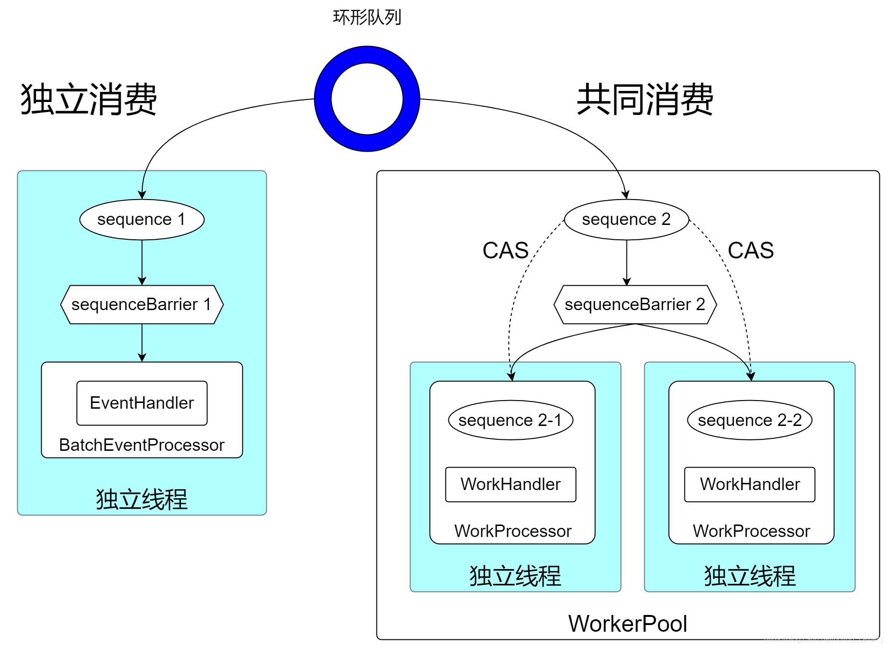

# Disruptor学习笔记之多消费者模型


* 依赖WorkPool实现多消费者：多个消费者共同消费(消费组的概念)
* **3.X.X 支持 4.X.X 似乎不支持**





> 1. 独立消费的每个消费者都有属于自己独有的SequenceBarrier实例，共同消费者是所有人共用同一个SequenceBarrier实例
> 2. 独立消费的每个消费者都有属于自己独有的Sequence实例，对于共同消费者，虽然他们也有属于自己的Sequence实例，但这个Sequence实例的值是从一个公共Sequence实例（WorkerPool的成员变量workSequence）得来的
> 3. 独立消费和共同消费都有自己的取数据再消费的代码，放在一起对比看就一目了然了，如下图，共同消费时，每个消费者的Sequence值其实来自公共Sequence实例，多线程之间用CAS竞争来抢占事件用于消费


```java
import com.example.disruptor.event.OrderEvent;
import com.lmax.disruptor.WorkHandler;
import lombok.extern.slf4j.Slf4j;

import java.util.concurrent.TimeUnit;


/**
 * @author user
 */
@Slf4j
public class OrderWorkHandler implements WorkHandler<OrderEvent> {


    private String name;

    public OrderWorkHandler(String name){
        this.name = name;
    }


    @Override
    public void onEvent(OrderEvent event) throws Exception {

        TimeUnit.MILLISECONDS.sleep(3000);
        log.info("消费者：{} 消费事件：{}", name, event);

    }
}
```


```java
import lombok.Data;

/**
 * @author user
 */
@Data
public class OrderEvent {

    private Long id;

    public void clear(){this.id = null;}


}
```


```java

import com.example.disruptor.event.OrderEvent;
import com.example.disruptor.handler.OrderWorkHandler;
import com.lmax.disruptor.*;
import com.lmax.disruptor.dsl.Disruptor;
import com.lmax.disruptor.dsl.ProducerType;
import io.micrometer.core.instrument.util.NamedThreadFactory;
import lombok.extern.slf4j.Slf4j;
import org.springframework.stereotype.Service;

import java.util.concurrent.Executors;

/**
 * @author user
 */
@Service
@Slf4j
public class OrderEventProducer {


    private final RingBuffer<OrderEvent>  ringBuffer;

    private static final EventTranslatorOneArg<OrderEvent, Long> TRANSLATOR = (event, sequence, id) -> event.setId(id);


    public OrderEventProducer(){
        //定义RingBuffer大小，必须是2的幂次方 e.g. 1024 * 1024
        int ringBufferSize = 16;
        //构造一个disruptor实例
        Disruptor<OrderEvent> disruptor = new Disruptor<>(OrderEvent::new,
                ringBufferSize,
                new NamedThreadFactory("order-event-"),
                ProducerType.MULTI,
                new BlockingWaitStrategy());

        //获取到RingBuffer
        this.ringBuffer = disruptor.getRingBuffer();

        //多个消费者使用同一个sequenceBarrier
        SequenceBarrier sequenceBarrier = ringBuffer.newBarrier();

        //可变参数的消费者
        OrderWorkHandler orderWorkHandler1 = new OrderWorkHandler("C-1");
        OrderWorkHandler orderWorkHandler2 = new OrderWorkHandler("C-2");

        WorkerPool<OrderEvent> workerPool = new WorkerPool<>(ringBuffer,
                sequenceBarrier,
                new LocalExceptionHandler(),
                orderWorkHandler1, orderWorkHandler2);


        //设置多个消费者的sequence序号用于单独统计消费进度，并且设置到ringBuffer中
        ringBuffer.addGatingSequences(workerPool.getWorkerSequences());
        //workerPool.start(Executors.newCachedThreadPool());

        disruptor.handleEventsWithWorkerPool(workerPool);
        disruptor.start();

    }

    public void onData(Long orderId) {

        ringBuffer.publishEvent(TRANSLATOR, orderId);
        log.info("====> publish id : {}", orderId);
    }

    private static class LocalExceptionHandler implements ExceptionHandler {

        @Override
        public void handleEventException(Throwable ex, long sequence, Object event) {

        }

        @Override
        public void handleOnStartException(Throwable ex) {

        }

        @Override
        public void handleOnShutdownException(Throwable ex) {

        }
    }

}

```


