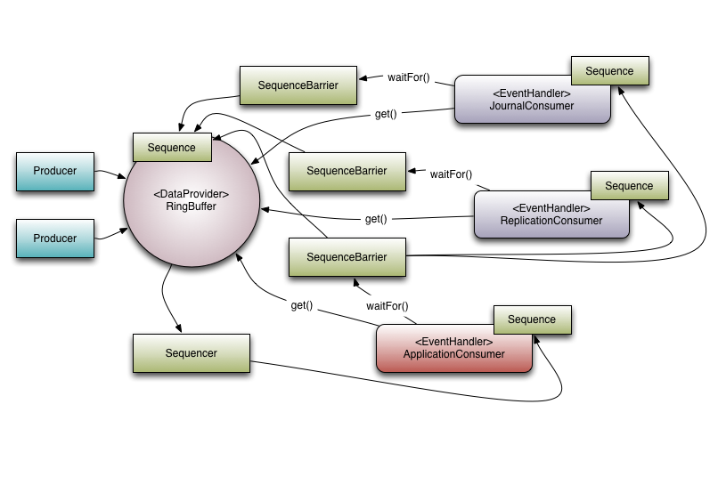
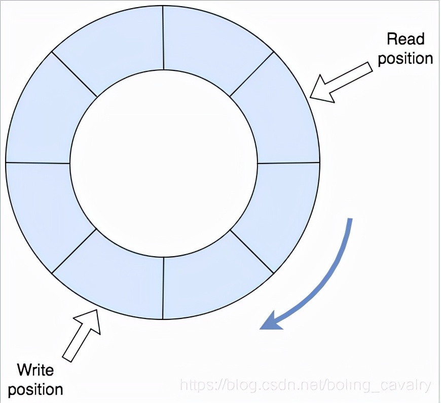

## 1. 背景

工作中遇到项目使用Disruptor做消息队列,对你没看错,不是Kafka,也不是rabbitmq;Disruptor有个最大的优点就是快,还有一点它是开源的哦,下面做个简单的记录.

disruptor 是 LMAX 公司开发的一个**高性能队列**，其作用和**阻塞队列(BlockingQueue)**类似，都是在**相同进程内、不同线程间传递数据(例如消息、事件)**，另外disruptor也有自己的一些特色：

1. 以广播的形式发布事件，并且消费者之间存在依赖关系；
2. 为事件提前分配内存；
3. 无锁算法；


## 2. Disruptor介绍

* A High Performance Inter-Thread Messaging Library
  > 一个高性能线程间消息传递库
* Disruptor 是英国外汇交易公司LMAX开发的一个**高性能队列**，研发的初衷是解决内存队列的延迟问题（在性能测试中发现竟然与I/O操作处于同样的数量级）。基于 Disruptor 开发的系统单线程能支撑每秒 600 万订单，2010 年在 QCon 演讲后，获得了业界关注。
* Disruptor是一个开源的Java框架，它被设计用于在**生产者—消费者**（producer-consumer problem，简称PCP）问题上获得尽量高的吞吐量（TPS）和尽量低的延迟。
* 从功能上来看，Disruptor 是实现了**队列**的功能，而且是一个**有界队列**。那么它的应用场景自然就是**生产者-消费者**模型的应用场合了
* Disruptor是LMAX在线交易平台的关键组成部分，LMAX平台使用该框架对订单处理速度能达到600万TPS，除金融领域之外，其他一般的应用中都可以用到Disruptor，它可以带来显著的性能提升。
* 其实Disruptor与其说是一个框架，不如说是一种设计思路，这个设计思路对于存在“并发、缓冲区、生产者—消费者模型、事务处理”这些元素的程序来说，Disruptor提出了一种大幅提升性能（TPS）的方案。
* Disruptor的github主页：[https://github.com/LMAX-Exchange/disruptor](https://github.com/LMAX-Exchange/disruptor)


## 3. Disruptor 的核心概念

先从了解 Disruptor 的核心概念开始，来了解它是如何运作的。下面介绍的概念模型，既是领域对象，也是映射到代码实现上的核心对象。

### 3.1 Ring Buffer

提到disruptor一般都会提到Ring Buffer(环形队列)是它的特点，实际上从3.0版本之后，环形队列只是用来存储和更新事件数据，在其他更复杂的场景下，用户可以通过自定义操作将其替换掉；

> 简单的说，disruptor官方认为Ring Buffe是核心概念（Core Concepts），但不是特色( key features)

### 3.2 Sequence


distuptor 使用 sequence 识别位置。每个消费者（事件处理器Event Processor）都维护一个序列 Sequence，就像 Disruptor 本身一样。大多数并发代码依赖于这些序列值的移动，因此序列支持 AtomicLong 的许多当前特性。 事实上，两者之间唯一真正的区别是序列包含额外的功能，以防止序列和其他值之间的错误共享。

通过顺序递增的序号来编号管理通过其进行交换的数据（事件），对数据(事件)的处理过程总是沿着序号逐个递增处理。一个 Sequence 用于跟踪标识某个特定的事件处理者( RingBuffer/Consumer )的处理进度。

虽然一个 AtomicLong 也可以用于标识进度，但定义 Sequence 来负责该问题还有另一个目的，那就是防止不同的 Sequence 之间的CPU缓存伪共享(Flase Sharing)问题。

> 注：这是 Disruptor 实现高性能的关键点之一，网上关于伪共享问题的介绍已经汗牛充栋，在此不再赘述）。

### 3.3 Sequencer

Sequencer 是 Disruptor 的真正核心。此接口有两个实现类 SingleProducerSequencer、MultiProducerSequencer ，它们定义在生产者和消费者之间快速、正确地传递数据的并发算法。

### 3.4 Sequence Barrier

用于保持对RingBuffer的 main published Sequence 和Consumer依赖的其它Consumer的 Sequence 的引用。Sequence Barrier 还定义了决定 Consumer 是否还有可处理的事件的逻辑。


### 3.5 Wait Strategy

定义 Consumer 如何进行等待下一个事件的策略。

> 注：Disruptor 定义了多种不同的策略，针对不同的场景，提供了不一样的性能表现


### 3.6 Event

在 Disruptor 的语义中，生产者和消费者之间进行交换的数据被称为事件(Event)。它不是一个被 Disruptor 定义的特定类型，而是由 Disruptor 的使用者定义并指定。

### 3.7 EventProcessor

EventProcessor 持有特定消费者(Consumer)的 Sequence，并提供用于调用事件处理实现的事件循环(Event Loop)。

### 3.8 EventHandler

Disruptor 定义的事件处理接口，由用户实现，用于处理事件，是 Consumer 的真正实现。

### 3.9 Producer

即生产者，只是泛指调用 Disruptor 发布事件的用户代码，Disruptor 没有定义特定接口或类型。




## 4. 案例-Demo

这是个springboot应用，作用是使用disruptor的基本功能：一个线程发布事件，另一个线程消费事件，也就是对环形队列最基本的操作，如下图：



> 用disruptor实现消息的发布和消费的套路:
> 咱们提前小结用disruptor实现消息的发布和消费的套路，后面的开发按部就班即可，括号中是本篇对应的java类：
> 1. 事件的定义：一个普通的bean（StringEvent.java）
> 2. 事件工厂：定义如何生产事件的内存实例，这个实例刚从内存中创建，还没有任何业务数据（StringEventFactory.java）
> 3. 事件处理：封装了消费单个事件的具体逻辑（StringEventHandler.java）
> 4. 事件生产者：定义了如何将业务数据设置到还没有业务数据的事件中，就是工厂创建出来的那种（StringEventProducer.java）
> 5. 初始化逻辑：创建和启动disruptor对象，将事件工厂传给disruptor，创建事件生产者和事件处理对象，并分别与disruptor对象关联；
> 6. 业务逻辑：也就是调用事件生产者的onData方法发布事件，本文的做法是在单元测试类中发布事件，然后检查消费的事件数和生产的事件数是否一致；

### 4.1 添加pom依赖

```groovy
implementation 'com.lmax:disruptor:3.4.4'
```


### 4.2 事件的定义：Event

> 事件定义类StringEvent.java，可见就是个普普通通的java bean：


```java
import lombok.Data;

@Data
public class StringEvent {

    private String value;
}
```

### 4.3 事件工厂：构造EventFactory

> 事件工厂的作用，是让disruptor知道如何在内存中创建一个事件实例，不过，该实例和业务还没有任何关系，本篇的事件工厂如下，可见就是创建StringEvent实例，并没有特别的操作：

```java
import com.example.disruptor.disruptor.event.StringEvent;
import com.lmax.disruptor.EventFactory;

public class StringEventFactory implements EventFactory<StringEvent> {
    @Override
    public StringEvent newInstance() {
        return new StringEvent();
    }
}
```

### 4.4 事件处理：构造EventHandler-消费者

> 1. 时间处理类的作用是定义一个事件如何被消费，里面是具体的业务代码，每个事件都会执行此类的onEvent方法；
> 2. 本篇的事件处理类做的事情是打印事件内容，再用sleep消耗100毫秒，然后再调用外部传入的Consumer实现类的accept方法：

```java
import com.example.disruptor.disruptor.event.StringEvent;
import com.lmax.disruptor.EventHandler;
import lombok.extern.slf4j.Slf4j;

import java.util.concurrent.TimeUnit;
import java.util.function.Consumer;


@Slf4j
public class StringEventHandler implements EventHandler<StringEvent> {

    private Consumer<StringEvent> consumer;

    public StringEventHandler(Consumer<StringEvent> consumer){
        this.consumer = consumer;
    }
    
    @Override
    public void onEvent(StringEvent event, long sequence, boolean endOfBatch) throws Exception {
        log.info("sequence [{}], endOfBatch [{}], event : {}", sequence, endOfBatch, event);

        // 这里延时100ms，模拟消费事件的逻辑的耗时
        TimeUnit.MILLISECONDS.sleep(100);

        // 如果外部传入了consumer，就要执行一次accept方法
        if (null!=consumer) {
            consumer.accept(event);
        }
    }
}
```

### 4.5 事件生产者

> 每当业务要生产一个事件时，就会调用事件生产者的onData方法，将业务数据作为入参传进来，此时生产者会从环形队列中取出一个事件实例（就是前面的事件工厂创建的），把业务数据传给这个实例，再把实例正式发布出去：

```java
import com.example.disruptor.disruptor.event.StringEvent;
import com.lmax.disruptor.RingBuffer;

public class StringEventProducer {


    // 存储数据的环形队列
    private final RingBuffer<StringEvent> ringBuffer;

    public StringEventProducer(RingBuffer<StringEvent> ringBuffer) {
        this.ringBuffer = ringBuffer;
    }

    public void onData(String content) {
        // ringBuffer是个队列，其next方法返回的是下最后一条记录之后的位置，这是个可用位置
        long sequence = ringBuffer.next();

        try {
            // sequence位置取出的事件是空事件
            StringEvent stringEvent = ringBuffer.get(sequence);
            // 空事件添加业务信息
            stringEvent.setValue(content);
        } finally {
            // 发布Event，激活观察者去消费，将sequence传递给消费者
            //注意最后的publish方法必须放在finally中以确保必须得到调用；如果某个请求的sequence未被提交将会堵塞后续的发布操作或者其他的producer
            ringBuffer.publish(sequence);
        }
    }
}
```

### 4.6 初始化逻辑

开发一个spring bean，这里面有disruptor的初始化逻辑，有几处需要关注的地方稍后会说到：


```java
public interface BasicEventService {

    void publish(String value);

    long eventCount();
}
```

```java

import com.example.disruptor.disruptor.event.StringEvent;
import com.example.disruptor.disruptor.eventfactory.StringEventFactory;
import com.example.disruptor.disruptor.handler.StringEventHandler;
import com.example.disruptor.disruptor.producer.StringEventProducer;
import com.lmax.disruptor.BlockingWaitStrategy;
import com.lmax.disruptor.dsl.Disruptor;
import com.lmax.disruptor.dsl.ProducerType;
import lombok.extern.slf4j.Slf4j;
import org.springframework.scheduling.concurrent.CustomizableThreadFactory;

import javax.annotation.PostConstruct;
import java.util.concurrent.atomic.AtomicLong;
import java.util.function.Consumer;

@Slf4j
@Service
public class BasicEventServiceImpl implements BasicEventService {

    /**
     * 指定ringbuffer字节大小，必须为2的N次方（能将求模运算转为位运算提高效率），否则将影响效率 e.g. 1024 * 256;
     */
    private static final int BUFFER_SIZE = 16;

    private Disruptor<StringEvent> disruptor;

    private StringEventProducer producer;

    /**
     * 统计消息总数
     */
    private final AtomicLong eventCount = new AtomicLong();

    @PostConstruct
    private void init() {


        CustomizableThreadFactory threadFactory = new CustomizableThreadFactory("event-handler-");
        StringEventFactory eventFactory = new StringEventFactory();

        //实例化
        disruptor = new Disruptor<>(eventFactory, BUFFER_SIZE, threadFactory, ProducerType.SINGLE, new BlockingWaitStrategy());

        // 准备一个匿名类，传给disruptor的事件处理类，
        // 这样每次处理事件时，都会将已经处理事件的总数打印出来
        Consumer<StringEvent> eventCountPrinter = e -> {
            long count = eventCount.incrementAndGet();
            log.info("receive [{}] event", count);
        };

        // 指定处理类---消费者
        disruptor.handleEventsWith(new StringEventHandler(eventCountPrinter));

        // 启动
        disruptor.start();

        // 生产者 获取ringbuffer环，用于接取生产者生产的事件
        producer = new StringEventProducer(disruptor.getRingBuffer());
    }

    @Override
    public void publish(String value) {
        producer.onData(value);
    }

    @Override
    public long eventCount() {
        return eventCount.get();
    }
}
```

> 上述代码有以下几点需要注意：
> 1. publish方法给外部调用，用于发布一个事件；
> 2. eventCountPrinter是Consumer的实现类，被传给了StringEventHandler，这样StringEventHandler消费消息的时候，eventCount就会增加，也就记下了已经处理的事件总数；
> 3. Disruptor的构造方法中，BUFFER_SIZE表示环形队列的大小，这里故意设置为16，这样可以轻易的将环形队列填满，此时再发布事件会不会导致环形队列上的数据被覆盖呢？稍后咱们可以测一下；
> 4. 记得调用start方法；

### 4.7 web接口

再写一个web接口类，这样就可以通过浏览器验证前面的代码了：


```java
import com.example.disruptor.disruptor.service.BasicEventServiceImpl;
import lombok.RequiredArgsConstructor;
import lombok.extern.slf4j.Slf4j;
import org.springframework.validation.annotation.Validated;
import org.springframework.web.bind.annotation.GetMapping;
import org.springframework.web.bind.annotation.RequestMapping;
import org.springframework.web.bind.annotation.RestController;

@RestController
@Slf4j
@RequestMapping("hello")
@Validated
@RequiredArgsConstructor
public class HelloController {


    private final BasicEventServiceImpl basicEventService;


    @GetMapping("ping")
    public Object ping(){

        basicEventService.publish("tomcat");
        return "pong";
    }


}
```

### 4.8 测试

现在生产事件的接口已准备好，消费事件的代码也完成了，接下来就是如何调用生产事件的接口来验证生产和消费是否正常，这里我选择使用单元测试来验证；测试逻辑是发布了一百个事件，再验证消费事件的数量是否也等于一百：


```java
import com.example.disruptor.disruptor.service.BasicEventService;
import org.junit.jupiter.api.Test;
import org.springframework.beans.factory.annotation.Autowired;
import org.springframework.boot.test.context.SpringBootTest;

@SpringBootTest
public class MyTest {

    @Autowired
    BasicEventService basicEventService;

    @Test
    public void publish() throws InterruptedException {
        System.out.println("start publich test");

        int count = 100;

        for(int i=0;i<count;i++) {
            System.out.println("publich : " + i);
            basicEventService.publish(String.valueOf(i));
        }
    }
}
```

* 聪明的您可能会产生疑惑：环形数组大小只有16，消费一个事件耗时很长(100毫秒)，那么环形数组中的事件还未消费完时如果还在发布事件会发生什么呢？新事件会覆盖未消费的事件吗？
* 显然不会，因为测试结果是通过的，那么disruptor是怎么做到的呢？
* 其实从日志上可以看出一些端倪，下图是测试过程中日志的末尾部分，红框显示，一直到测试快结束，发布事件的线程还在执行发布操作，这就意味着：如果消费速度过慢导致环形队列里放不进新的事件时，发布事件的线程就会阻塞，直到环形队列中可以放入事件为止.


## 5. 总结

其实 **生成者->消费者** 模式是很常见的，通过一些消息队列也可以轻松做到上述的效果。不同的地方在于，Disruptor 是在内存中以队列的方式去实现的，而且是无锁的。这也是 Disruptor 为什么高效的原因。


