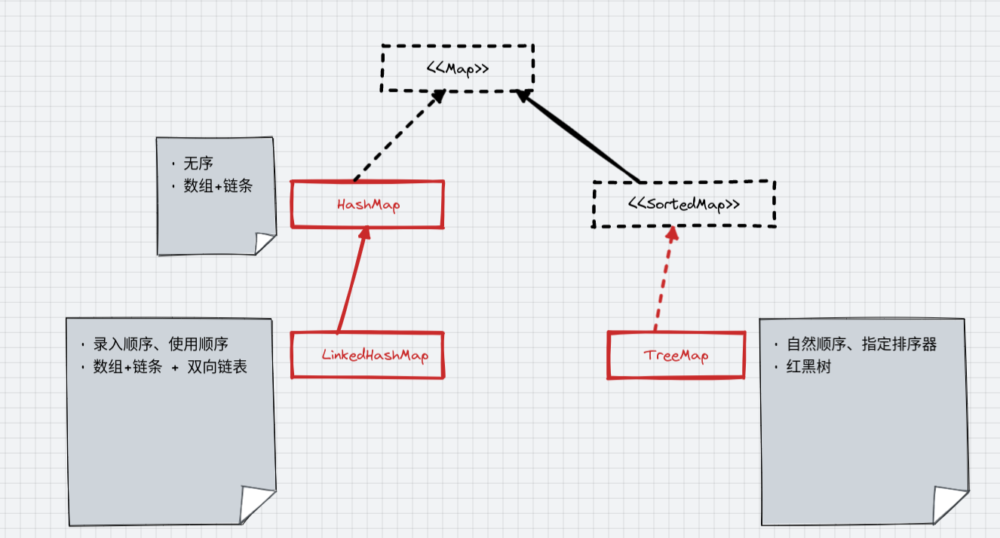

* Jdk

    - map
        - [HashMap](HashMap.md)
        - [LinkedHashMap](LinkedHashMap.md) 有序
        - [treeMap](treeMap.md) 排序
        - [HashTable](HashTable.md) HashMap + synchronized => 支持同步、线程安全、效率不高
        - [ConcurrentHashMap](CurrentHashMap.md) 线程安全、效率高
    - set: 无序、不可重复
        - [HashSet](HashSet.md) hash表、去重、无序
        - [LinkedHashSet](LinkedHashSet.md) 有序
        - [TreeSet](TreeSet.md) 二叉树(平衡二叉树更具体一点就是红黑树)、排序、去重
    - list: 有序，可重复
        - [ArrayList](ArrayList.md) 数组结构、set/get效率高
        - [LinkedList](LinkedList.md) 双向链条结构、add/remove效率高
        - [Vector](Vector.md) ArrayList + synchronized => 数组结构、线程安全、效率不高
    - Queue: FIFO
      - [PriorityQueue](PriorityQueue.md): 按照元素的大小重新排序
      - [Deque](Deque.md): 双向队列 => 是队列也是栈 => 实现：LinkedList、ArrayDeque
      - [ConcurrentLinkedQueue](ConcurrentLinkedQueue.md): 线程安全

* [guava](../guava/Guava中这些Map的优秀操作让我的代码量减少了50%25.md)

    - [MultiMap](MultiMap.md) Map<T, List>
    - [MultiSet](MultiSet.md) 无序 but 可重复
    - [BiMap](BiMap.md) 双向map. 通过key-> value、亦可以value -> key
    - [Table](Table.md) Map<String, Map<String, Object>>
    - [RangeMap](RangeMap.md) Map<[30, 60], "A"> -> get(45)>>>A
    - [ClassToInstanceMap](ClassToInstanceMap.md) <class, instance> 好处：1. 不用强制类型转换还支持泛型

