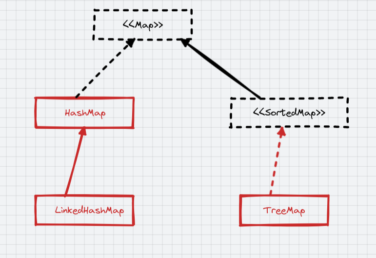
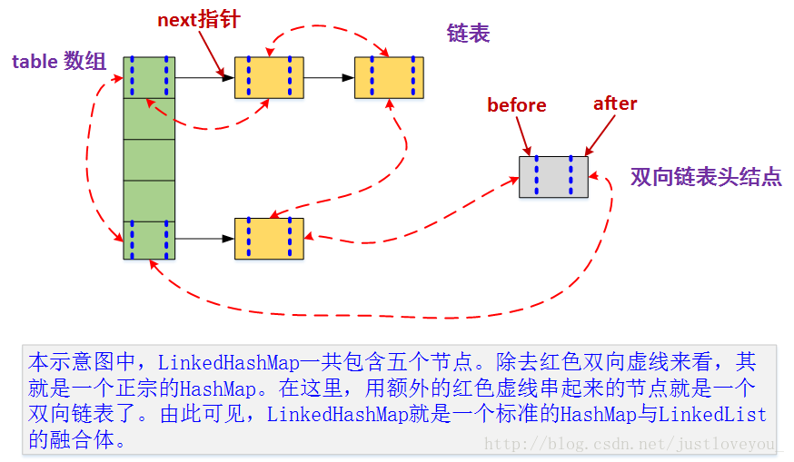

# LinkedHashMap

**HashMap**和**双向链表**合二为一即是**LinkedHashMap**。所谓LinkedHashMap，其落脚点在HashMap，因此更准确地说，它是一个将所有Entry节点链入一个双向链表的HashMap。由于LinkedHashMap是HashMap的子类，所以LinkedHashMap自然会拥有HashMap的所有特性。比如，LinkedHashMap的元素存取过程基本与HashMap基本类似，只是在细节实现上稍有不同。当然，这是由LinkedHashMap本身的特性所决定的，因为它额外维护了一个双向链表用于保持迭代顺序。

* LinkedHashMap 是 对 HashMap 做了增强，HashMap有的，LinkedHashMap 都有
* LinkedHashMap 每个元素增加了头尾指针，维护了双向链表，**保证有序**

 

## 有序

1. 录入顺序

    * 默认使用录入顺序保证输出顺序

3. 使用顺序 ==>> 可以实现LRU算法

    * `new LinkedHashMap<>(16, 0.75, true);` accessOrder=true 通过使用顺序保证输出顺序，使用过的（get）放在了最后

