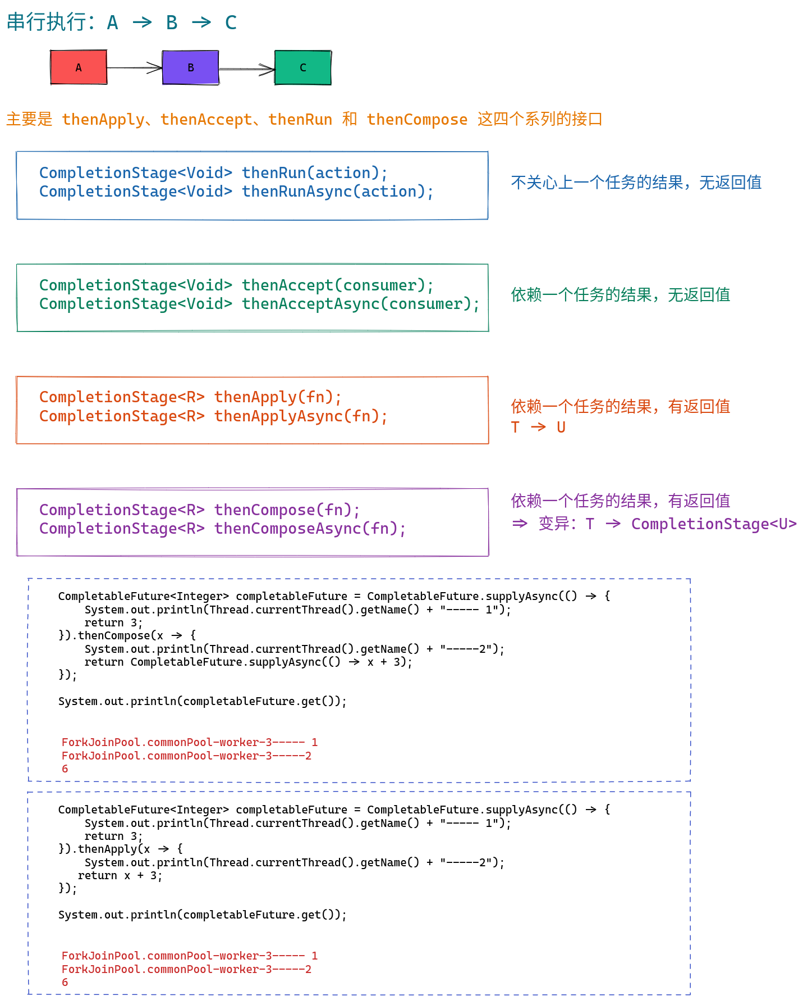
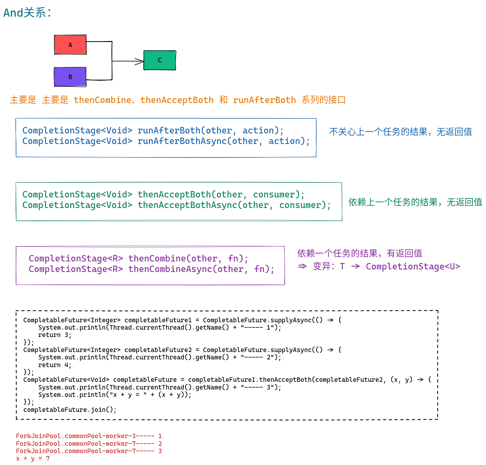
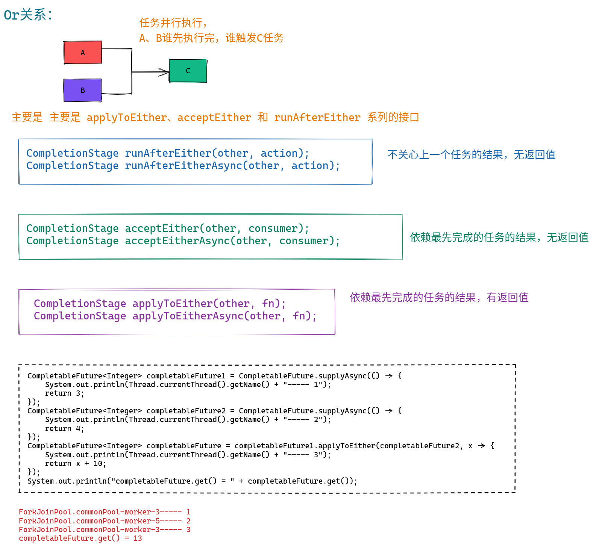
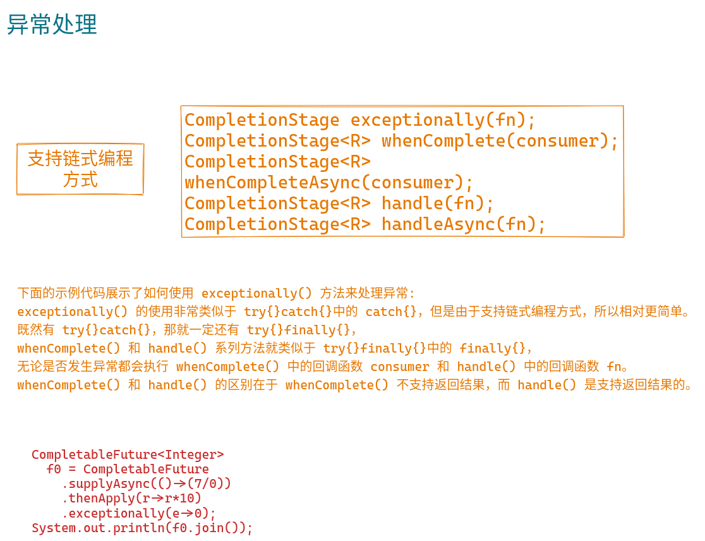
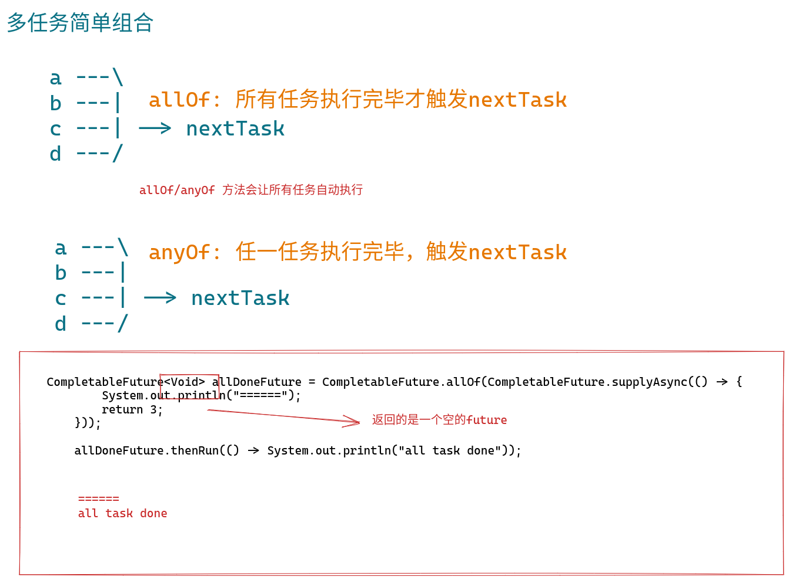

# CompletableFuture


1. 默认使用ForkJoinPool线程池（ForkJoinPool线程池默认线程数=cpu核数）
2. 也可以使用自定义的线程池（推荐）
3. 支持串行、并行、汇聚、and、or关系

## 构造方法

```java
//使用默认线程池
static CompletableFuture<Void> runAsync(Runnable runnable)
static <U> CompletableFuture<U> supplyAsync(Supplier<U> supplier)
//可以指定线程池  
static CompletableFuture<Void> runAsync(Runnable runnable, Executor executor)
static <U> CompletableFuture<U> supplyAsync(Supplier<U> supplier, Executor executor)  
```

* 不指定线程池，使用默认线程池ForkJoinPool.ForkJoinPool公共线程池，所有的CompletableFuture共享一个线程池。
  * 推荐不同的业务使用不同的线程池，防止有些任务执行的很慢，阻塞其他任务。
* Runnable无返回值，Supplier有返回值：supplier.get()
* CompletableFuture 实现了 Future 接口, 可以解决一下两个问题：
  1. 任务什么时候结束
  2. 获取任务的执行结果
* CompletableFuture 实现了 CompletionStage 接口，可以实现串行、并行、汇聚关系
## 串行任务



## and任务




## or任务



## 异常处理



## 多任务简单组合



