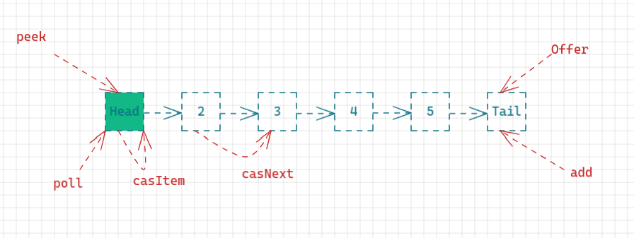

# ConcurrentLinkedQueue

## 特点

1. 线程安全的、无界的、非阻塞队列（cas实现并非锁）
2. 底层数据结构使用的是单向列表

## API

* offer: 队未添加一个元素（元素不能为null, 否则NPE异常）, 无限cas（获取尾节点，如果尾节点变化了，自旋再获取新的尾节点，直到尾节点没有元素【尾节点的next==null】）, 直到添加成功。
* poll: 在队列的头部获取并移除一个元素，如果队列为空则返回null。
* peek: 从队头获取一个元素（只获取不移除），空 -> null
* size: 计算当前队列元素的个数，没有cas，可能会有并发安全问题
* remove: 删除指定元素，如果有多个删除第一个并返回true,否则返回false(一个线程操作成功，失败的线程循环查找队列中是否有匹配的其他元素)
* contains: 是否包含元素，有可能调用时返回true,包含该元素。但是在遍历的时候，元素已近被其他线程删除。

