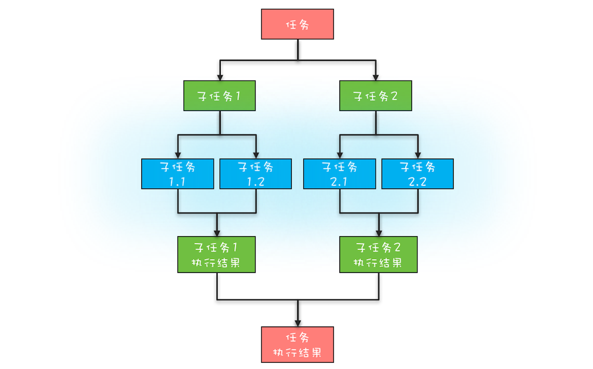
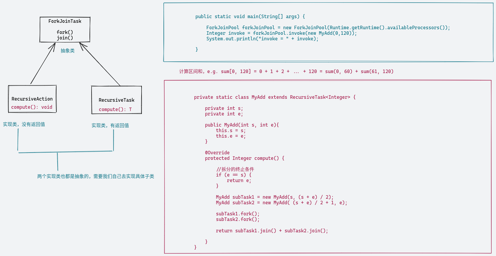
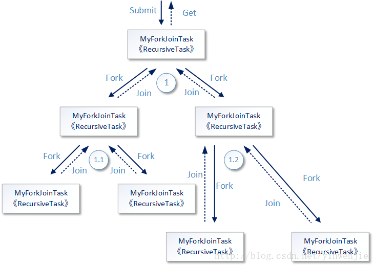
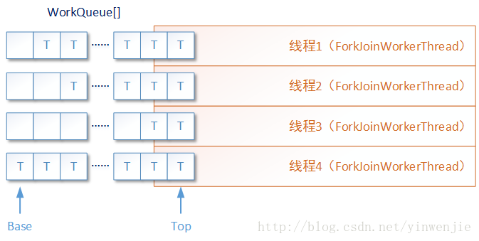

# ForkJoin

递归框架，Fork 对应的是分治任务模型里的任务分解，Join 对应的是结果合并

它可以将一个大的任务拆分成多个子任务进行并行处理，最后将子任务结果合并成最后的计算结果

1. 分治任务的线程池 ForkJoinPool, 线程数默认=CPU核数
2. ForkJoinTask 分治任务，就是Runnable

下图展示了以上代码的工作过程概要，但实际上Fork/Join框架的内部工作过程要比这张图复杂得多，例如如何决定某一个recursive task是使用哪条线程进行运行；再例如如何决定当一个任务/子任务提交到Fork/Join框架内部后，是创建一个新的线程去运行还是让它进行队列等待。

每一个ForkJoinWorkerThread线程都具有一个独立的任务等待队列（work queue），这个任务队列用于存储在本线程中被拆分的若干子任务。

