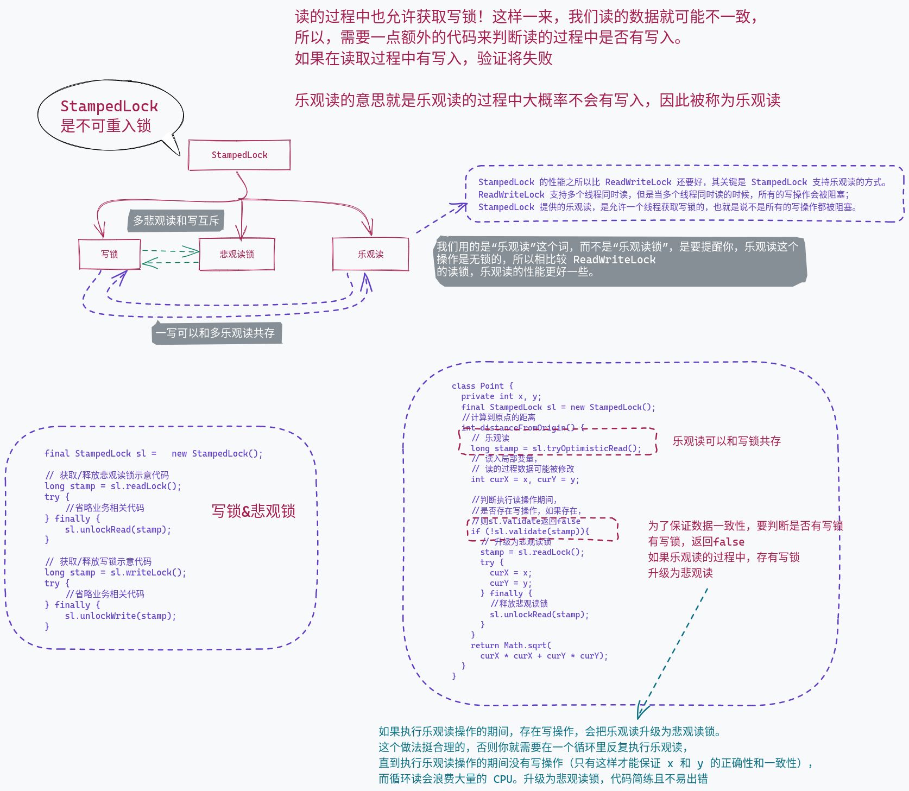

# StampedLock

* 读写锁允许多个线程同时读共享变量，适用于读多写少的场景
* 那在读多写少的场景中，还有没有更快的技术方案呢？还真有，Java 在 1.8 这个版本里，提供了一种叫 StampedLock 的锁，它的性能就比读写锁还要好。
* StampedLock 支持三种模式，分别是：写锁、悲观读锁和乐观读。
  * 写锁、悲观读锁的语义和 ReadWriteLock 的写锁、读锁的语义非常类似，允许多个线程同时获取悲观读锁，但是只允许一个线程获取写锁，写锁和悲观读锁是互斥的。不同的是：StampedLock 里的写锁和悲观读锁加锁成功之后，都会返回一个 stamp；然后解锁的时候，需要传入这个 stamp。
  * 写锁和乐观读可以共存（认为不存在写操作），需要加一步单独的判断，如果在读的过程中，确实有写，返回false,这个时候就不能继续读了，否则就是错误数据，需要降级为读锁，等待写操作完成，或者不停循环判断，直到没有写锁，返回true

