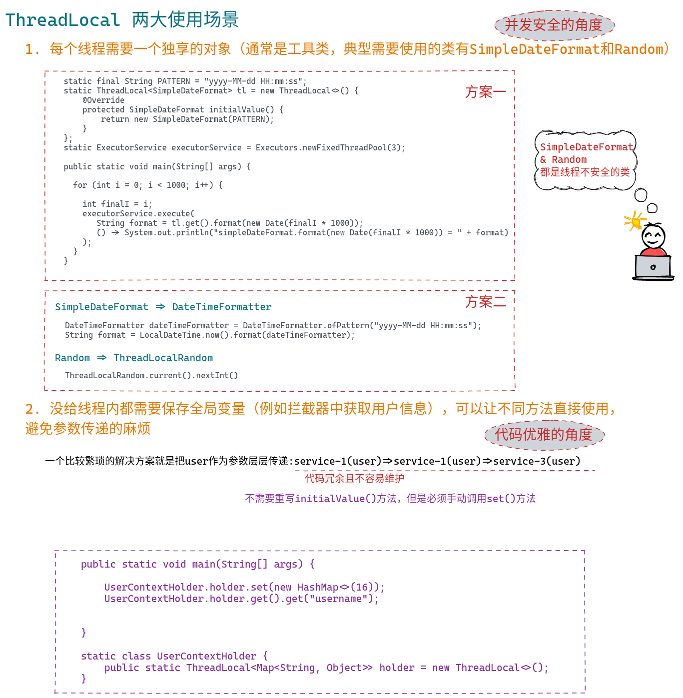
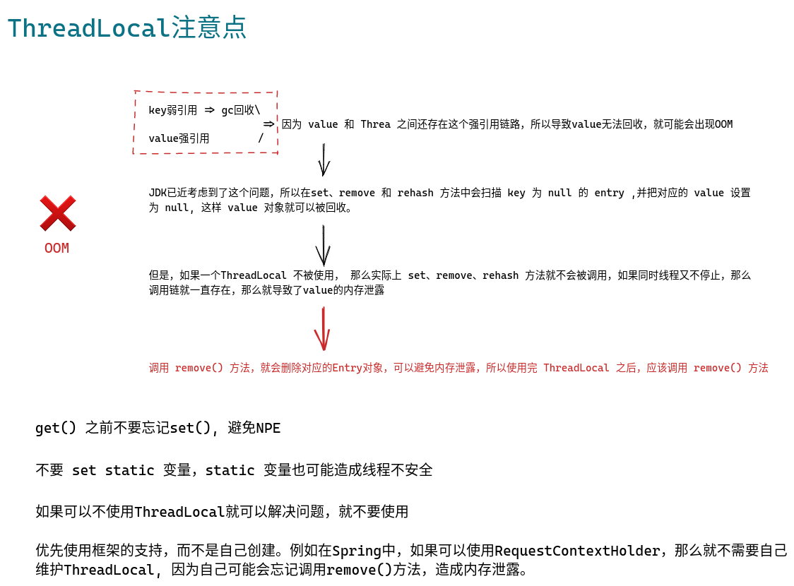
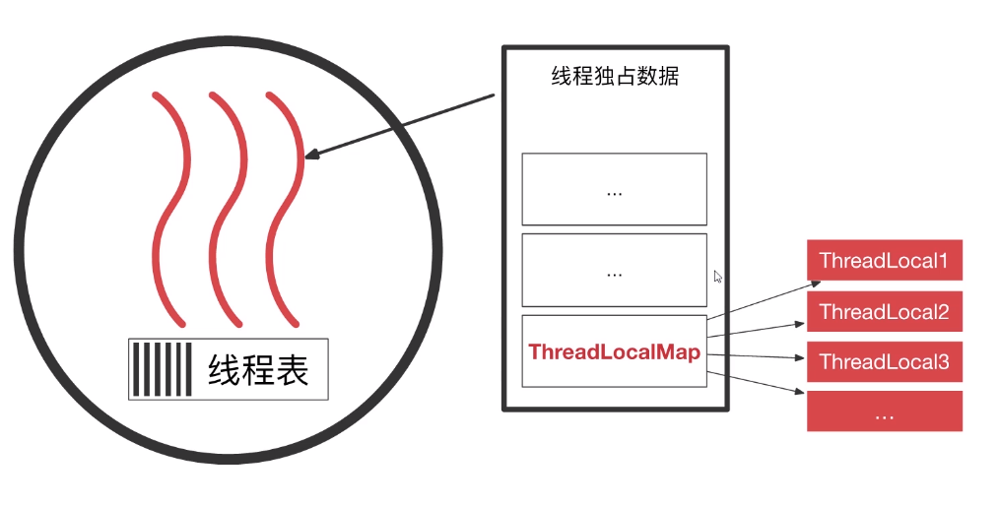
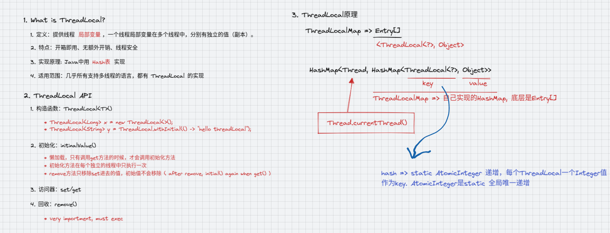

# ThreadLocal








## ThreadLocal是什么

* 定义：提供线程<font color="red">局部变量</font>，一个线程局部变量在多个线程中，分别有独立的值（副本）.

> ThreadLocal叫做线程变量，意思是ThreadLocal中填充的变量属于当前线程，该变量对其他线程而言是隔离的，也就是说该变量是当前线程独有的变量。ThreadLocal为变量在每个线程中都创建了一个副本，那么每个线程可以访问自己内部的副本变量。

* 特点：

    * 简单（开箱即用）
    * 快速（无额外开销）
    * 安全（线程安全）

* 实现原理：底层是一个Hash表
* 适用范围：几乎所有支持多线程的语言，都有ThreadLocal的实现
* ThreadLocal模型：

  

## ThreadLocal API


* 构造函数：ThreadLocal<T>()

  - ThreadLocal<Long> x = new ThreadLocal<>();
  - ThreadLocal<String> y = ThreadLocal.withInitial(() -> "hello threadLocal");

* 初始化：initialValue()

  - 懒加载，只有调用get方法的时候，才会调用初始化方法
  - 初始化方法在每个独立的线程中只执行一次
  - remove方法只移除set进去的值，初始值不会移除(remove以后，再执行get操作的时候会再次执行initial方法)

* 访问器：get/set

* 回收：remove()

  - 非常重要，必须执行的方法,否则会导致线程不安全和内存泄露


```java

public class Main {


    private static ThreadLocal<Long> x = new ThreadLocal<>(){
        /**
         * 延迟加载（懒加载），不调用get方法不会执行初始化方法，
         * 该方法在每个线程中只执行一次
         * remove方法只移除set进去的值，初始值不会移除【remove以后再次调用get()的时候会再次执行initial()】
         */
        @Override
        protected Long initialValue() {
            System.out.println("Initial value run ...");
            return Thread.currentThread().getId();
        }
    };

    private static ThreadLocal<String> y = ThreadLocal.withInitial(() -> "hello threadLocal");


    public static void main(String[] args) {


        new Thread(){
            @Override
            public void run() {
                System.out.println(x.get());
                System.out.println(y.get());
            }
        }.start();


        System.out.println(x.get());
        System.out.println(y.get());
        x.remove();
        y.remove();
        System.out.println(x.get());
        System.out.println(y.get());

    }
}


```


## ThreadLocal 原理





