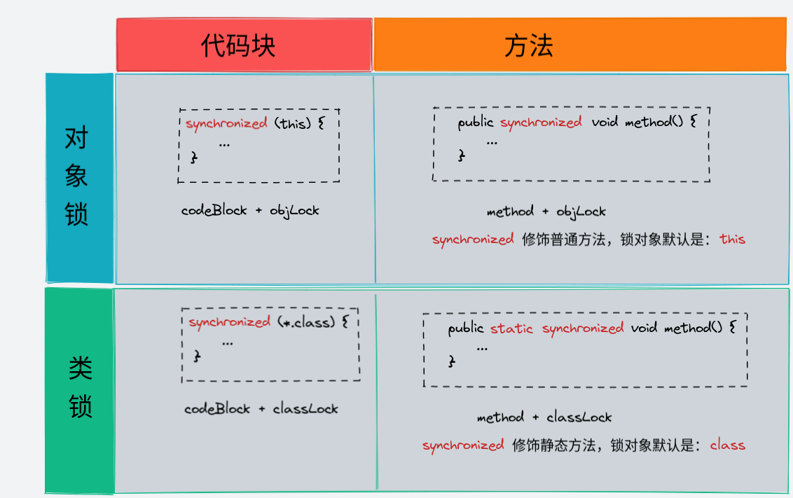

# synchronized

## 1. synchronized 简介

官方解释：同步方法支持一种简单的策略来防止线程干扰和内存一致性错误：如果一个对象对多个线程可见，则对该对象变量的所有读取或写入都是通过同步方法完成的。

一句话说出`synchronized`作用：**能够保证在同一时刻最多只有一个线程执行该段代码，以达到保证并发安全的效果。**

## 2. synchronized 两个用法

| 方法   | 解释                                                                       |
| -----  | -----                                                                      |
| 对象锁 | 方法锁（默认锁对象是this => 当前实例对象）、同步代码块锁（自己指定锁对象） |
| 类锁   | synchronized 修饰的静态的方法、指定锁为Class对象                           |

> 同步代码块在抛出异常后，会自动释放锁

## synchronized 性质

* 可重入性
    - 指的是同一线程的外层函数获取锁以后，内层函数可以直接再次获取该锁
* 不可中断性
    - 一旦这个锁已近被别人获得了，如果我还想获得，我只能选择等待或者组赛，指导别的线程释放这个锁。如果别人永远不释放锁，那么我只能永远等待下去。:wa

## 缺陷

* 效率低

    * 锁的释放情况少：同步代码块执行完成、抛出异常
    * 试图获得锁时不能设定超时,一直阻塞
    * 不能终端一个正在试图获得锁的线程

* 不够灵活

    * 加锁和释放的时机单一，每个锁仅有单一的条件（某个对象），可能是不够

* 无法知道是否成功的获取到了这个锁

