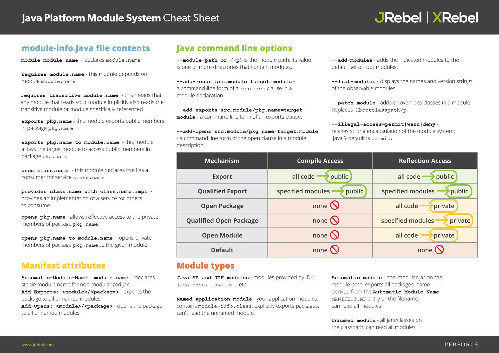

你好，我是范学雷。今天，我们继续讨论 Java 平台模块系统（Java Platform Module System，JPMS）。

Java 平台模块系统是在 JDK 9 正式发布的。在上一讲我们也说过，这项重要的技术从萌芽到诞生，花费了十多年的时间，堪称 Java 出现以来最重要的新软件工程技术。

模块化可以帮助各级开发人员在构建、维护和演进软件系统时提高工作效率。更让人满意的是，它还非常简单、直观。我们不需要太长的学习时间就能快速掌握它。

这一节课，我们就一起来看看应该怎么使用 Java 平台模块系统。

## 阅读案例

在前面的课程里，我们多次使用了 Digest 这个案例来讨论问题。在这些案例里，我们把实现的代码和接口定义的代码放在了同一个文件里。对于一次 Java 新特性的讨论来说，这样做也许是合适的。我们可以使用简短的代码，快速、直观地展示新特性。

```java
public sealed abstract class Digest {

    private static final class SHA256 extends Digest {

    }

    private static final class SHA512 extends Digest {

    }

    public static Returned<Digest> of(String algorithm) {

    }

    public abstract byte[] digest(byte[] message);

}
```

但是，如果放到生产环境，这样的示例就不一定是一个好的导向了。因为，Digest 的算法可能有数十种。其中有老旧废弃的算法，有即将退役的算法，还有当前推荐的算法。把这些算法的实现都装到一个瓶子里，似乎有点拥挤。

而且，不同的算法，可能有不同的许可证和专利限制；实现的代码也可能是由不同的个人或者公司提供的。同一个算法，可能还会有不同的实现：有的实现需要硬件加速，有的实现需要使用纯 Java 代码。这些情况下，这些实现代码其实都是没有办法装到同一个瓶子里的。

所以，典型的做法就是分离接口和实现。

首先，我们来看一看接口的设计。下面的代码就是一个接口定义的例子。

```java
package co.ivi.jus.crypto;

import java.util.ServiceLoader;

public interface Digest {

    byte[] digest(byte[] message);

    static Returned<Digest> of(String algorithm) {

        ServiceLoader<DigestManager> serviceLoader = ServiceLoader.load(DigestManager.class);

        for (DigestManager cryptoManager : serviceLoader) {

            Returned<Digest> rt = cryptoManager.create(algorithm);

            switch (rt) {

                case Returned.ReturnValue rv -> { return rv; }
                case Returned.ErrorCode ec -> { continue; }

            }

        }

        return Returned.UNDEFINED;

    }

}
```

在这个例子里，我们只定义了 Digest 的公开接口，以及实现获取的方法（使用 ServiceLoader），而没有实现具体算法的代码。同时呢，我们希望 Digest 接口所在的包也是公开的，这样应用程序可以方便地访问这个接口。

有了 Digest 的公开接口，我们还需要定义连接公开接口和私有实现的桥梁，也就是实现的获取和供给办法。下面这段代码，定义的就是这个公开接口和私有实现之间的桥梁。Digest 公开接口的实现代码需要访问这个桥梁接口，所以它也是公开的接口。

```java
package co.ivi.jus.crypto;

public interface DigestManager {

    Returned<Digest> create(String algorithm);

}
```

然后，我们来看看 Digest 接口实现的部分。有了 Digest 的公开接口和实现的桥梁接口，Digest 的实现代码就可以放置在另外一个 Java 包里了。比如，下面的例子里，我们把 Sha256 的实现，放在了 co.ivi.jus.impl 这个包里。

```java
package co.ivi.jus.impl;

import co.ivi.jus.crypto.Digest;
import co.ivi.jus.crypto.Returned;

final class Sha256 implements Digest {

    static final Returned.ReturnValue<Digest> returnedSha256;

    private Sha256() { }

    @Override
    public byte[] digest(byte[] message) {

    }

}
```

因为这只是一个算法的实现代码，我们不希望应用程序直接调用实现的子类，也不希望应用程序直接访问这个 Java 包。所以，Sha256 这个子类，使用了缺省的访问修饰符。

同时，在这个 Java 包里，我们也实现了 Sha256 的间接获取方式，也就是实现了桥梁接口。

```java
package co.ivi.jus.impl;

public final class DigestManagerImpl implements DigestManager {

    @Override
    public Returned<Digest> create(String algorithm) {

        return switch (algorithm) {

            case "SHA-256" -> Sha256.returnedSha256;
            case "SHA-512" -> Sha512.returnedSha512;

            default -> Returned.UNDEFINED;

        };

    }

}
```

稍微有点遗憾的是，由于 ServiceLoader 需要使用 public 修饰的桥梁接口，所以我们不能使用除了 public 以外的访问修饰符。也就是说，如果应用程序加载了这个 Java 包，它就可以直接使用 DigestManagerImpl 类。这当然不是我们期望的使用办法。

我们并不希望应用程序直接使用 DigestManagerImpl 类，然而 JDK 8 之前的 Java 世界里，我们并没有简单有效的、强制性的封装办法。所以，我们的解决办法通常是对外宣称：“co.ivi.jus.impl”这个包是一个内部 Java 包，请不要直接使用。这需要应用程序的开发者仔细地阅读文档，分辨内部包和公开包。

但在 Java 9 之后的 Java 世界里，我们就可以使用 Java 模块来限制应用程序使用 DigestManagerImpl 类了。

## 使用 Java 模块

下面我们来一起看看，Java 模块是怎么实现这样的限制的。

### 模块化公开接口

首先呢，我们把公开接口的部分，也就是 co.ivi.jus.crypto 这个 Java 包封装到一个 Java 模块里。我们给这个模块命名为 jus.crypto。Java 模块的定义，使用的是 module-info.java 这个文件。这个文件要放在源代码的根目录下。下面的代码，就是我们封装公开接口的部分的 **module-info.java** 文件。

```java
module jus.crypto {

    exports co.ivi.jus.crypto;

    uses co.ivi.jus.crypto.DigestManager;

}

```

第一行代码里的“module”，就是模块化定义的关键字。紧接着 module 的就是要定义的模块的名字。在这个例子里，我们定义的是 jus.crypto 这个 Java 模块。

第二行代码里的“exports”, 说明了这个模块允许外部访问的 API，也就是这个模块的公开接口。“模块的公开接口”，是一个 Java 模块带来的新概念。

没有 Java 模块的时候，除了内部接口，我们可以把 public 访问修饰符修饰的外部接口看作是公开的接口。这样的规则，需要我们去人工分辨内部接口和外部接口。

但有了 Java 模块之后我们就知道，使用了“exports”模块定义、并且使用了 public 访问修饰符修饰的接口，就是公开接口。这样，公开接口就有了清晰的定义，我们就不用再去人工分辨内部接口和外部接口了。

而第四行代码里的“uses”呢，则说明这个模块直接使用了 DigestManager 定义的服务接口。

你看，这么简短的五行代码，就把 co.ivi.jus.crypto 这个 Java 模块化了。它定义了公开接口以及要使用的服务接口。

### 模块化内部接口

然后呢，我们要把内部接口的部分，也就是 co.ivi.jus.impl 这个 Java 包也封装到一个 Java 模块里。下面的代码，就是我们封装内部接口部分的 module-info.java 文件。

```java

module jus.crypto.impl {

    requires jus.crypto;

    provides co.ivi.jus.crypto.DigestManager with co.ivi.jus.impl.DigestManagerImpl;

}
```

在这里，第一行代码定义了 jus.crypto.impl 这个 Java 模块。

第二行代码里的“requires”说明，这个模块需要使用 jus.crypto 这个模块。也就是说，定义了这个模块的依赖关系。有了这个明确定义的依赖关系，加载这个模块的时候，Java 运行时就不再需要地毯式地搜索依赖关系了。

第四行代码里的“provides”说明，这个模块实现了 DigestManager 定义的服务接口。同样的，有了这个明确的定义，服务接口实现的搜索，也不需要地毯式地排查了。

需要注意的是，这个模块并没有使用“exports”定义模块的公开接口。这也就意味着，虽然在 co.ivi.jus.impl 这个 Java 包里，有使用 public 访问修饰符修饰的接口，它们也不能被模块外部的应用程序访问。这样，我们就不用担心应用程序直接访问 DigestManagerImpl 类了。取而代之的，应用程序只能通过 DigestManager 这个公开的接口，间接地访问这个实现类。这是我们想要的封装效果。

### 模块化应用程序

有了公开接口和实现，我们再来看看该怎么模块化应用程序。下面的代码，是我们使用了 Digest 公开接口的一个小应用程序。

```java

package co.ivi.jus.use;

import co.ivi.jus.crypto.Digest;
import co.ivi.jus.crypto.Returned;

public class UseCase {

    public static void main(String[] args) {

        Returned<Digest> rt = Digest.of("SHA-256");

        switch (rt) {

            case Returned.ReturnValue rv -> {
                Digest d = (Digest) rv.returnValue();
                d.digest("Hello, world!".getBytes());
            }

            case Returned.ErrorCode ec -> System.getLogger("co.ivi.jus.stack.union").log(System.Logger.Level.INFO, "Failed to get instance of SHA-256");

        }

    }

}
```

下面的代码，就是我们封装这个应用程序的 module-info.java 文件。

```java

module jus.crypto.use {

    requires jus.crypto;

}
```

在这里，第一行代码定义了 jus.crypto.use 这个 Java 模块。

第二行代码里的“requires”, 说明这个模块需要使用 jus.crypto 这个模块。

需要注意的是，这个模块并没有使用“exports”定义模块的公开接口。那么，我们该怎么运行 UseCase 这个类的 main 方法呢？其实，和传统的 Java 代码相比，模块的编译和运行有着自己的特色。

### 模块的编译和运行

在 javac 和 java 命令行里，我们可以使用“–module-path”指定 java 模块的搜索路径。在 Jar 命令行里，我们可以使用“–main-class”指定这个 Jar 文件的 main 函数所在的类。在 Java 命令里，我们可以使用“–module”指定 main 函数所在的模块。

有了这些选项的配合，在上面的例子里，我们就不需要把 UseCase 在模块里定义成公开类了。我们来看看这些选项是怎么使用的。

```java

$ cd jus.crypto
$ javac --enable-preview --release 17 \
-d classes src/main/java/co/ivi/jus/crypto/* \
src/main/java/module-info.java

$ jar --create --file ../jars/jus.crypto.jar -C classes .

$ cd ../jus.crypto.impl

$ javac --enable-preview --release 17 \
--module-path ../jars -d classes \
src/main/java/co/ivi/jus/impl/* \
src/main/java/module-info.java

$ jar --create --file ../jars/jus.crypto.impl.jar -C classes .

$ cd ../jus.crypto.use

$ javac --enable-preview --release 17 \
--module-path ../jars -d classes \
src/main/java/co/ivi/jus/use/* \
src/main/java/module-info.java

$ jar --create --file ../jars/jus.crypto.use.jar \
--main-class co.ivi.jus.use.UseCase \
-C classes .

$ java --enable-preview --module-path ../jars --module jus.crypto.use
```


我在专栏里不会讲解这些选项的细节。具体的用法，我更希望你去找第一手的资料。下面的这个备忘单是我看到的一个比较好的总结。你可以打印下来备用，用熟了之后再丢掉。



## 总结

好，到这里，我来做个小结。前面，我们讨论了怎么使用 Java 模块封装我们的代码，了解了 module-info.java 文件以及它的结构和关键字。

总体来看，Java 模块的使用是简单、直观的。Java 模块的使用，实现了更好的封装，也定义了模块和 Java 包之间的依赖关系。有了依赖关系，Java 语言就能够实现更快的类检索和类加载了。这样的性能提升，通过模块化就能实现，还不需要更改代码。

如果面试的时候，讨论到了 Java 平台模块系统，你可以聊一聊 Java 模块封装的关键字，以及这些关键字能够起到的作用。我相信，这是一个有意思、有深度的话题。

## 思考题

在前面的讨论中，我们把 DigestManager 定义成了公开接口。我们希望 Digest 的实现可以使用这个桥梁接口，但是我们又不希望应用程序直接使用它。取而代之的，应用程序应该使用 Digest.of 方法获得算法的实现。从这个意义上说，我们前面的案例，并没有做好封装。

那么，有没有更好的办法，把 DigestManager 也封装起来，让应用程序无法调用呢？这是我们这一次、也是最后一次的思考题。

欢迎你在留言区留言、讨论，分享你的阅读体验以及你的改进。
