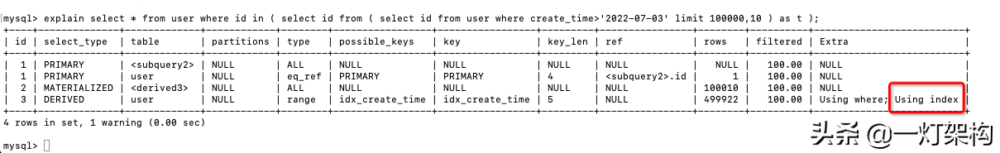

开发经常遇到分页查询的需求，但是当翻页过多的时候，就会产生深分页，导致查询效率急剧下降。

有没有什么办法，能解决深分页的问题呢？

本文总结了三种优化方案，查询直接效率提升10倍，一起学习一下。

## 1. 准备数据

先创建一张用户表，只在create\_time字段上加索引：

```sql
CREATE TABLE `user` (
  `id` int NOT NULL AUTO_INCREMENT COMMENT '主键',
  `name` varchar(255) DEFAULT NULL COMMENT '姓名',
  `create_time` timestamp NULL DEFAULT NULL COMMENT '创建时间',
  PRIMARY KEY (`id`),
  KEY `idx_create_time` (`create_time`)
) ENGINE=InnoDB COMMENT='用户表';
```

然后往用户表中插入100万条测试数据，这里可以使用存储过程：

```sql
drop PROCEDURE IF EXISTS insertData;
DELIMITER $$
create procedure insertData()
begin
 declare i int default 1;
   while i <= 100000 do
         INSERT into user (name,create_time) VALUES (CONCAT("name",i), now());
         set i = i + 1; 
   end while; 
end $$

call insertData() $$
```

## 2. 验证深分页问题

每页10条，当我们查询第一页的时候，速度很快：

```sql
select * from user 
where create_time>'2022-07-03' 
limit 0,10;
```


在不到0.01秒内直接返回了，所以没显示出执行时间。

当我们翻到第10000页的时候，查询效率急剧下降：

```sql
select * from user 
where create_time>'2022-07-03' 
limit 100000,10;
```


执行时间变成了0.16秒，性能至少下降了几十倍。

耗时主要花在哪里了？

1.  需要扫描前10条数据，数据量较大，比较耗时
2.  create_time是非聚簇索引，需要先查询出主键ID，再回表查询，通过主键ID查询出所有字段

画一下回表查询流程：

**1. 先通过create_time查询出主键ID**


**2. 再通过主键ID查询出表中所有字段**


别问为什么B+树的结构是这样的？问就是规定。

可以看一下前两篇文章。

[MySQL索引底层实现为什么要用B+树？](https://www.toutiao.com/article/7093527245851230750/)

[一篇文章讲清楚MySQL的聚簇/联合/覆盖索引、回表、索引下推](https://www.toutiao.com/article/7095749260137726476/)

然后我们就针对这两个耗时原因进行优化。

## 3. 优化查询

### 3.1 使用子查询

先用子查询查出符合条件的主键，再用主键ID做条件查出所有字段。

```sql
select * from user 
where id in (
  select id from user 
  where create_time>'2022-07-03' 
  limit 100000,10
);
```

不过这样查询会报错，说是子查询中不支持使用limit。


我们加一层子查询嵌套，就可以了：

```sql
select * from user 
where id in (
 select id from (
    select id from user 
    where create_time>'2022-07-03' 
    limit 100000,10
 ) as t
);
```


执行时间缩短到0.05秒，减少了0.12秒，相当于查询性能提升了3倍。

为什么先用子查询查出符合条件的主键ID，就能缩短查询时间呢？

我们用explain查看一下执行计划就明白了：

```sql
explain select * from user 
where id in (
 select id from (
    select id from user 
    where create_time>'2022-07-03' 
    limit 100000,10
 ) as t
);
```



可以看到Extra列显示子查询中用到**Using index**，表示用到了**覆盖索引**，所以子查询无需回表查询，加快了查询效率。

### 3.2 使用inner join关联查询

把子查询的结果当成一张临时表，然后和原表进行关联查询。

```sql
select * from user 
inner join (
   select id from user 
    where create_time>'2022-07-03' 
    limit 100000,10
) as t on user.id=t.id;
```


查询性能跟使用子查询一样。

### 3.3 使用分页游标（推荐）

实现方式就是：当我们查询第二页的时候，把第一页的查询结果放到第二页的查询条件中。

例如：首先查询第一页

```sql
select * from user 
where create_time>'2022-07-03' 
limit 10;
```

然后查询第二页，把第一页的查询结果放到第二页的查询条件中：

```sql
select * from user 
where create_time>'2022-07-03' and id>10 
limit 10;
```

这样相当于每次都是查询第一页，也就不存在深分页的问题了，推荐使用。


执行耗时是0秒，查询性能直接提升了几十倍。

这样的查询方式虽然好用，但是又带来一个问题，就是无法跳转到指定页数，只能一页页向下翻。

所以这种查询只适合特定场景，比如资讯类APP的首页。

互联网APP一般采用瀑布流的形式，比如百度首页、头条首页，都是一直向下滑动翻页，并没有跳转到制定页数的需求。

不信的话，可以看一下，这是头条的瀑布流：


传参中带了上一页的查询结果。


响应数据中，返回了下一页查询条件。

所以这种查询方式的应用场景还是挺广的，赶快用起来吧。

## 4. 知识点总结


## 5. 推荐阅读：《我爱背八股系列》
> [为什么要用MQ？MQ的作用有哪些？](https://www.toutiao.com/article/7033425569278689829/?group_id=7033425569278689829)  
> [高并发场景下，如何保证数据的一致性的？](https://www.toutiao.com/article/6960992235844338208/?group_id=6960992235844338208)  
> [如何进行分库分表？分库分表后有哪些问题以及对应的解决方案。](https://www.toutiao.com/article/7051608761718817287/?group_id=7051608761718817287)  
> [高并发下怎么生成订单ID？以及每种方案的优缺点。](https://www.toutiao.com/article/7043419467908481540/?group_id=7043419467908481540)  
> [如何实现分布式锁？使用数据库、分布式数据库、分布式协调服务分别如何实现？](https://www.toutiao.com/article/7057879891647267336/)
> 
> [MySQL索引底层数据结构为什么要用B+树？以及红黑树、B树的优缺点。](https://www.toutiao.com/article/7093527245851230750/)
> 
> [一篇文章讲清楚MySQL的聚簇/联合/覆盖索引、回表、索引下推](https://www.toutiao.com/article/7095749260137726476/)
> 
> [ThreadLocal线上故障复盘，差点丢了工作。](https://www.toutiao.com/article/7095297099218174499/)  
> [一文详解MySQL事务底层原理](https://www.toutiao.com/article/7098259319149445646/)  
> [一文讲清楚MySQL的所有锁](https://www.toutiao.com/article/7103169937350328866/)
> 
> [MySQL update语句加锁过程和原理](https://www.toutiao.com/article/7105712543062065698/)  
> [手把手教你排查线上MySQL死锁](https://www.toutiao.com/article/7106815583118967300/?log_from=e1b62527948af_1655132181242)  
> [彻底搞懂三大MySQL日志，Redo Log、Undo Log、Bin Log](https://www.toutiao.com/article/7108735969838694953/)
> 
> [MySQL查询为什么没走索引？这篇文章带你全面解析](https://www.toutiao.com/article/7114691536863969800/)
