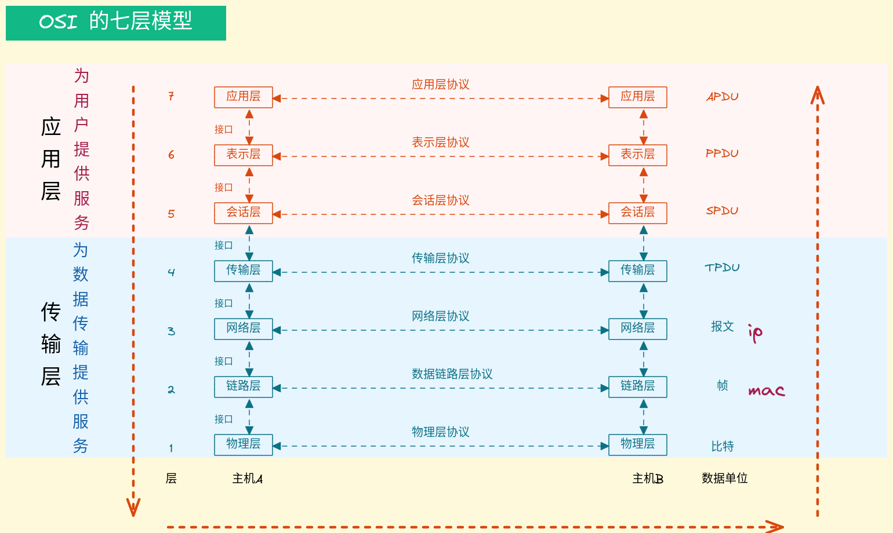

# ISO-OSI七层模型

* ISO: 国际标准化组织
* OSI: 开放系统互联模型
* IOS: 苹果操作系统

| 层         | 详解                                                                                                  |
|------------|-------------------------------------------------------------------------------------------------------|
| 应用层     | 用户接口                                                                                              |
| 表示层     | 数据的表现形式、特定功能的实现（如加密）                                                              |
| 会话层     | 对应用会话的管理、同步                                                                                |
| 传输层     | 可靠与不可靠的传输、65535端口、tpc(面向连接的、可靠的、有序的)、udp(广播报文)、传输前的错误检测、流控 |
| 网络层     | 提供逻辑地址（写入源ip & 目的ip地址）、选路                                                           |
| 数据链路层 | 成帧、mac地址访问媒介(源mac地址 & 目标mac地址[mac地址在局域网内使用])、错误检测与修改正               |
| 物理层     | 设备之间比特流的传输、物理接口(网线、网卡)、电气特性等                                                |

