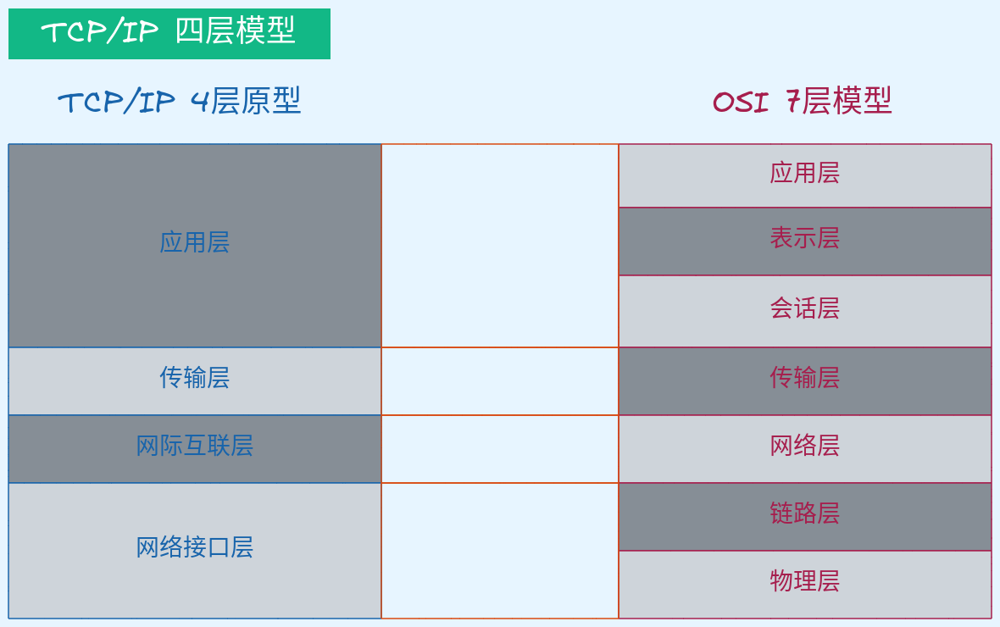
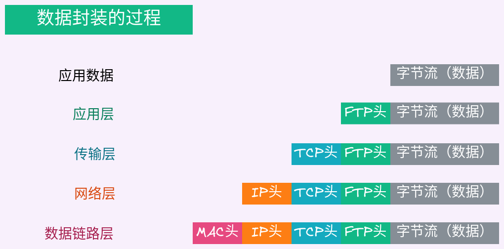

# TCP-IP四层模型

1. 网络接口层：数据传输、ARP协议（ip地址解析mac地址; ip地址是网络地址、mac地址是物理地址; ip在外网使用、mac地址在内网使用）
2. 网际互联层：主要解决主机到主机的通信问题。它所包含的协议设计数据包在整个网络上的逻辑传输。ip协议、ping协议
3. 传输层：为应用层实体提供端到端的通信功能。保证数据包的顺序传输和数据的完整性。包含两个主要的协议：传输控制协议TCP、用户数据包协议UDP
4. 应用层：为用户提供所需要的各种服务，例如：FTP、Telnet、DNS、SMTP etc.

