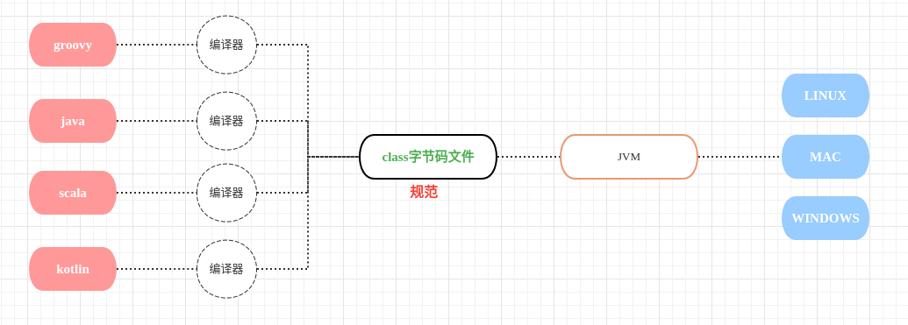
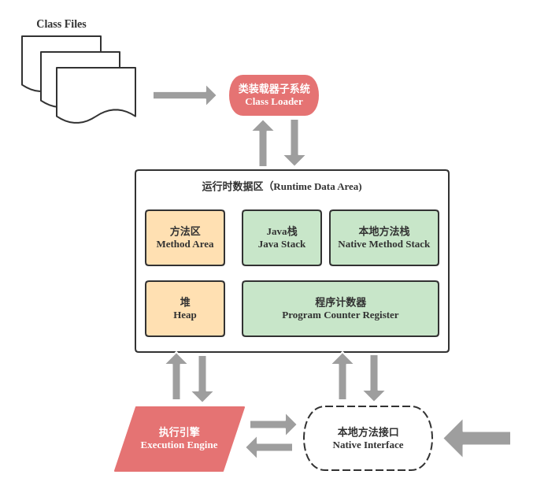
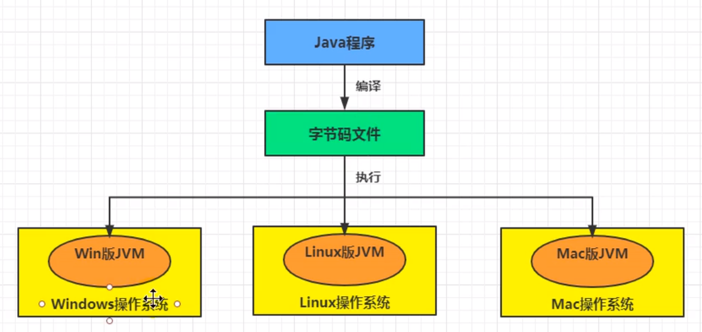
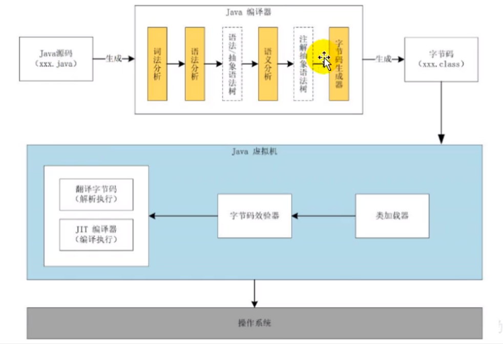

## 跨平台的语言Java和跨语言的平台JVM

## JVM的整体结构

1. 方法区、堆 多线程共享
2. 栈、本地方法区、程序计数器 多线程不共享(每个线程独有一份)
3. 执行引擎包括解释器、解释编译器JIT、垃圾回收器

## Java代码执行流程

1. 操作系统不识别字节码指令，操作系统只识别机器指令([高级语言->汇编语言->机器指令->CPU]())；
2. **翻译字节码（解释执行）** 和 **JIT编译器（编译执行）** 就是执行引擎。它的作用就是把字节码指令翻译成机器指令。
3. **翻译字节码（解释执行）**：保证执行时间的,针对字节码指令逐行解释执行。
4. **JIT编译器（编译执行）**：将反复执行的代码（热点代码）直接编译成机器指令缓存起来。

