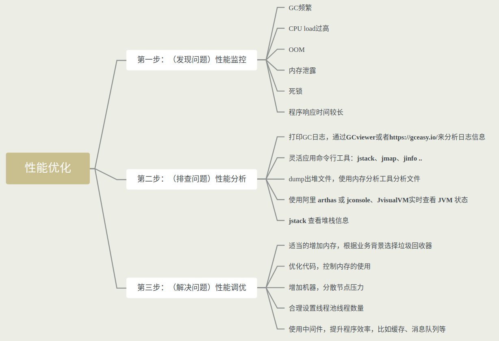
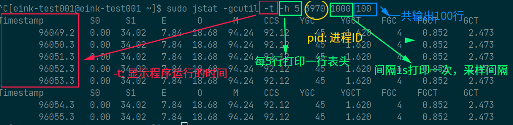

# 1. 概述




# 2. jps

查看正在运行的java进程

- **jps -m :** 查看传递给 **main** 函数的参数
- **jps -v ：**查看java进程启动时，**jvm** 参数

> 1. **`netstat -tnlp`** 查看端口和pid、pname 或者使用 **`ss -lunt`**
> 2. 如果java进程是通过`sudo`启动的，jps也必须加`sudo`


# 3. jstat

查看JVM统计信息。用于监视虚拟机各种运行状态信息的命令行工具。类装载、内存、垃圾收集、JIT编译等运行数据。

```bash
jstat -<option> [-t] [-h<lines>] <vmid> [<interval> [<count>]]
```

- **类装载相关的：**

	**-class:** 显示classloader相关的信息。类的装载、卸载数量、总空间、类装载所消耗的时间等

- **垃圾回收相关的：**

	- **-gc:** 显示与GC相关的堆信息。包括<font color="red">Eden区、两个Survivor区、老年代、永久代等的容量、已用空间、GC时间合计</font>等信息
	- **-gccapacity:** 显示内容与-gc基本相同，但输出主要关注java堆各个区域使用到的最大、最小空间
	- **-gcutil:** 显示内容与-gc基本相同，但输出主要关注已<font color="red">使用空间占总空间的百分比</font> 
	- **-gccause:** 与-gcutil功能一样，但是会额外输出导致最后一次或当前正在发生的GC产生的原因
	- **-gnew:** 显示新生代GC状况
	- **-gcnewcapacity:** 显示内容和-gcnew基本相同，输出主要关注使用到的最大、最小空间
	- **-geold:** 实现老年代GC状况
	- **-gcoldcapacity:** 显示内容和-gcold基本相同，输出主要关注使用到的最大、最小空间
	- **-gcpermcapacity:** 显示永久代使用到底最大、最小空间

- **JIT相关的：**
	
	- **-compiler:** 显示JIT编译器编译过的方法、耗时等信息
	- **-printcompilation:** 输出已经被JIT编译的方法





> - 如果总的gct时间（垃圾回收时间）占总运行时间20%,说明目前堆的压力较大；   
> - 如果总的gct占总运行时间90%,说明没有堆里几乎没有可用时间，随时发生[OOM]()异常。 


> - 多次取样ou(old used)老年带内存占用[每隔一段时间取一组数据中的最小值]()，如果是上升趋势，可能存在内存泄露


# 4. jinfo

实时查看和修改JVM配置参数。<font color="green">可以用来查看虚拟机配置参数信息，也可以用来调整虚拟机配置参数。</font>

当不知道某一个具体的java虚拟机参数值（包括未配置的默认值），jinfo工具可以很方便的找到java虚拟机参数的当前值。

> **jps -v** 只能看到显示设置的虚拟机参数，不能看到默认值未设置的虚拟机参数

```bash
jinfo [option] pid
```

- **option选项：**

	- **no option:** 输出全部的参数和全部系统属性
	- **-flag name:** 输出对应的参数
	- **-flag [+-]name:** 开启或者关闭对应名称参数。只有被标记未manageable的参数才可以被动态修改
	- **-flag name=value:** 设定对应名称的参数
	- **-flags:** 查看曾经赋过值的一些参数
	- **-sysprops:** 输出系统属性，可以查看System.getProperties()取得的参数

> java -XX:+PrintFlagsFinal -version | grep manageable 查看可以被标记为 manageable 的参数


# 5. jmap

导出内存映像文件&内存使用情况

1. 获取dump文件<font color="green">（堆转储快照文件，二进制文件）</font>
2. java进程的内存相关信息，包括java堆各区域的使用情况、对中对象的统计信息、类的加载信息等。

```bash

jmap [option] pid

```

- **option选项：**

	- **-dump:** 生成java堆转储快照dump文件;特别的，-dump:live只保存堆中的存活对象
	- **-heap:** 输出整个堆空间的详细信息，包括GC的使用，堆配置信息
	- **-histo:** 输出堆中对象的统计信息，包括类、实例数量和合计；特别多，-histo:live只统计堆中存活对象

- **使用1：导出内存映像文件**

	- <font color="Magenta">手动方式：</font>
		
		- [jmap -dump:format=b,file=<filename.hprof> pid]()
		- [jmap -dump:live,format=b,file=<filename.hprof> pid]()

	- <font color="Magenta">自动方式：</font>

	 	- [-XX:+HeapDumpOnOutOfMemoryError]()：在程序发生OOM的时候，导出应用程序的当前堆快照。
	 	- [-XX:HeapDumpPath=<filename.hprof>]()：可以指定堆快照的保存位置,两个参数一起使用。


- **使用2：查看堆内存相关信息**

	- [jmap -heap pid]()
	- [jmap -histo pid]()


> 1. heap dump 又叫堆内存文件。JAVA进程在某个时间点的内存快照。Heap Dump在触发内存快照的时候会保存此刻的信息。
> 2. **通常在写Heap Dump文件前会触发一次Full GC**,所以heap dump文件保存到都是Full GC后留下的对象信息。
> 3. 生成dump文件比较耗时。


# 6. jhat

(jhat:java heap analysis tool)JDK自带的堆分析工具.jhat命令和jmap命令搭配使用，用于分析jmap生成的heap dump文件。

jhat内置了一个微型的http/html服务器，生成dump文件的分析结果后，用户可以在浏览器查看分析结果。

使用jhat命令，就启动了一个http服务，端口是7000；

<font color="red">jhat命令在JDK9、JDK10中已经被删除了，官方建议VisualVM(图形界面工具)代替。</font>

> 不会在生产环境直接调用jhat


# 7. jstack

(jvm stack track)打印JVM中线程快照，用于生成虚拟机指定进程当前时刻的线程快照。

<font color="orange">可用于定位线程出现长时间停顿的原因，如线程间死锁、死循环、请求外部资源导致的长时间等待等问题。这些都是导致线程长时间停顿的常见原因。当线程出现停顿时，就可以用 [**jstack**]() 显示各个线程调用的堆栈情况</font>


在thread dump中，要留意下面几种状态：

- <font color="red">**死锁，Deadlock(重点关注)**</font>
- <font color="red">**等待资源，Waiting on condition(重点关注)**</font>
- <font color="red">**等待获取监视器，Waiting on monitor entry(重点关注)**</font>
- <font color="red">**阻塞，Blocked(重点关注)**</font>
- 执行中，Runnable
- 暂停，Suspended


```bash

sudo jstack pid

```

# 8. jcmd

在 JDK 1.7 以后，新增了一个命令行工具jcmd.

他是一个多功能工具，可以用来实现除了jstat以外所有命令的功能。比如：用他来导出堆，内存使用，查看java进程，导出线程信息，执行GC、JVM运行时间等。


<font color="lime"> jcmd拥有jmap的大部分功能，Oracle官网，推荐使用jcmd代替jmap命令。</font>

1. jcmd -l,列出所有的java进程
2. jcmd pid help, 针对指定的进程，列出支持的所有命令
3. jcmd pid 具体命令, 显示指定进程的指令命令的数据

|jcmd命令|替代命令|说明|
|-----|-----|-----|
|jcmd pid Thread.print |jstack pid | 线程栈信息（线程卡死）|
|jcmd pid GC.class_histogram | jmap -histo pid | class柱图(实例个数，占内存大小)|
|jcmd pid GC.heap_dump filename.hprof | jmap -dump:format=b,file=<filename.hprof> pid | heap dump文件|


# 9. jstatd

远程主机信息收集


