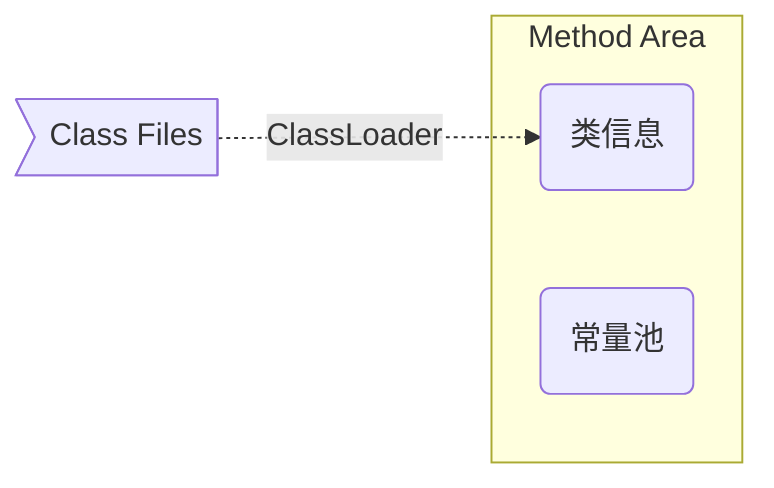
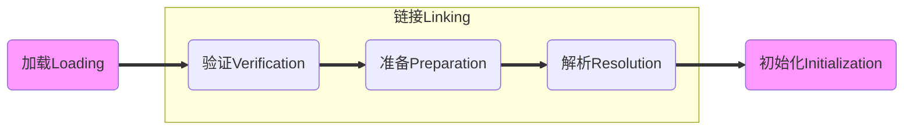
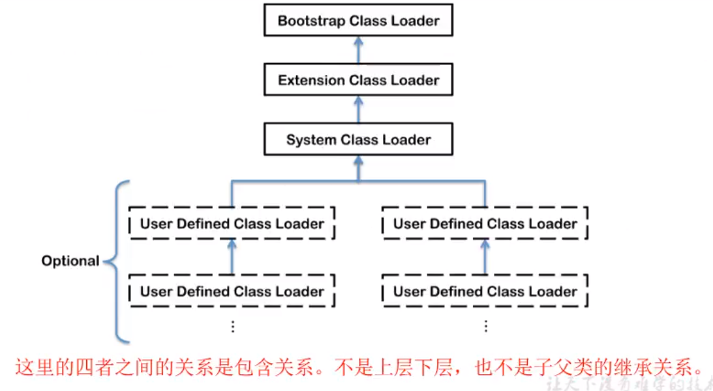
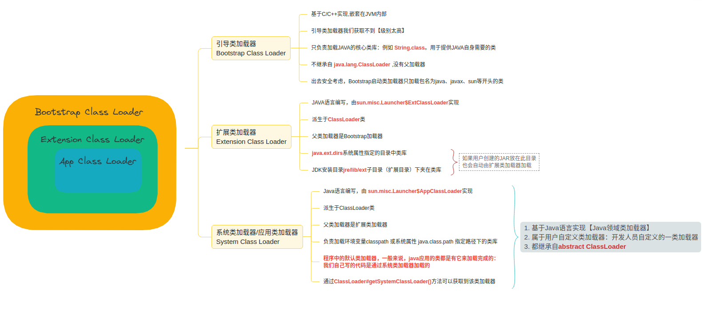
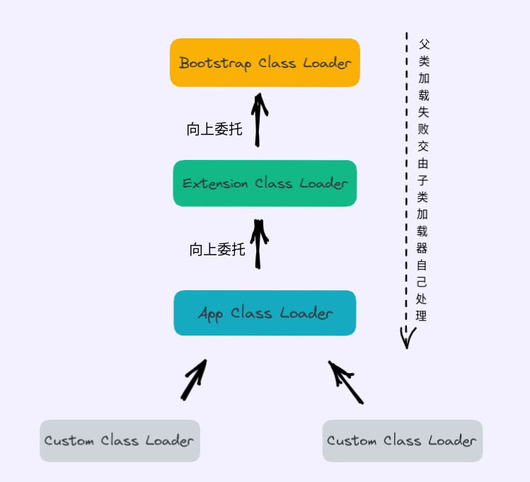

1. ClassLoader负责将class字节码文件加载到内存中
2. 加载的类信息存放于一块称为方法区的内存空间。除了类的信息外，方法区中还会存放运行时常量池信息，可能还包括字符串字面量和数字常量（这部分常量信息是Class文件中常量池部分的内存映射）


## 类的加载过程







### 加载Loading

1. 通过类的全限定名获取类的二进制字节流
2. 将这个字节流所代表的静态存储结构转化为[方法区运行时数据结构]()
3. 在内存中生成一个代表这个类的java.lang.Class对象，作为方法区这个类的各种数据的访问入口


### 链接Linking

- 验证：字节流信息是否符合当前虚拟机的要求
- 准备：类变量（静态成员变量）默认初始值。例如int类型变量的初始值是0
	- 不包括final修饰的static变量，因为final在编译等时候就会分配了，准备阶段会显式初始化
	- 不会为实例变量初始化（还没有new),类变量分配在方法区，而实例变量会随对象一起分配到Java堆中
- 解析：将常量池中的符号引用转为直接引用的过程

### 初始化Initialization

1. 就是调用`<clinit>`方法,这个方法是编译器默认帮我们加上的.这个方法干了什么事呢？
	- 类变量（static变量）初始化赋值（会按照原语句的顺序）
	- 实例变量是在new的时候初始化到Heap堆中的；final static 修饰的变量在准备阶段就显式初始化了。
	- 这个方法只执行一次
2. 构造方法在ClassLoader看来是`<init>`方法
3. 构造方法`<init>`一个类中至少有一个，`<clinit>`方法如果有类变量编译器才会帮我们自动加上（为了初始化变量值），如果没有类变量，就没有`<clinit>`方法了


## 类加载器分类






```java

package com.jvm.www;

public class ClassLoaderTest {


    public static void main(String[] args) {

        //获取系统类加载器
        ClassLoader systemClassLoader = ClassLoader.getSystemClassLoader();
        System.out.println(systemClassLoader);//sun.misc.Launcher$AppClassLoader@18b4aac2

        //获取其上层： 扩展类加载器
        ClassLoader extClassLoader = systemClassLoader.getParent();
        System.out.println(extClassLoader);//sun.misc.Launcher$ExtClassLoader@74a14482

        //获取其上层
        ClassLoader bootstrapClassLoader = extClassLoader.getParent();
        System.out.println(bootstrapClassLoader);//null

        //对于用户自定义类来说: 默认使用系统类加载器进行加载
        ClassLoader classLoader = ClassLoaderTest.class.getClassLoader();
        System.out.println(classLoader);//sun.misc.Launcher$AppClassLoader@18b4aac2

        //String类使用引导类加载器进行加载的：java核心类库都是使用引导类加载器加载的
        ClassLoader stringClassLoader = String.class.getClassLoader();
        System.out.println(stringClassLoader);//null


    }

}

```

1. 在日常应用程序开发中，类的加载几乎由以上3种类加载器相互配合执行的。在必要时我们才自定义类加载器
2. 什么情况下自定义类加载器？
	1. 隔离加载类
	2. 修改类的加载的方式
	3. 扩展加载源
	4. 防止源码泄露
	

## 双亲委派机制

Java虚拟机对class文件采用的是<font color="red">**按需加载**</font>的方式。也就是说需要使用该类时，才会将他的class文件加载到内存生成class对象。

加载某个类的class文件时，JAVA虚拟机采用的是<font color="red">**双亲委派模式**</font>，即把请求交由父类处理，他是一种任务委派模式。


### 工作原理

1. 如果一个类加载器收到一个类加载的请求，它并不会自己先去加载，而是把这个请求委托给父类的加载器去执行。
2. 如果父类加载器还存在其父类加载器，则进一步向上委托，依次递归，请求最终将到达顶层的启动类加载器。
3. 如果父类加载器可以完成类加载任务，就成功返回。倘若父类加载器无法完成此加载任务，向下交由子加载器自己处理。这就是双亲委派模式。





> - 如果我们自定义一个类：java.lang.String, 由于类加载使用的是双亲委派模式，加载到的永远的jdk自带的java.lang.String而非我们自定义的java.lang.String
> - 类加载器虽然各司其职、相互配合。这和双亲委派机制不冲突。虽然类的加载由类加载器向父类加载器一直委派上去，父类加载器首先会判断是否是自己的职责范围内，如果是就加载，如果不是就向下回退给子类加载器。


在JVM中表示两个class对象是否是同一个类存在两个必要条件：
1. 类的完整类名必须一致，包括包名。
2. 加载这个类的classLoader必须想同。

否则，这两个类对象也是不想等的。


