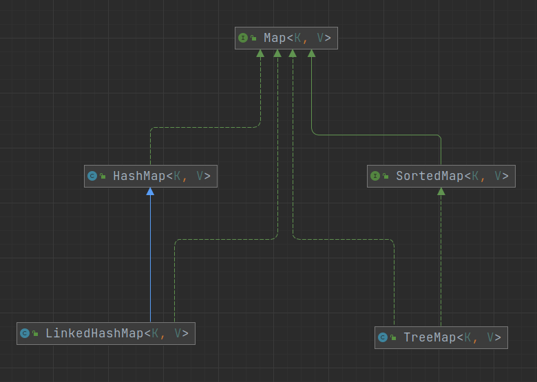
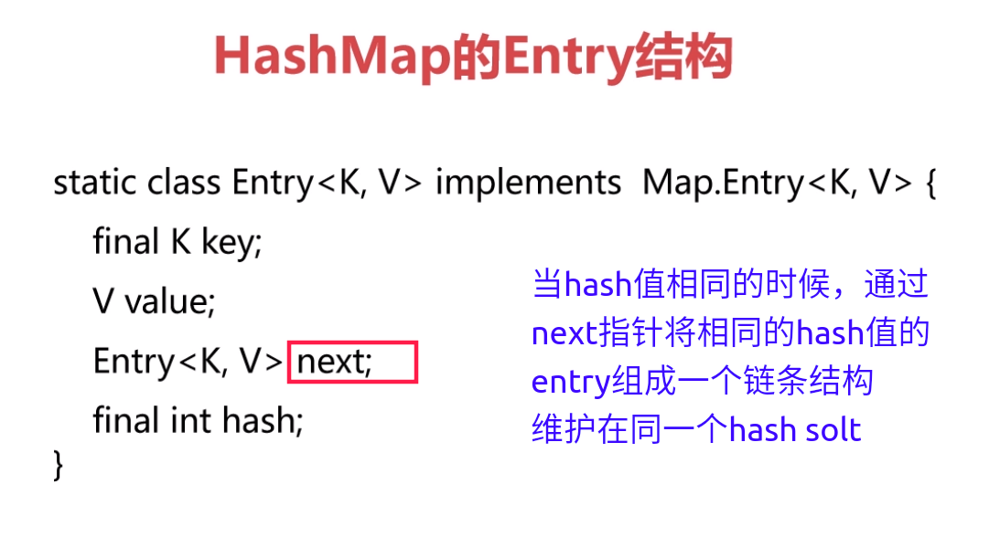
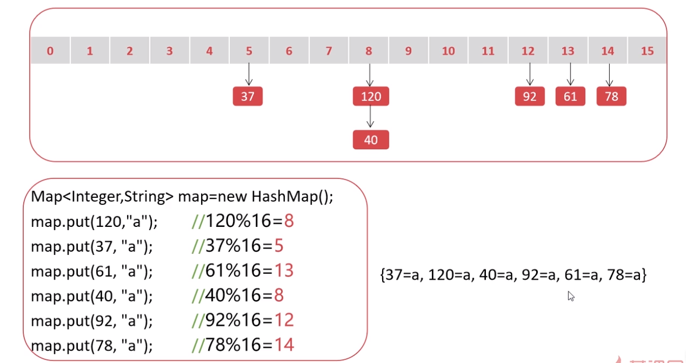

# HashMap







## map遍历

* [map遍历的几种方式][wumingsheng.github.io.map]

[wumingsheng.github.io.map]: https://wumingsheng.github.io/mkdocs_java/#map-foreach/


## HashMap原理

* HashMap是无序的，输出顺序和输入顺序无关
* HashMap的输出也不上随机的，有一定的顺序，这就涉及到了HashMap的底层原理



## HashMap构造方法

```java

Map<String, Object> map1 = new HashMap<>();
Map<String, Object> map2 = new HashMap<>(16);
Map<String, Object> map3 = new HashMap<>(16, 0.75F);

```

* 默认的初始容量是：16  =>> 底层是16位长度的数组
* 默认的负载因子是：0.75 ==>> 当75%的solt被占用以后就自动扩容(默认以2倍的容量扩容：16 -> 32 -> 64 -> 128)

> * 默认的初始容量和扩容的规则正好也是mysql varchar 字段长度设定的规则。:joy:
> * 16x0.75=12 12个数组位有entry后就会进行扩容了
> * 初始容量设置多少，底层数组的初始长度就是多少吗？非也！规则：大于该值的最小的2的n次方。例如初始容量设置为3，实际上底层是大于3的最小的2的n次方是4.
> * 扩容会有性能消耗，（开辟新的内存地址，数据复制）因此，在初始创建的时候，指定内存初始容量（评估数据量）避免扩容

## 问题

* new HashMap(10000, 0.75)  要录入的数据有10000条，会产生扩容吗？

    - 底层数组的实际长度是2的14次方16384x0.75=12288 > 10000 也就是说怎么占用（即使平铺）也不会超过0.75负载因子，不会产生扩容


