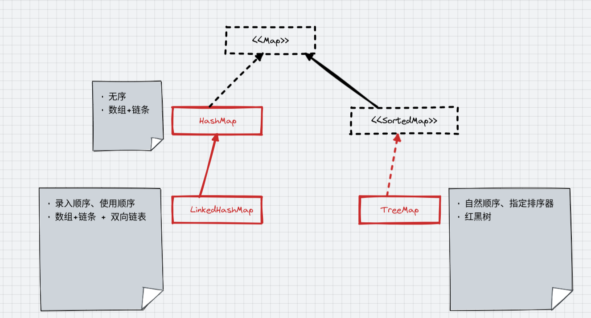

* Jdk

    - map
        - [HashMap](HashMap.md)
        - [LinkedHashMap](LinkedHashMap.md)
        - [treeMap](treeMap.md)
    - set
        - [SortedSet](SortedSet.md)

* guava

    - [MultiMap](MultiMap.md)
    - [MultiSet](MultiSet.md)
    - [BiMap](BiMap.md)
    - [Table](Table.md)

