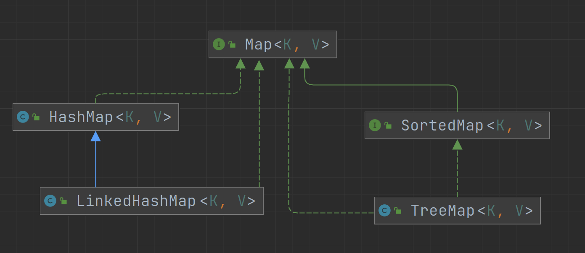
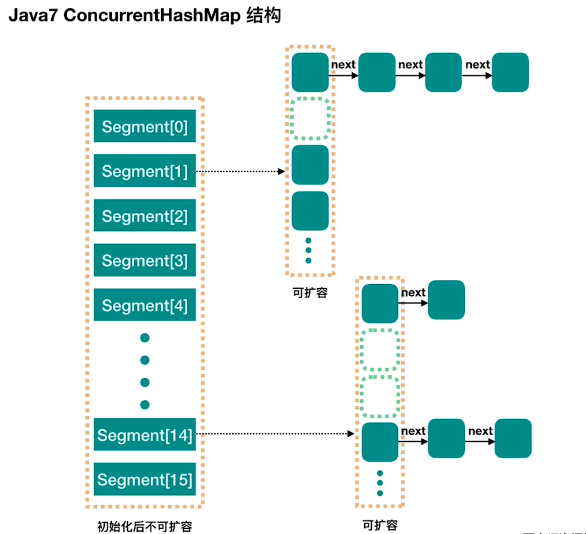
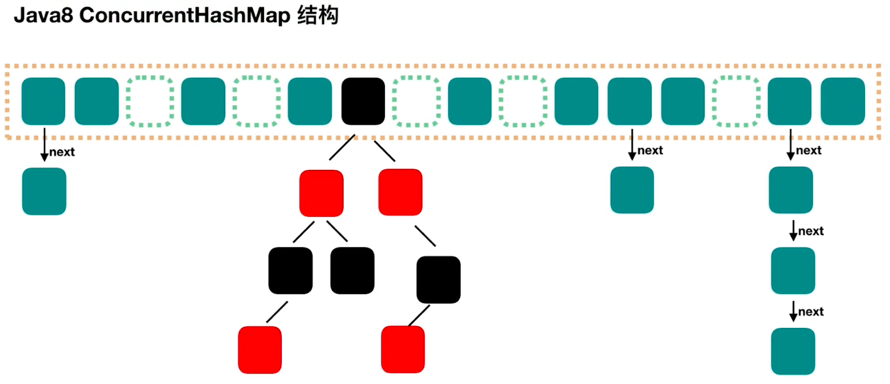

# ConcurrentHashMap线程安全的HashMap

## 集合历史

* Vector = ArrayList + synchronized method

* HashTable = HashMap + synchronized method

* Collections.synchronizedList(new ArrayList<>(10)) = SynchronizedList(synchronized codeBlock)

* Collections.synchronizedMap(new HashMap<>(16)) = SynchronizedMap(synchronized codeBlock)

## Map家族

* LinkedHashMap: 有序
* TreeMap: 支持排序

## 1.7结构

## 1.8结构

