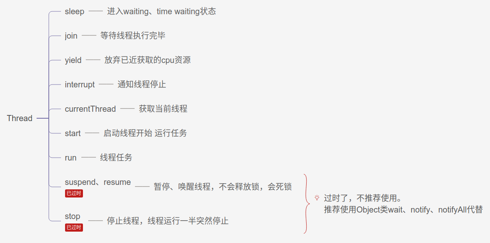
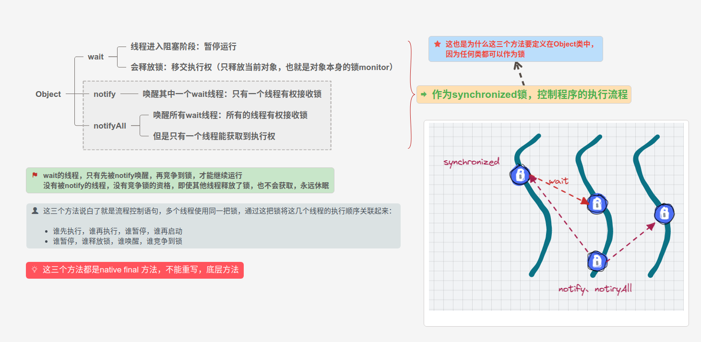
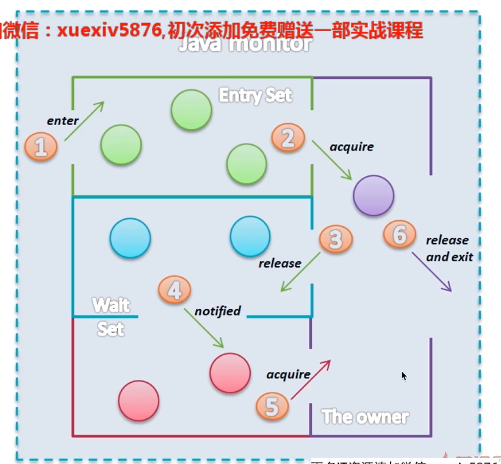

# Thread

## 1. 创建、启动线程


## 2. 停止线程


### 2.1 run方法内没有sleep或wait方法时，停止线程

```java

public class A implements Runnable {
    @Override
    public void run() {

        int num = 0;
        while (!Thread.currentThread().isInterrupted() && num <= Integer.MAX_VALUE / 2){
            if ( num % 10000 == 0){
                System.out.println(num + "是10000的倍数");
            }
            num++;
        }

        System.out.println("任务运行结束");

    }

    public static void main(String[] args) throws InterruptedException {
        Thread thread = new Thread(new A());
        thread.start();
        Thread.sleep(2000);
        thread.interrupt();
    }
}

```

### 2.2 run方法内带有sleep中断线程的写法

需要try-catch处理，通过代码手动决定是否中断、何时中断

```java

/**
 * run方法内带有sleep中断线程的写法
 */
public class B  {


    public static void main(String[] args) throws InterruptedException {

        Runnable runnable = () -> {
            try {
                int num = 0;
                while (num <= 300 && !Thread.currentThread().isInterrupted()){
                    if (num % 100 == 0){
                        System.out.println(num + "是100倍数");
                    }
                    num++;
                }
                Thread.sleep(1000);
            } catch (InterruptedException e) {
                e.printStackTrace();
            }

        };

        Thread thread = new Thread(runnable);
        thread.start();
        Thread.sleep(500);
        thread.interrupt();


    }
}

```
### 2.3 错误停止线程的方法


## 3. 响应中断方法列表

响应中断方法：如果一个中断信号过来了，方法能够感知到interrupt中断信号


* Object.wait()/wait(long)/wait(long, int)
* Thread.sleep(long)/sleep(long, int)
* Thread.join()/join(long)/join(long, int)
* java.util.concurrent.BlockingQueue.take()/put(E)
* java.util.concurrent.locks.Lock.lockInterruptibly()
* java.util.concurrent.CountDownLatch.await()
* java.util.concurrent.CyclicBarrier.await()
* java.util.concurrent.Exchanger.exchange(V)
* java.nio.channels.InterruptibleChannel相关方法
* java.nio.channels.Selector的相关方法

## 4. 线程的生命周期（6状态）


## 5. Thread和Object类中线程相关方法

### 5.1 方法概览

| 类               | 方法名                  | 说明                                    |
| ---------------- | ---------------         | ---------------                         |
| Thread           | sleep                   | 线程休眠，进入waiting、time waiting状态 |
| Thread           | join                    | 等待其他线程执行完毕                    |
| Thread           | yield                   | 放弃已近获取的cpu资源                   |
| Thread           | currentThread           | 获取当前执行线程的引用                  |
| Thread           | start                   | 启动线程                                |
| Thread           | interrupt               | 通知线程停止                            |
| Thread           | stop、suspend、resume   | 已废弃                                  |
| Object           | wait、notify、notifyAll | 让线程暂时的休息和唤醒                  |




### 5.2 wait、notify、notifyAll






