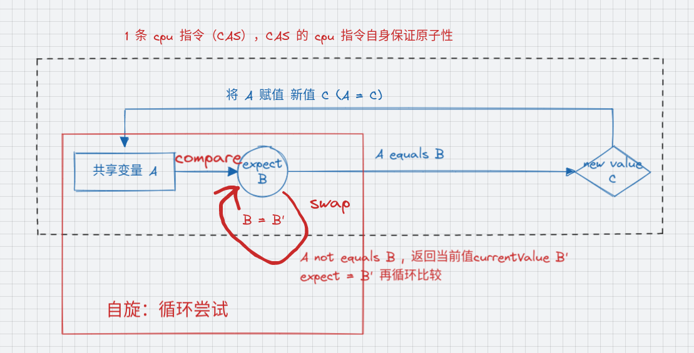
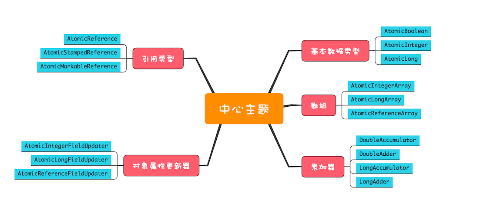

# atomic

* 一句话，成员变量`static AtomicInteger i = new AtomicInteger(0);`线程安全；和`ConcurrentHashMap`类似
* 推荐使用。无加锁解锁操作，高效且能保证互斥

## 实现原理

CAS(全称Compare And Swap, 即"比较并交换")。CAS 指令包含 3 个参数：共享变量的内存地址 A、用于比较的值 B 和共享变量的新值 C；并且只有当内存中地址 A 处的值等于 B 时，才能将内存中地址 A 处的值更新为新值 C。**作为一条 CPU 指令，CAS 指令本身是能够保证原子性的。**其实原子类性能高的秘密很简单，硬件支持而已。

使用 CAS 来解决并发问题，一般都会伴随着自旋，而所谓自旋，其实就是循环尝试。当内存地址A（变量）不等于期望的值B的时候，说明有另一个线程修改了A变量，这个时候就将expect替换成新值B’,继续比较，如果还不相同，继续替换再比较，一直循环指导A内存地址变量值等于expect，这个时候再付新值。

> DoubleAccumulator、DoubleAdder、LongAccumulator 和 LongAdder，这四个类仅仅用来执行累加操作，相比原子化的基本数据类型，速度更快，但是不支持 compareAndSet() 方法。如果你仅仅需要累加操作，使用原子化的累加器性能会更好。

