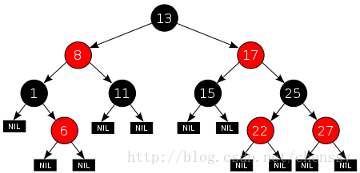

# treeMap

 

TreeMap是一个能比较元素大小的Map集合，会对传入的key进行了大小排序。其中，可以使用元素的自然顺序，也可以使用集合中自定义的比较器来进行排序；


* 默认安装key升序进行排列，如果安装降序，需要自己定义Comparator
* 通过构造方法传入比较器
* TreeMap的实现是红黑树算法的实现

```java

       new TreeMap<>(new Comparator<String>() {


            @Override
            public int compare(String o1, String o2) {
                return 0;
            }
        });


```

 


