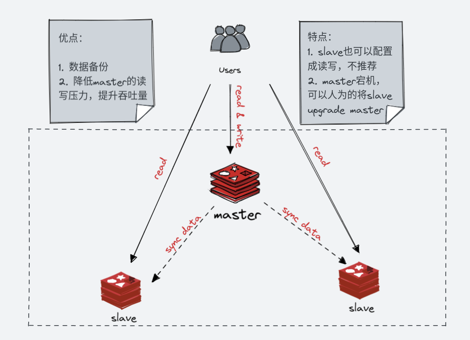

# 主从模式 - 读写分离




## 开启主从模式

```ini

replicaof ip port

```
## 查看主从配置信息

```ini

> info replication

```


## 一主两从，伪集群

| ip        | port |
|-----------|------|
| 127.0.0.1 | 6379 |
| 127.0.0.1 | 6380 |
| 127.0.0.1 | 6381 |

```shell
$ sudo cp redis.conf redis-6379.conf
$ sudo cp redis.conf redis-6380.conf
$ sudo cp redis.conf redis-6381.conf
```

* redis-6379.conf

    ```ini
    bind * -::*
    port 6379
    daemonize yes
    pidfile redis_6379.pid
    logfile redis_6379.log
    dbfilename dump_6379.rdb
    dir /usr/local/redis/
    masterauth foobared
    replica-read-only yes
    requirepass foobared
    appendonly yes
    appendfilename "appendonly_6379.aof"
    appendfsync everysec
    no-appendfsync-on-rewrite no
    auto-aof-rewrite-percentage 100
    auto-aof-rewrite-min-size 64mb
    aof-load-truncated yes
    aof-use-rdb-preamble yes
    ```
* redis-6380.conf

    ```ini
    bind * -::*
    port 6380
    daemonize yes
    pidfile redis_6380.pid
    logfile redis_6380.log
    dbfilename dump_6380.rdb
    dir /usr/local/redis/
    masterauth foobared
    replica-read-only yes
    requirepass foobared
    appendonly yes
    appendfilename "appendonly_6380.aof"
    appendfsync everysec
    no-appendfsync-on-rewrite no
    auto-aof-rewrite-percentage 100
    auto-aof-rewrite-min-size 64mb
    aof-load-truncated yes
    aof-use-rdb-preamble yes
    # 从节点配置主节点, 主节点不用配置
    replicaof 127.0.0.1 6379
    ```

* redis-6381.conf

    ```ini
    
    bind * -::*
    port 6381
    daemonize yes
    pidfile redis_6381.pid
    logfile redis_6381.log
    dbfilename dump_6381.rdb
    dir /usr/local/redis/
    masterauth foobared
    replica-read-only yes
    requirepass foobared
    appendonly yes
    appendfilename "appendonly_6381.aof"
    appendfsync everysec
    no-appendfsync-on-rewrite no
    auto-aof-rewrite-percentage 100
    auto-aof-rewrite-min-size 64mb
    aof-load-truncated yes
    aof-use-rdb-preamble yes
    # 从节点配置主节点, 主节点不用配置
    replicaof 127.0.0.1 6379
    ```

* 说明

    ```ini

    #设置密码和主节点认证密码必须一致，主从都必须设置（主从切换方便）
    requirepass foobared
    masterauth foobared


    # ---- 下面的配置只需要从节点配置，主节点不需要配置
    replicaof 127.0.0.1 6379

    ```


* 查看状态


    ```ini
    $ bin/redis-cli -a foobared
    127.0.0.1:6379> info replication
    # Replication
    role:master
    connected_slaves:2
    ......
    
    ```


* 验证

    1. replica 节点只读不能写
    2. master 节点可读可写
    3. replica 可以读到master节点写入的数据


