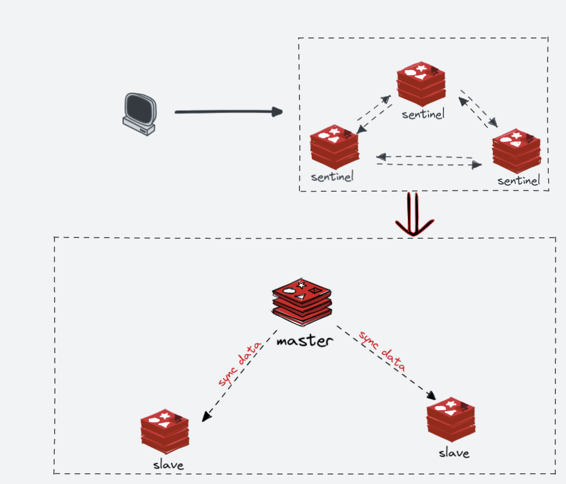

# 项目改造升级为主从哨兵模式

哨兵模式无需配置主从节点信息，客户端连接sentinel节点，从sentinel节点获取主从信息，进行读写（相当于sentinel充当了配置中心的角色，优点类似zookeeper）



```properties

spring.redis.password=foobared
spring.redis.database=0
spring.redis.sentinel.master=mymaster
spring.redis.sentinel.nodes=127.0.0.1:26379,127.0.0.1:26380,127.0.0.1:26381
spring.redis.sentinel.password=foobared
spring.redis.timeout=10000
spring.redis.lettuce.pool.enabled=true
spring.redis.lettuce.pool.max-idle=8
spring.redis.lettuce.pool.max-wait=3000
spring.redis.lettuce.pool.min-idle=1
spring.redis.lettuce.pool.max-active=8
spring.redis.lettuce.pool.time-between-eviction-runs=10s
spring.redis.lettuce.shutdown-timeout=100ms

```


