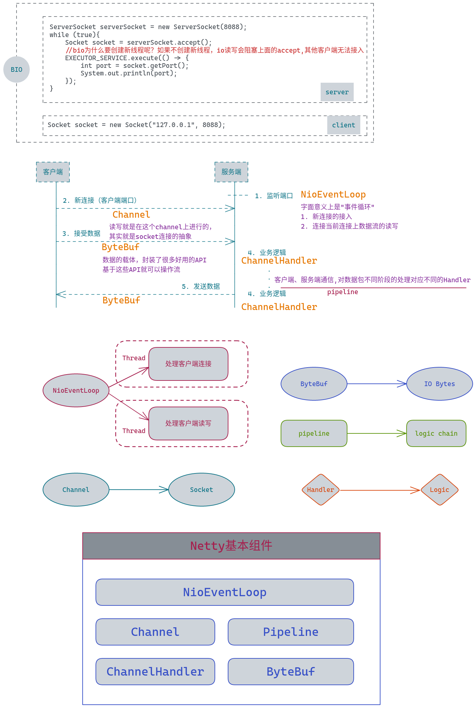

# Java读源码之Netty深入剖析

## netty是什么

* 异步事件驱动框架，快速开发高性能服务端和客户端（性能问题不用担心）
* 封装了JDK 底层BIO和NIO模型，提供了高度可用的API
* 自带编解码器解决拆包粘包问题，用户只关心业务逻辑
* 精心设计的reactor线程模型，支持高并发海量连接
* 自带了各种协议栈让你处理任何一种协议都几乎不用亲自动手

## Netty基本组件

