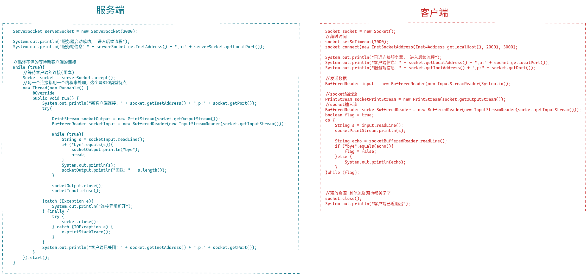
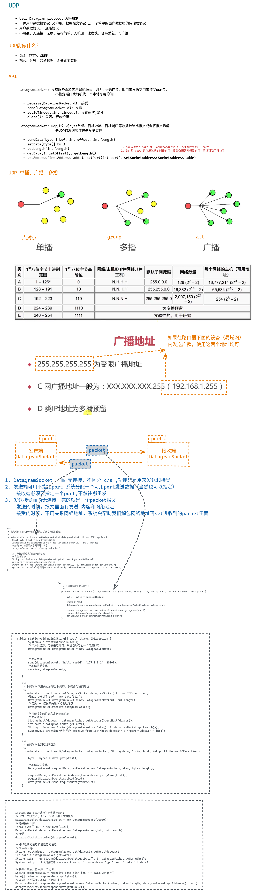
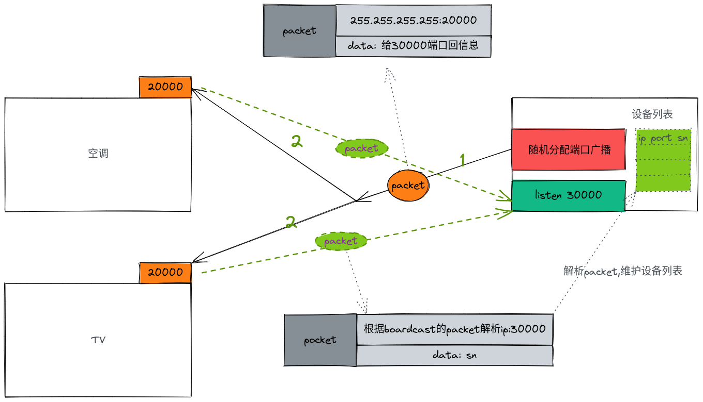
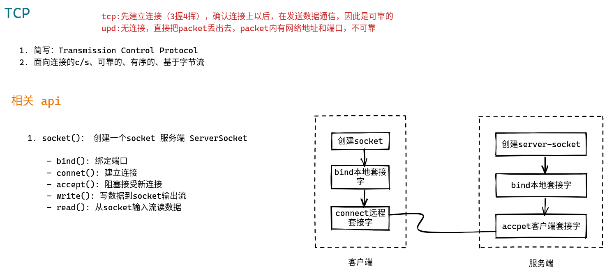
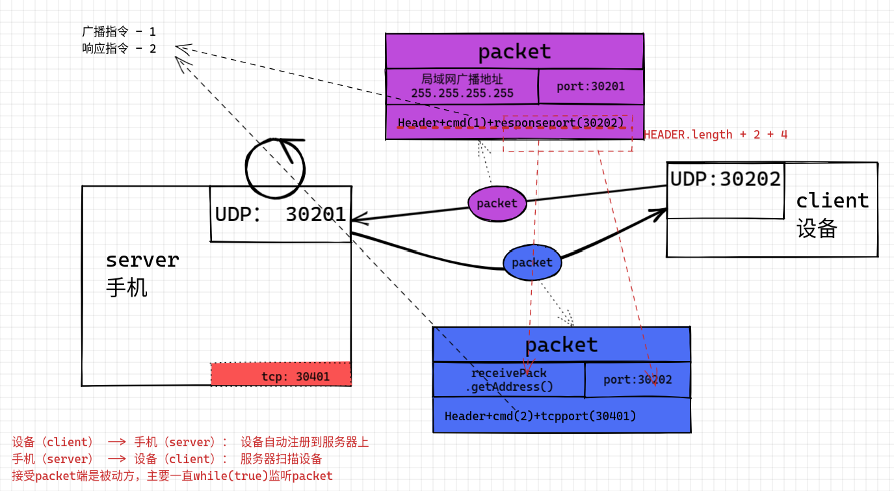
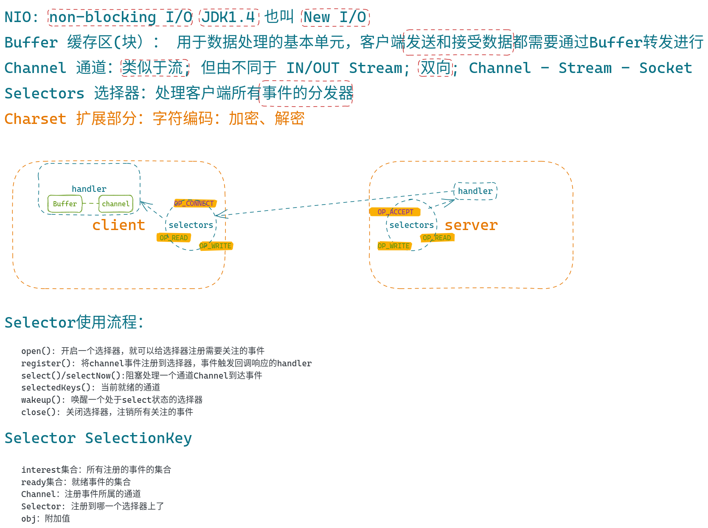

# Socket网络编程进阶与实战

## Socket TCP牛刀小试

## Socket UDP快速入门

## 案例实操-局域网搜索案例

[代码演示](案例实操-局域网搜索案例.md)

## Socket TCP快速入门

## UDP辅助TCP实现点对点传输案例

本章节中将利用UDP 的发现进行TCP连接建立点对点数据传输，同时让大家理解并实现数据收发并行。本章节主要收获：
1. UDP如何与TCP结合使用
2. UDP与TCP的主要职责划分
3. 传输数据如何做到并传输
4. 学会利用多线程解决阻塞与并行的案 

[代码](src/SocketDemo-L5-UDP/)

## 第7章 服务器传输优化-NIO

