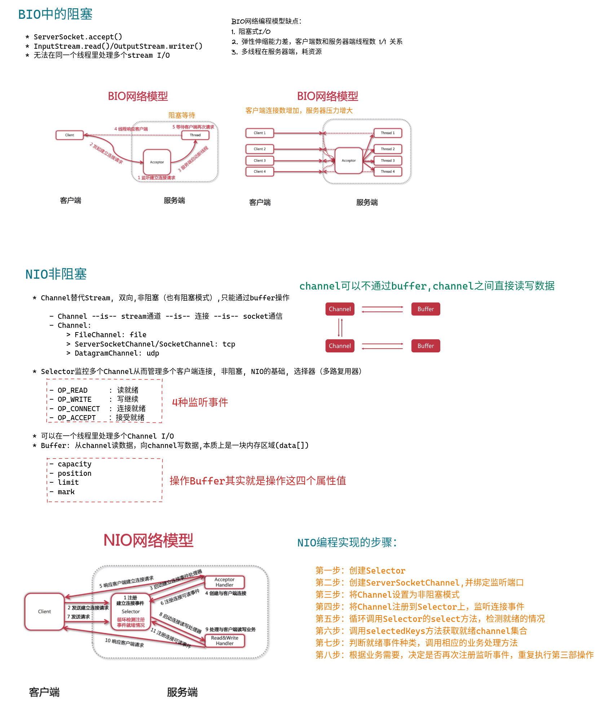

# 一站式学习Java网络编程-深度理解BIO-NIO-AIO

## 第1章 【开宗明义】网络编程三剑客BIO、NIO、AIO

## 第2章 网络层的解析与协议

## 第3章 解读java.io专业术语也可以变得生动精辟

 

## 第4章 JavaIO的“前世”：BIO阻塞模型

## 第5章 实战：基于BIO的多人聊天室设计与实现

[Talk is cheap. Show me the code](第5章实战：基于BIO的多人聊天室设计与实现.md)

## 第6章 JavaIO的“今生”：NIO非阻塞模型

## 第7章 实战：使用NIO改造多人聊天室

[代码演示](第7章实战：使用NIO改造多人聊天室.md)

## 第8章 JavaIO的“后世”之师：AIO异步通信模型

## 第9章 实战：基于AIO改造多人聊天室

[代码案例](第9章实战：基于AIO改造多人聊天室.md)

