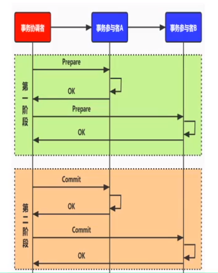
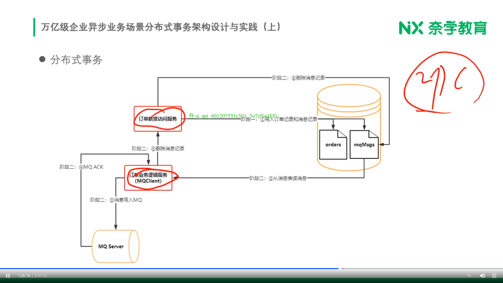
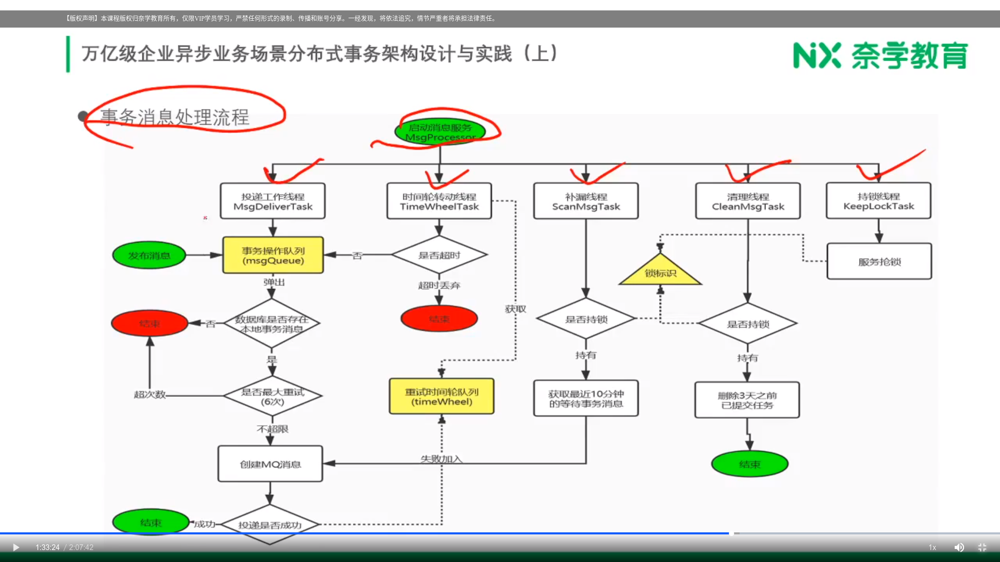

# 万亿级企业分布式事物架构设计哲学本质

> 同步、异步业务等维度场景案例

- 一次请求涉及数据分布多个存储系统

  - 多个 DB
  - DB 和 Cache
  - DB 和 MQ
  - ......

- 业务场景的容忍度

  - 拼多多购买商品

    - 商品、订单、支付

  - 朋友圈发布信息

    - 发布消息、朋友圈小红点提升

  - 用户操作

    - 用户注册和用户登录数据同步(mysql数据库主从同步)

[CAP理论](CAP理论.md)

1. 一般的互联网场景是AP: 可用性、分区容错性 + 最终一致性（舍弃了实时一致性，实时一致性要求没有那么强）
2. 银行转账：CP: 一致性、分区容错性（一个银行系统进账必须等待另一个银行系统出账）
3. AC: 不满足分布式，无从谈起分布式事物，例如mysql单实例，本身就满足AC

# 普适方法论

* 拆分

    * 分布式事物 -> 长事物
    * 本地事物 -> 短事物
    * 长事物**拆分**多个短事物

* 补偿

    * A -> B -> C
        * A、B 成功，C失败
            * C不需要补偿
            * 补偿B和A(**逆向**)

# 2PC

* 过程

    

    * 应用程序发起事物commit请求
    * 事物协调者发起prepare投票
    * 事物参与者都同意后，事物协调者再发起commit
    * commit过程中出现宕机等异常，服务重启后，再次进行commit

* 特点

    * 没有回滚（补偿）的过程

* 实践落地

    * 不通用方式

    

    * 优化

    
    
    

        * 第一阶段，消息落地数据库
            
            * 订单表、消息表
    
        * 第二阶段，消息发送mq
        
            * 读取消息，不断重试，确保发送到mq中

