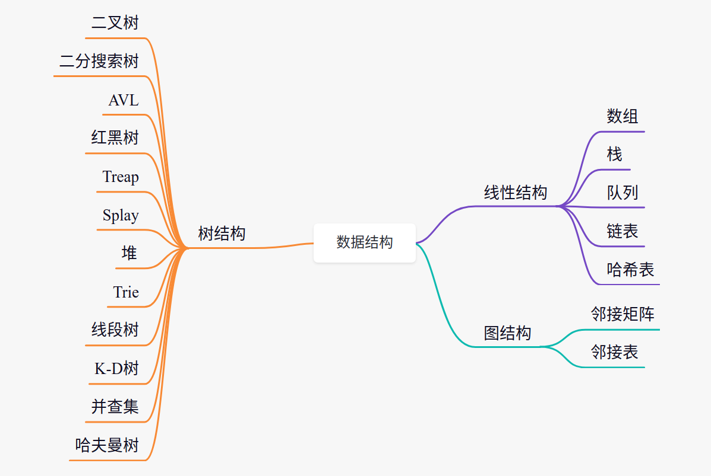

# Imooc算法与数据结构体系课

* 排序算法

  * 插入、冒泡、选择、希尔
  * 快速、归并、堆排序
  * 技术排序、桶排序、技术排序

* 查找算法

  * 线性查找、二份查找

* 线程数据结构

  * 动态数组、链表
  * 栈、队列、hash表

* 经典树结构

  * 二份搜索树、堆
  * AVL、红黑树、B类树

* 高级数据结构

  * 线段树、并查集、Trie
  * SQRT分解

* 字符串算法

  * KMP
  * 模式匹配

* [线性查找法](img/image_2022-02-22-17-03-14.png)
* [时间复杂度](时间复杂度.md)
* [选择排序法](img/image_2022-02-23-11-18-53.png)
* [插入排序法](img/image_2022-02-24-10-38-44.png)

* [数组](img/image_2022-02-24-09-31-55.png)
* [栈](img/image_2022-02-24-14-03-57.png)
* [队列](img/image_2022-02-24-15-41-57.png)
* [链表](链表_2022_02_25.md)
* [递归](递归_2022_02_25.md)
* [归并排序法](归并排序法_2022_02_25.md)
* [快速排序法](快速排序法_2022_03_08.md)

