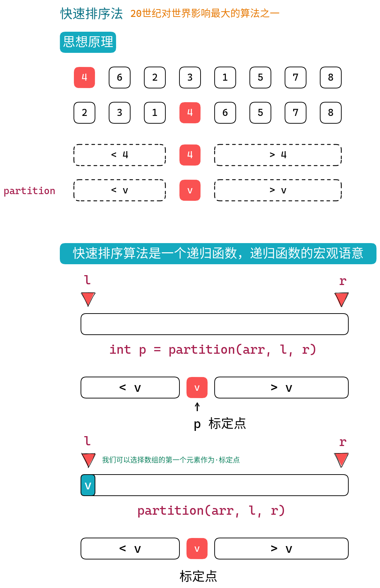
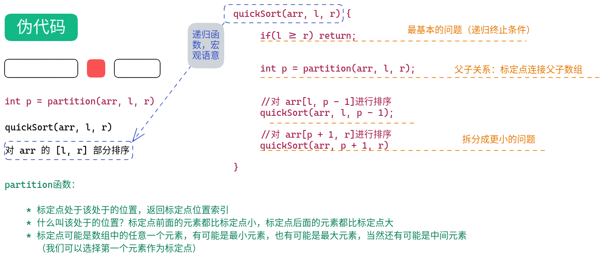
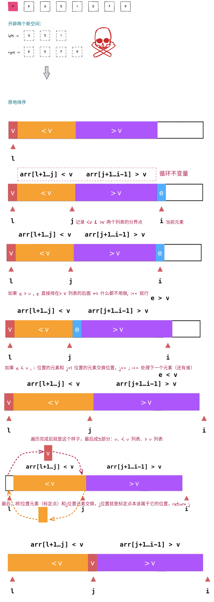
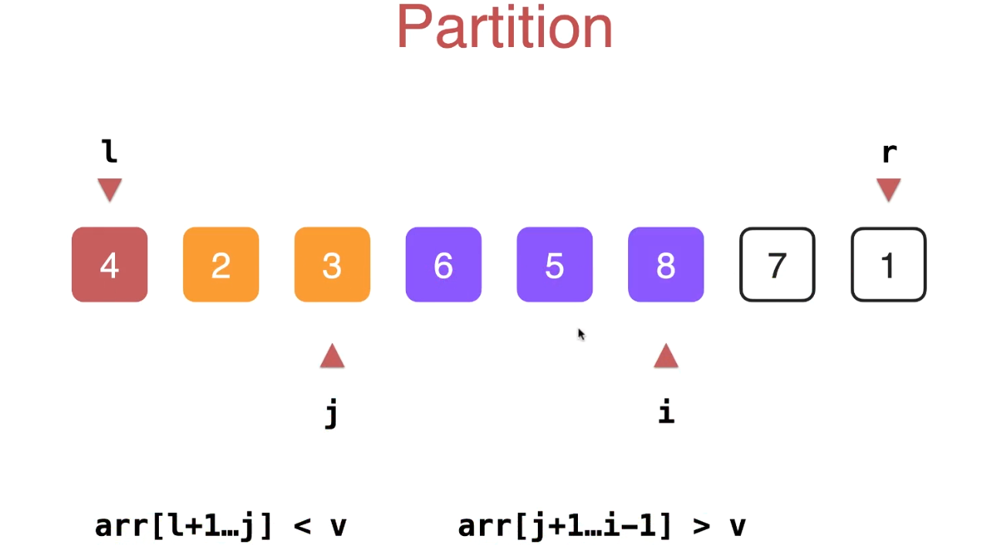
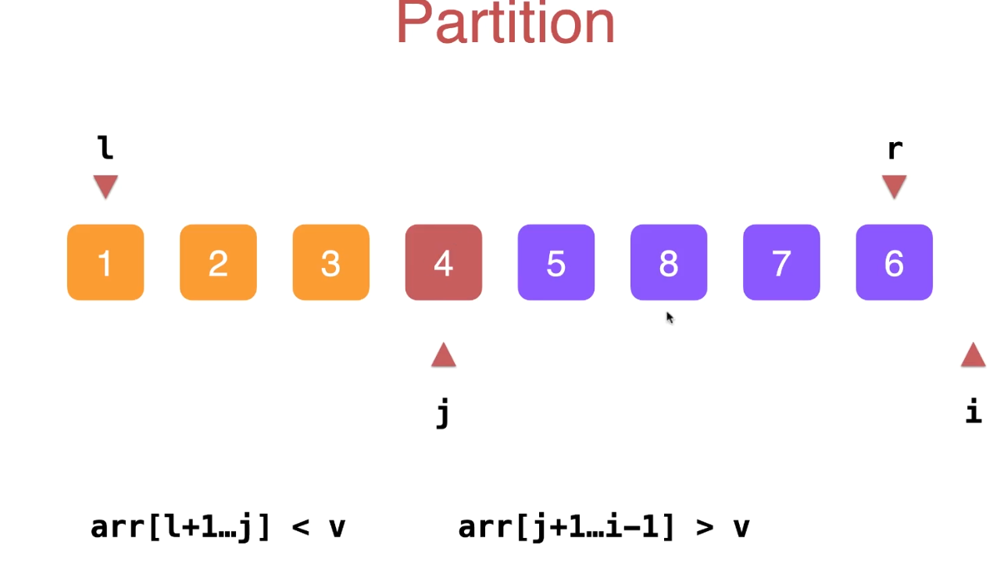
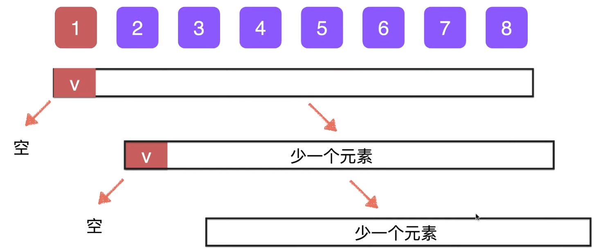
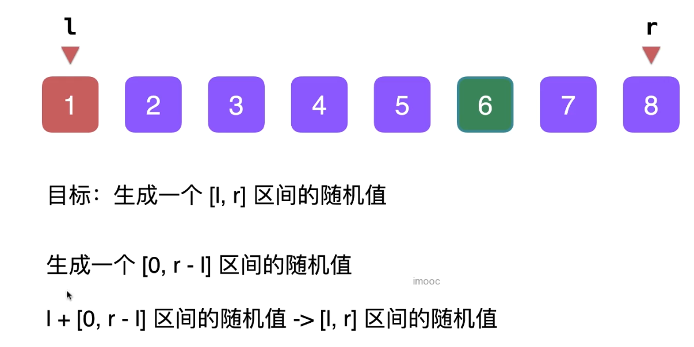
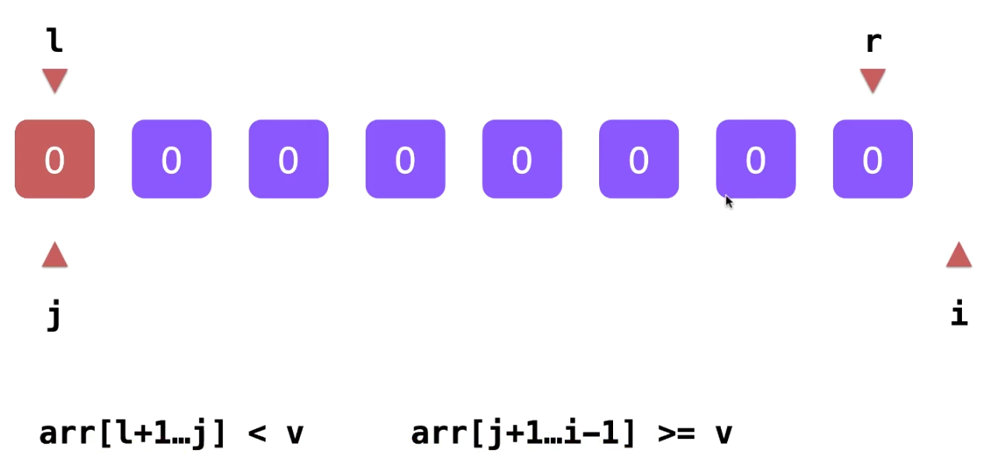

# 快速排序法

## 思想原理



## 伪代码



## 最基础的partition实现


-----






* 用j指针控制（小于标定点）& （大于标定点）两个列表的分界点, j++
* 用i指针（i++）来循环处理整个数组列表中的每一个元素
* 循环不变量arr[l+1,j] 是小于标定点的列表；arr[j+1, i-1]是大于标定点的列表
* l也就是列表的第一个元素选作标定点（通常）
* 最后将l元素和j元素交换位置，j元素就是l标定点本该在的位置
* 如果当前元素i大于v,什么也不用做，下一步（还有谁）**next{i++}**
* 如果当前元素i小于v,要将v放入到小于v的列表: i元素和j+1元素交换位置&j++ => **swap{j+1, i} && j++**, 下一步（还有谁）**next{i++}**


## 代码实现

```java
public class Main {
    public static void main(String[] args) {
        int[] arr = {4, 6, 2, 3, 1, 5, 7, 8, 4, 8,4, 4, 3, 3, 3 };
        quickSort(arr, 0, arr.length - 1);
        System.out.println(Arrays.toString(arr));
    }
    /**
     * 快速排序
     * 宏观语意：对 arr[l, r] 排好序
     * 实现原理，标定点，标定点前面的排好序，标定点后面的排好序 => 整个数组就排好序了
     */
    private static void quickSort(int[] arr, int l, int r){

        if(l >= r){
            return;
        }

        int p = partition(arr, l, r);
        quickSort(arr, l, p - 1);
        quickSort(arr, p + 1, r);

    }


    /**
     * 标定点: 将标定点放在其应该在的position, then return index
     * 比标定点小的元素放在标定点前面，比标定点大的元素放在标定点后面
     * arr[l+1, j] < v 
     * arr[j+1, i] > v
     */
    private static int partition(int[] arr, int l, int r){

        if(l >= r){
            return l;
        }

        int j = l;
        for(int i = l+1; i <= r; i++){

            if(arr[i] <= arr[l]){
                //交换j+1和i && j++
                swap(arr, j+1, i);
                j++;
            }
        }
        //交换l 和 j
        swap(arr, l, j);
        return j;

    }

    private static void swap(int[] arr, int i, int j){
        int tmp = arr[i];
        arr[i] = arr[j];
        arr[j] = tmp;
    }
}
```

## 问题一：有序数组

* 如果列表在排序之前就是一个有序的列表，时间复杂度是多少呢？=> 等差数列，1+2+3+...+n = (n^2^+n)/2 => n^2^

    

* 解决办法：为快速排序算法添加随机化

    - 通常，我们选择列表的第一个元素（最左边的元素）作为定位点
    - 随机化，从列表中随机取任意一个元素作为定位点
    - 将选中的随机化的定位点和列表中第一个元素互换位置（后续的步骤就恢复正常了）
    ```java
    int random = l + new Random().nextInt(r - l + 1);
    swap(arr, l, p);
    ```

     

## 问题二：数组中每一个元素都相同

* 如果列表中每个元素都相同，随机数选取也就没有意义了。最后的时间复杂度还是：n^2^

    

* 解决办法：将和定位点元素相同的元素划分在小于定位点的列表中


## 时间复杂度


* 最坏的情况：O(n^2^) 概率极低，火星撞地球
* 期望复杂度：O(nlogn)


> 普通算法，看最差 能找到一组数据 100% 恶化
> 随机算法，看期望（快速排序算法随机化后，属于随机算法类）没有一组数据能 100% 恶化


