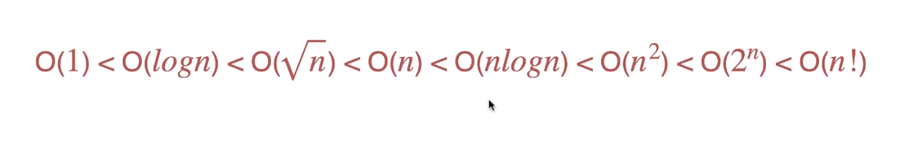

# 时间复杂度

* 表示算法的性能
* 算法运行的上限（最坏的情况）
* T = 5n + 2       T = c1 * n + c2      O(n)
* O(n) 常数不重要 复杂度描述的是随着数据规模n的增大，算法性能的变化趋势

* 常见的线性复杂度：

  * O(n)
  * O(n^2^)
  * O(logN): O(log~2~N) 不管底数是多数，可以忽略，统一叫O(logN)
  * O(2^n^): 时间复杂度非常大
  * O(n!)：时间复杂度非常大
  * O(1): 和n的大小无关
  * O(√n)

* 2^4^ = 16  => log16 = 4  => 2^m^ = n => m = logN
* 4^2^ = 16 => √16 = 4 => m^2^ = n => m = √n

