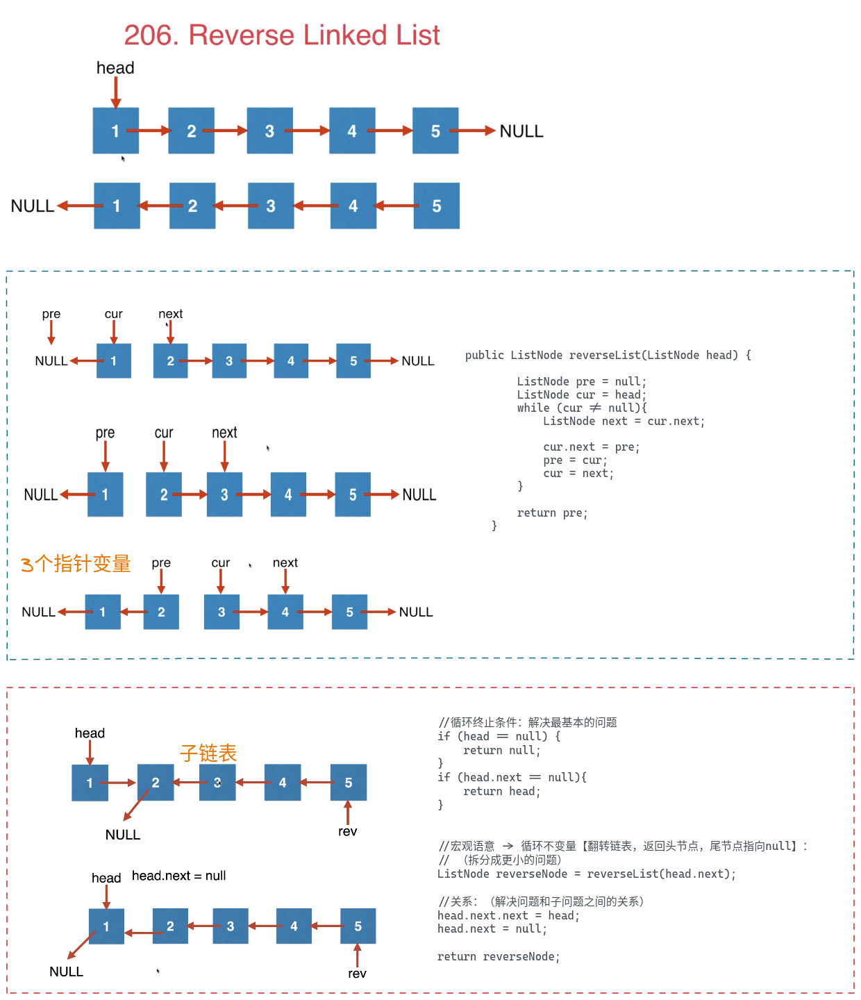

# 递归

* 过程：可以拆解成两个步
  * 去的过程称为“递”
  * 回来的过程称为“归”。
* 满足递归的3个条件：
  1. 待求解问题的解可以分解为几个子问题的解(更小的问题)
  2. 待求解的问题与分解之后的子问题，只有数据规模不同，求解思路完全相同
  3. 存在递归终止条件(不能无限循环) -> 求解最基本的问题
* 模型：
  * 终止条件：递归终止条件（求解最基本的问题）
  * 拆分自调用：拆分成更小的问题（递归函数自调用 -> 循环不变量 -> 头脑要时刻清醒它的宏观语意）
  * 解决关系：问题和子问题之间的解决关系
* 技巧：
  1. 想清楚最基本的问题，递归终止条件
  2. 屏蔽递归细节，只需要思考问题和子问题的解决关系，不需要考虑子问题和子子问题的关系
* 隐患：
  1. 压栈弹栈，堆栈溢出
  2. 重复计算，hash表存储

