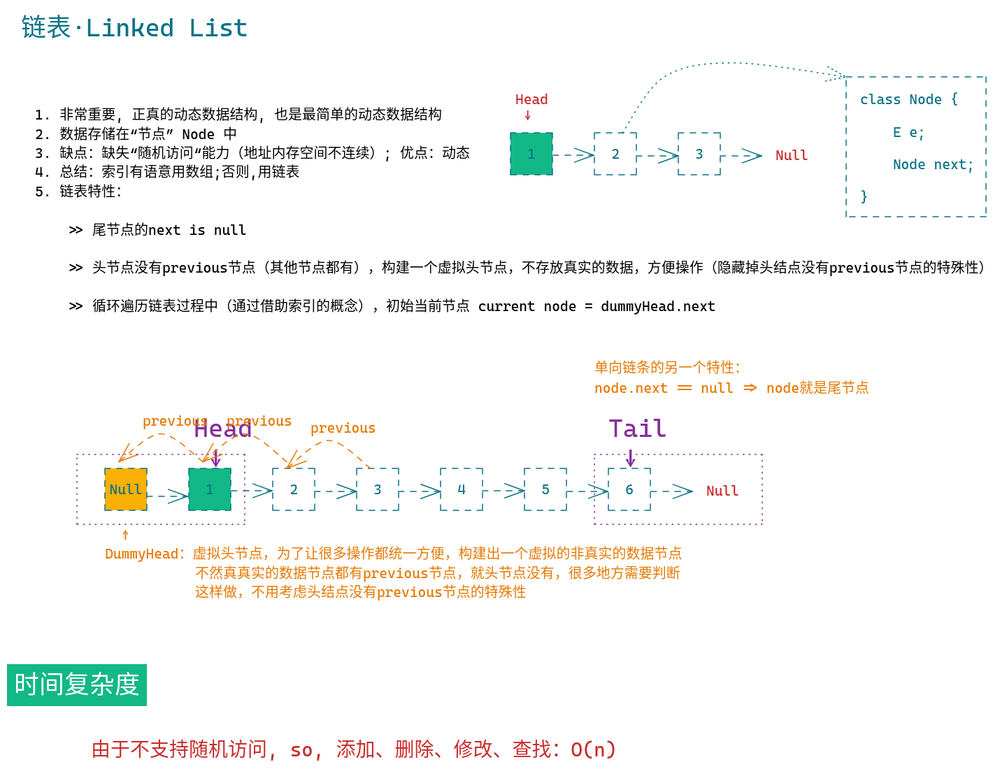
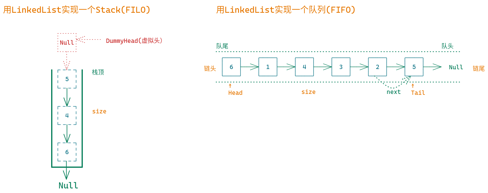

## 自己实现一个链表

```java

public class LinkedList<E> {


    /**
     * 虚拟头节点
     */
    private final Node<E> dummyHead;

    private int size;


    /**
     * 构造方法
     */
    public LinkedList(){
        this.dummyHead = new Node<>(null, null);
        this.size = 0;
    }


    /**
     * 返回链表长度
     */
    public int getSize(){
        return size;
    }

    /**
     * 链表是否为null
     */
    public boolean isEmpty(){
        return size == 0;
    }

    /**
     * 头添加元素
     */
    public void addFirst(E e){
        add(0, e);
    }

    /**
     * 指定index添加元素
     */
    public void add(int index, E e) {

        if(index < 0 || index > size){
            throw new IllegalArgumentException("index value illegal");
        }

        Node<E> prev = dummyHead;
        for (int i = 0; i < index; i++){
            prev = prev.next;
        }

        prev.next = new Node<>(e, prev.next);
        size++;
    }

    /**
     * 列表末尾添加元素
     */
    public void addLast(E e){
        add(size, e);
    }


    /**
     * 获取链表的第n个元素
     */
    public E get(int index){

        if (index < 0 || index > size) {
            throw new IllegalArgumentException();
        }
        Node<E> current = dummyHead.next;
        for (int i = 0; i < index; i++) {
            current = current.next;
        }
        return current.e;
    }

    /**
     * 获取链表头节点
     */
    public E getFirst(){
        return get(0);
    }

    /**
     * 获取链表的尾节点
     */
    public E getLast(){
        return get(size);
    }

    /**
     * 更新指定节点的元素
     */
    public void set(int index, E e){

        if (index < 0 || index > size) {
            throw new IllegalArgumentException();
        }

        Node<E> curr = dummyHead.next;
        for (int i = 0; i < index; i++) {
            curr = curr.next;
        }
        curr.e = e;
    }

    /**
     * 查看链表中是否存在元素e
     */
    public boolean contains(E e){
        Node<E> cur = dummyHead.next;
        while (cur != null){
            if (cur.e.equals(e)) {
                return true;
            }
            cur = cur.next;
        }
        return false;
    }

    @Override
    public String toString() {
        StringBuilder stringBuilder = new StringBuilder();

        for(Node<E> cur = dummyHead.next; cur != null; cur = cur.next){
            stringBuilder.append(cur).append(" -> ");
        }

        stringBuilder.append("Null");
        return stringBuilder.toString();
    }


    /**
     * 删除指定索引位置的元素
     */
    public E remove(int index){

        if (index < 0 || index > size) {
            throw new IllegalArgumentException();
        }

        Node<E> provious = dummyHead;
        for (int i = 0;i < index; i++){
            provious = provious.next;
        }

        Node<E> cur = provious.next;
        provious.next = cur.next;
        cur.next = null;
        size--;
        return cur.e;
    }

    /**
     * 删除第一个元素
     */
    public E removeFirst(){
        return remove(0);
    }

    /**
     * 删除最后一个元素
     */
    public E removeLast(){
        return remove(size -1);
    }

    /**
     * 为什么设计成内部私有类？
     * 1. 对外屏蔽实现细节
     * 2. 不需要对外访问
     */
    private static class Node<E> {
        E e;
        Node<E> next;

        public Node(E e, Node<E> next){
            this.e = e;
            this.next = next;
        }

        public Node(E e){
            this(e, null);
        }

        public Node(){
            this(null, null);
        }

        @Override
        public String toString() {
            return e.toString();
        }
    }


}


```


## 用链表实现一个栈

```java

public interface Stack<E> {

    int getSize();
    boolean isEmpty();
    void push(E e);
    E pop();
    E peek();

}

```


```java

public class LinkedListStack<E> implements Stack<E>{

    private LinkedList<E> linkedList;


    public LinkedListStack(){
        linkedList = new LinkedList<>();
    }

    @Override
    public int getSize() {
        return linkedList.getSize();
    }

    @Override
    public boolean isEmpty() {
        return linkedList.isEmpty();
    }

    @Override
    public void push(E e) {
        linkedList.addFirst(e);
    }

    @Override
    public E pop() {
        return linkedList.removeFirst();
    }

    @Override
    public E peek() {
        return linkedList.getFirst();
    }


    @Override
    public String toString() {
        return new StringBuilder("stack:top").append(linkedList).toString();
    }
}

```


## 链表实现一个队列

```java
public interface Queue<E> {

    int getSize();
    boolean isEmpty();
    void enqueue(E e);
    E dequeue();
    E getFront();
}

```

```java

public class LinkedListQueue<E> implements Queue<E>{


    private Node<E> head, tail;

    private int size;

    private E e;

    public LinkedListQueue(){
        this.head = null;
        this.tail = null;
        this.size = 0;
    }


    @Override
    public int getSize() {
        return 0;
    }

    @Override
    public boolean isEmpty() {
        return this.size == 0;
    }

    @Override
    public void enqueue(E e) {
        if(tail == null){
            tail = new Node<>(e);
            head = tail;
        }else {
            tail.next = new Node<>(e, null);
            tail = tail.next;
        }

        size++;
    }

    @Override
    public E dequeue() {
        if (isEmpty()) {
            throw new IllegalArgumentException();
        }
        Node<E> t = head;
        head = head.next;
        //如果只有一个元素的话，tail指针也被删除了，tail需要赋值为空
        if(head == null){
            tail = null;
        }
        //被删除的元素要与链表断开连接，方便垃圾回收
        t.next = null;
        size--;
        return t.e;
    }

    @Override
    public E getFront() {
        if (isEmpty()) {
            throw new IllegalArgumentException();
        }
        return head.e;
    }


    private static class Node<E> {
        private E e;
        private Node<E> next;

        public Node(E e, Node next){
            this.e = e;
            this.next = next;
        }

        public Node(E e){
            this(e, null);
        }

        public Node(){
            this(null, null);
        }

        @Override
        public String toString() {
            return e.toString();
        }
    }


}


```


