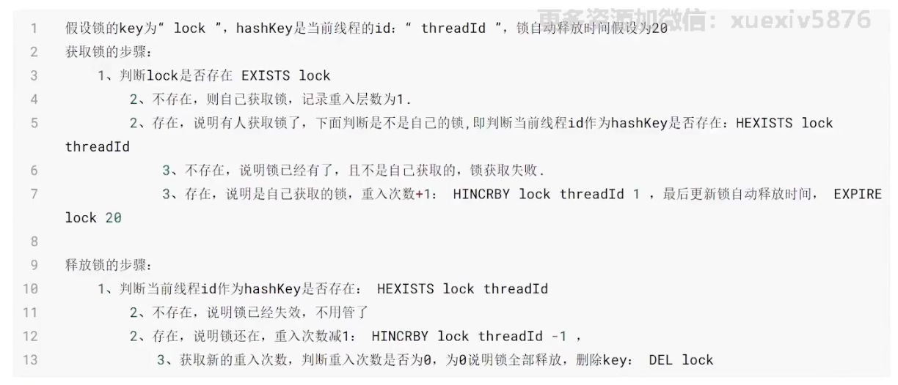

## 分布式锁


1. value 谁上锁谁解锁，不解别人锁
2. ex|px 设置过期时间，避免线程挂掉一直死锁 ex/s    px/ms
3. nx 不存在才插入数据（上锁）保证多线程并发互斥


```lua

-- unlock.lua
if redis.call('get', KEYS[1]) == ARGV[1] then
    return redis.call('del', KEYS[1])
else
    return 0
end

```

```lua

-- lock.lua
-- KEYS[1] ==> key
-- ARGV[1] ==> requestid ==> uuid
-- ARGV[2] ==> expireTime
return redis.call('set', KEYS[1], ARGV[1], 'PX', ARGV[2], 'NX')

```

### 可重入锁

* 自己获取了锁以后，自己还可以重复获取这个锁

设计思路：其实就是需要有一个计数器，记录上了几次锁（重入了几次）,因为上了几次就要解几次，直接解到0（不能解多也不能解少）。这里使用hash结构，key还是锁的key, requestId(value)作为hash-key(field), hash-value是计数器（记录重入了几次）



存储在锁中的信息就必须包含：key、线程标识、重入次数。不能再使用简单的key-value结构。这里推荐使用hash结构。而且要让所有指令都在都一个线程中操作，那么使用lua脚本


```lua

local key = KEYS[1];   --第1个参数，锁的key
local threadId = ARGV[1]; --第2个参数，线程唯一标识
local releaseTime = ARGV[2]; --第3个参数，锁的自动释放时间

if(redis.call('exists', key) == 0) then  -- 判断锁是否已近存在
    redis.call('hset', key, threadId, '1'); -- 不存在，则获取锁
    redis.call('expire', key, releaseTime); -- 设置有效期
    return 1; -- 返回结果
end;

if(redis.call('hexists', key, threadId) == 1) then -- 锁已近存在，判断threadid是否是自己
    redis.call('hincrby', key, threadId, '1'); -- 如果是自己，则重入次数+1
    redis.call('expire', key, releaseTime); -- 设置有效期
    return 1; -- 返回结果
end;
return 0; -- 代码走到这里，说明获取锁的不是自己，获取锁失败

```

```lua

local key = KEYS[1]; --第1个参数，锁的key
local threadId = ARGV[1]; --第2个参数，线程唯一标识

if (redis.call('hexists', key, threadId) == 0) then  -- 不存在，说明锁已近失效过期了，不用管了
    return nil;
end;

local count = redis.call('hincrby', key, threadId, -1); -- 存在，说明锁还在，重入次数-1

if (count == 0) then -- 获取新的重入次数，判断重入次数是否为0，为0说明锁全部释放，删除key: del lock
    redis.call('del', key);
    return nil;
end;

```


* 可重入锁比不可重入锁多了一个计数器，代码设计上稍微复杂了一点点，但是在功能上，可重入锁 > 不可重入锁，可重入锁可以替代不可重入锁


## 解决库存超卖问题


```lua

-- KEYS[1] ==> key(hash类型)
-- KEYS[2] ==> field(库存)

if (redis.call('hexists', KEYS[1], KEYS[2]) == 1) then
	local stock = tonumber(redis.call('hget', KEYS[1], KEYS[2]));
	if (stock > 0) then
	   redis.call('hincrby', KEYS[1], KEYS[2], -1);
	   return stock;
	end;
    return 0;
end;

```


