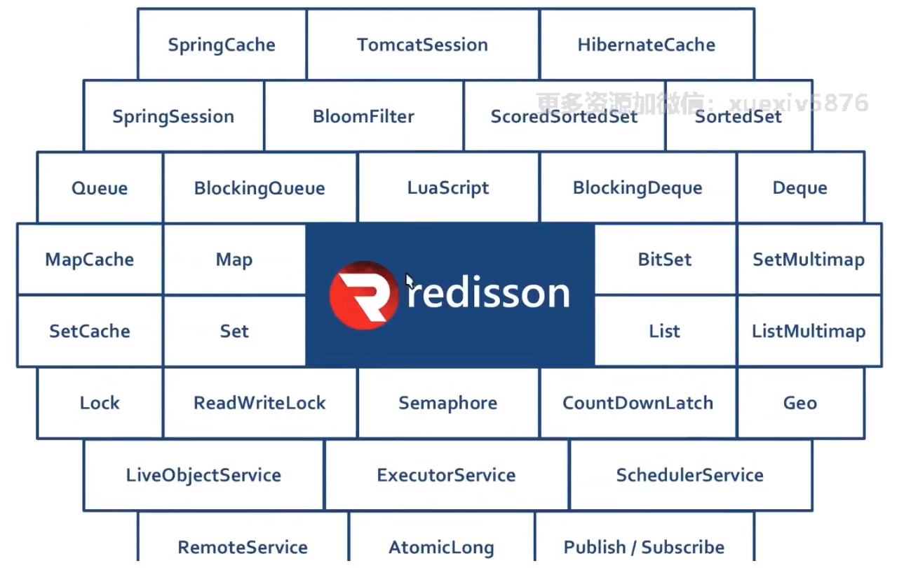

Redisson 是一个高级的分布式协调Redis客户端。能帮助用户在分布式环境中轻松实现一些Java对象

它适用于多种场景：分布式应用、分布式缓存、分布式回话管理、分布式服务（任务、延迟任务、执行器）、分布式redis客户端。




* [GitHub][github redisson]
* 添加依赖：`implementation 'org.redisson:redisson-spring-boot-starter:3.16.8'`


```java
@Resource
private RedissonClient redissonClient;


public void method(){

    //lock key
    String lockName = RedisKeyConstant.lockKey.getKey() + dinerInfo.getId() + ":" + voucherId;
    // 锁的过期时间
    long expireTime = seckillVouchers.getEndTime().getTime() - now.getTime();
    
    //redisson分布式锁处理
    RLock lock = redissonClient.getLock(lockName);
    
    try{
        
        boolean isLocked = lock.tryLock(expireTime, TimeUnit.MILLISECONDS);
        if(isLocked){
        
            //.....
        
        } 
    
    }catch(Exception e){
    
        //手动回滚事物
        TransactionAspectSupport.currentTransactionStatus().setRollbackOnly();
        //解锁
        lock.unlock();
    }

}


```


[github redisson]: https://github.com/redisson/redisson


