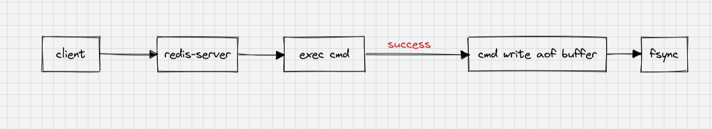

# AOF持久化

redis持久化的重要手段之一。AOF (Append Only File)只追加文件，也就是每次处理完请求命令后都会将此命令追加到aof文件的末尾。（先执行命令，执行成功后的命令才会追加）。而RDB是压缩成二进制等时机开子进程去干这件事。

## 开启AOF

默认是关闭的。

```ini
# 默认appendonly 为 no
appendonly yes
# AOF文件的名称
appendfilename "appendonly.aof"
# RDB文件和AOF文件所在目录
dir /usr/local/redis/
```

## AOF同步策略

redis 提供了3中 AOF 同步策略:

1. 每秒同步（默认），每秒调用一次fsync（这种默认性能并不是很糟糕）
2. 每修改同步，会极大的消弱redis的性能，因为这种模式下，每次write后都会调用fsync
3. 从不主动同步，由操作系统主动调用fsync(刷磁盘), 性能是最好的

```ini
# 每修改同步,数据安全性最强（最多只丢失一个命令），同时性能也是最差的
appendfsync always
# 每秒同步，缺省策略
appendfsync everysec
# 操作系统执行fsync
appendfsync no
```


## AOF 原理

- redis每次都是先将命令放到缓存区，然后再根据具体策略进行刷盘操作。
- 如果配置的是always,是典型的阻塞操作，主线程执行。
- 如果配置的是everysec每秒的话，会开一个同步线程（fork子线程），每秒进行刷盘操作，对主线程影响较小。



> rdb和aof都有阻塞模式（主线程执行）和非阻塞模式
> - rdb分save和bgsave(系统配置是save策略，走的是bgsave)
> - aof分always和everysec(always是典型的阻塞，everysec是子线程执行)


## AOF 重写

Redis可以在AOF文件体积变得过大时，**自动** 在后台对 AOF 进行 rewrite.

1. 继续将修改命令追加到老的现有的 AOF 文件中
2. 用一个临时文件记录重写过程中修改命令
3. 将现有的aof文件重写到一个aof文件中

## rewrite 触发条件

* 客户端执行：`bgrewriteaof` 命令
* `auto-aof-rewrite-min-size 64mb`, 文件大小达到64m的时候重写
* `auto-aof-rewrite-percentage 100`, 距离上次重写扩容2倍以上重写

## aof优缺点

* 优点

    - 数据不易丢失
    - 自动重写机制
    - 易懂易恢复

* 缺点

    - aof文件恢复数据慢
    - apf持久化效率低


## AOF 相关的所有配置项

```ini
# 开启aof
apendonly yes
# 每秒fsync刷盘
appendfsync everysec
# aof文件名
appendfilename "appendonly.aof"
# aof文件存放目录
dir /usr/local/redis/
# aof重写策略
# 距离上次重写大小扩大了一倍，重写。上次重写大小是64m，这次重写要128m
auto-aof-rewrite-percentage 100
# 达到64m重写
auto-aof-rewrite-min-size 64mb

# aof重写期间，是否禁用fsync
# 如果开启该选项，可以减轻文件重写时cpu和硬盘的负载（尤其是硬盘），但有可能会丢失aof重写期间的数据。需要在负载和安全性之间进行平衡。
# 默认: no 默认是bgsave和rewrite期间也会执行fsync.
no-appendfsync-on-rewrite no

# 如果aof文件结尾损坏了，redis启动时是否仍然加载aof文件
# yes, （默认值）启动时先检查aof文件，如果aof文件损坏了，默认不启动。修复完成以后再启动
# no, 不检查aof文件的完整性，启动redis服务
aof-load-truncated yes
```


*[AOF]: Append Only File, 只追加文件


