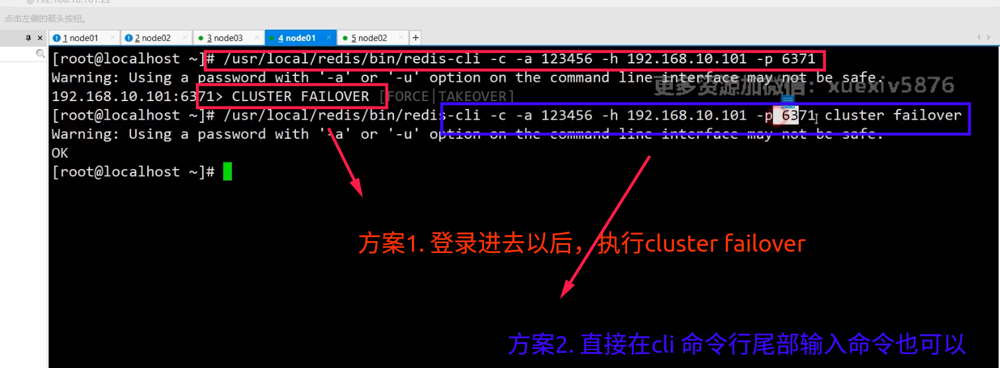

# 手动故障转移

背景：redis主节点所在的机器要停机维护，需要主动停止redis主节点

如果把该主节点的solt分配出去，也是一种方案，成本较高


我们可以在该主节点的从节点上执行`cluster failover`, 这样从节点就会升级为主节点，主节点就会降级为从节点


```shell
redis-cli -c -a foobared -h ip -p port cluster failover

```




