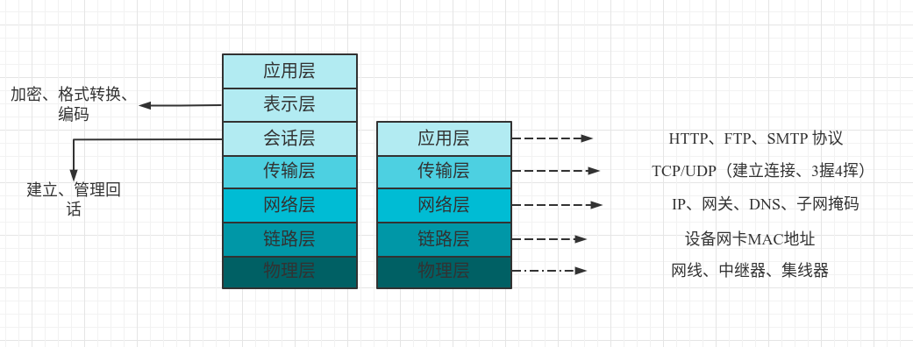
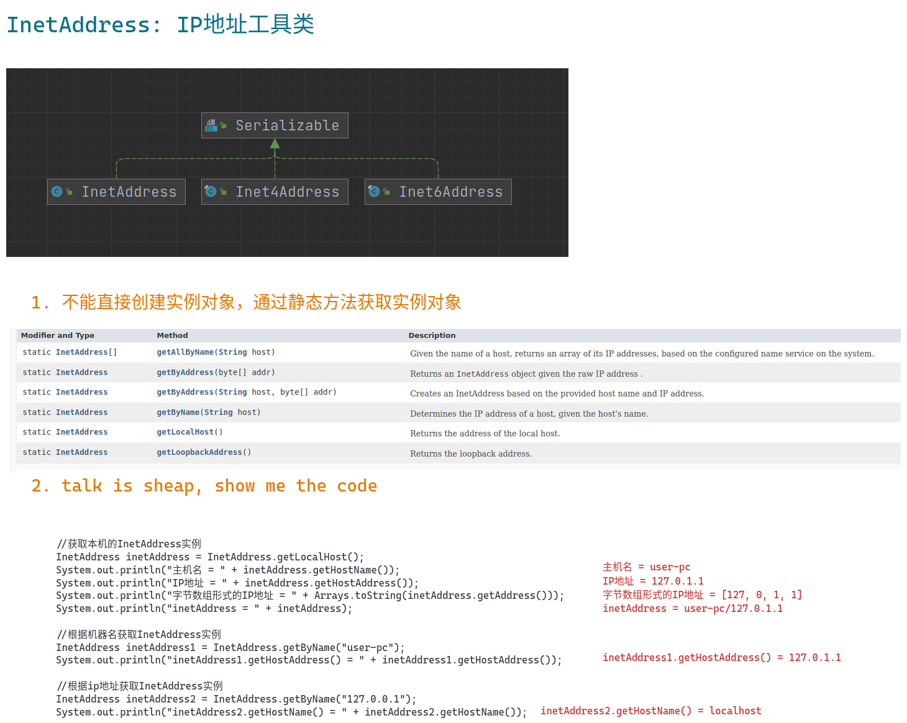
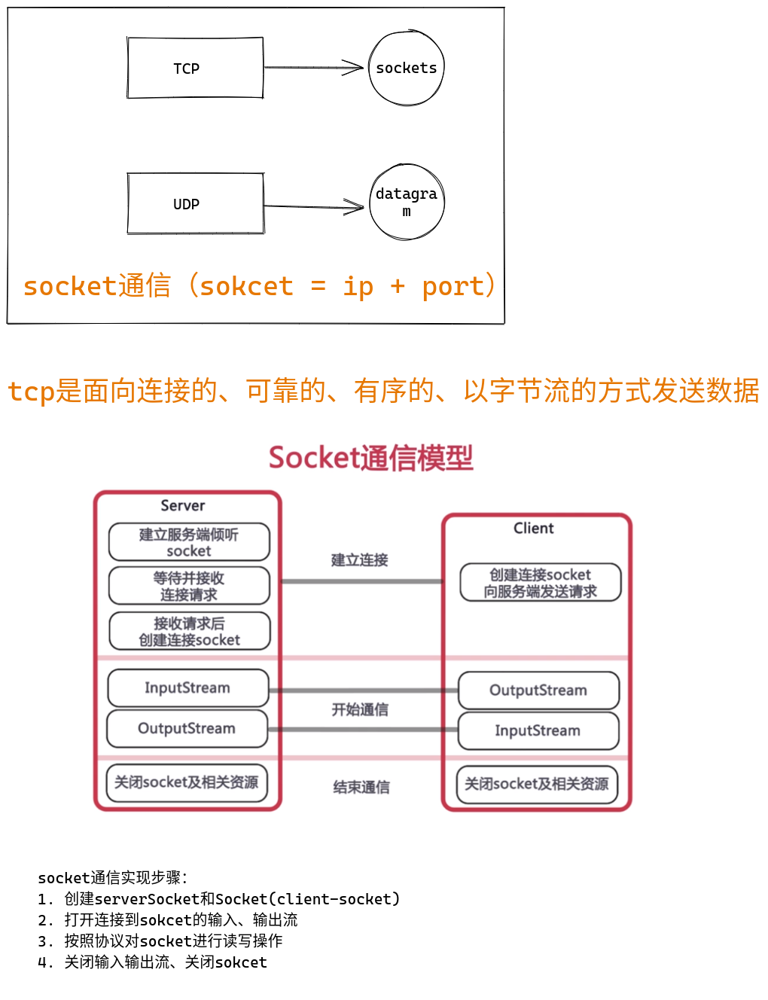
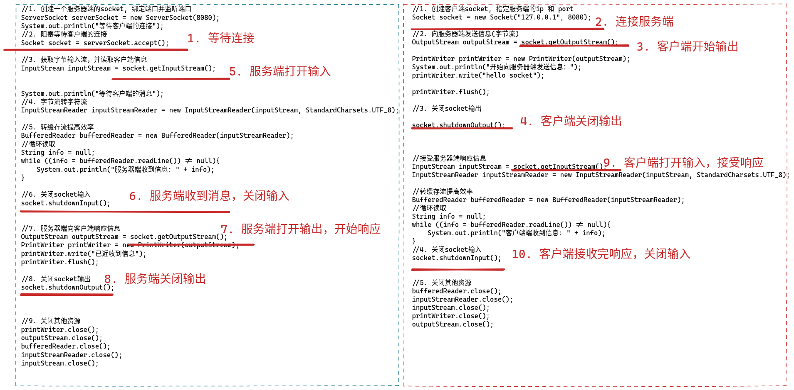
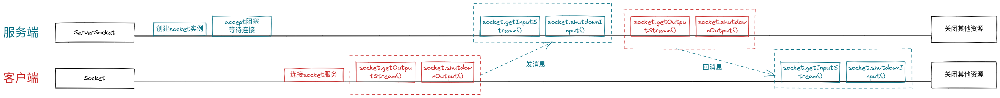
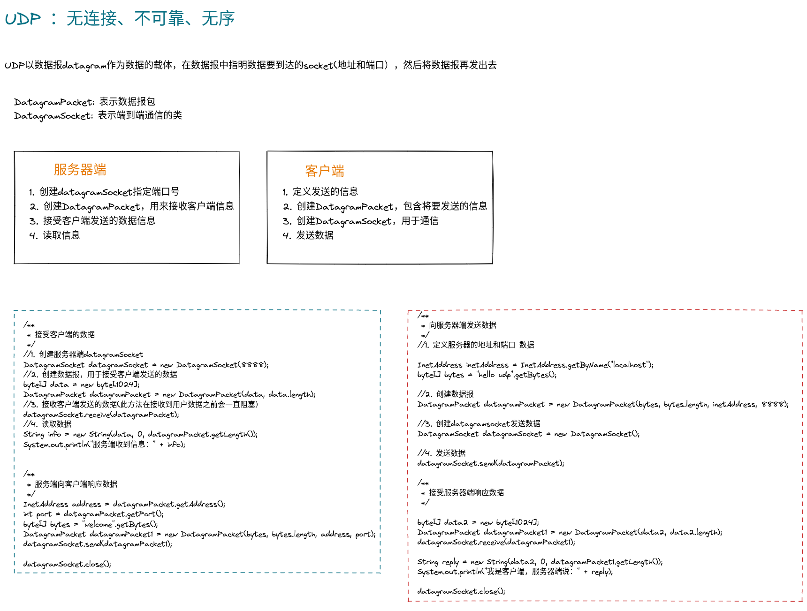

# Java Socket应用---通信是这样练成的


## 网络基础知识





* socket = ip + port
* socket 是TCP/UDP网络传输的基础
* Java中网络的支持
  * InetAddress: 用来标识网络上的硬件资源 => ip
  * URL: 统一资源定位符，通过URL直接读取或写入网络上的数据
  * Sockets: TCP协议实现网络通信的socket相关类
  * Datagram: UDP协议实现网络通信的数据报


## Java中网络相关api应用

### InetAddress类



### URL

#### 通过url解刨其基本属性

```java
//可以直接创建url实例
URL imooc = new URL("http://www.imooc.com");
//也可以通过父url创建url实例
URL url  = new URL(imooc, "/index.html?username=tom#test");

System.out.println("url.getProtocol() = " + url.getProtocol());
System.out.println("url.getHost() = " + url.getHost());
//如果未指定端口号，使用默认端口，but 此时获取出来的是 -1
System.out.println("url.getPort() = " + url.getPort());
System.out.println("url.getPath() = " + url.getPath());
System.out.println("url.getRef() = " + url.getRef());
System.out.println("url.getQuery() = " + url.getQuery());

```


```log
url.getProtocol() = http
url.getHost() = www.imooc.com
url.getPort() = -1
url.getPath() = /index.html
url.getRef() = test
url.getQuery() = username=tom
```

#### 通过url读取资源内容

```java


//通过url读取页面内容

URL url = new URL("http://www.baidu.com");
//获取字节流
InputStream inputStream = null;
InputStreamReader isr = null;
BufferedReader bufferedReader = null;
try {
    inputStream = url.openStream();
    //字节流转字符流
     isr = new InputStreamReader(inputStream, StandardCharsets.UTF_8);
    //通过缓存流提升效率
     bufferedReader = new BufferedReader(isr);
    String line = bufferedReader.readLine();
    while (line != null){
        System.out.println(line);
        line = bufferedReader.readLine();
    }
} catch (IOException e) {
    e.printStackTrace();
}finally {
    if (bufferedReader != null){
        bufferedReader.close();
    }
    if (isr != null){
        isr.close();
    }
    if (inputStream != null){
        inputStream.close();
    }
}


```


## TCP编程:socket








### 多客户端连接

```java

ServerSocket serverSocket = new ServerSocket(8080);

while(true){
    //阻塞等待客户端连接
    Socket socket = serverSocket.accept();
    new Thread(() -> {
        //获取客户端的地址信息
        InetAddress inetAddress = socket.getInetAddress();
        System.out.println(inetAddress);
    }).start();
}

```

```java

Socket socket = new Socket("127.0.0.1", 8080);


```

## UDP编程:datagram





