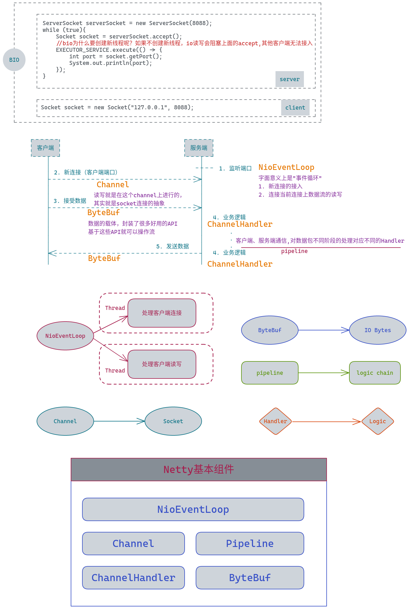
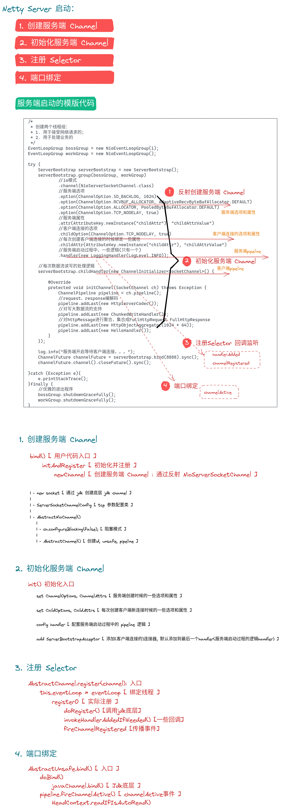

# Java读源码之Netty深入剖析

## netty是什么

* 异步事件驱动框架，快速开发高性能服务端和客户端（性能问题不用担心）
* 封装了JDK 底层BIO和NIO模型，提供了高度可用的API
* 自带编解码器解决拆包粘包问题，用户只关心业务逻辑
* 精心设计的reactor线程模型，支持高并发海量连接
* 自带了各种协议栈让你处理任何一种协议都几乎不用亲自动手

## Netty基本组件

## Netty 服务端启动

> 分析服务端启动流程，包括服务端Channel的创建，初始化，以及注册到selector

## NioEventLoop

> 分析Netty reactor线程处理过程，包括事件监听，事件处理，常规任务处理和定时任务处理

* new NioEventLoopGroup() => 线程组，默认2*cpu

## 新连接接入

> 分析新连接接入以及绑定reactor线程，绑定到selector的过程

检测新连接 -> 创建NioSocketChannel(客户端Channel) -> 分配线程(NioEventLoop)及注册selector -> 向selector注册读事件

